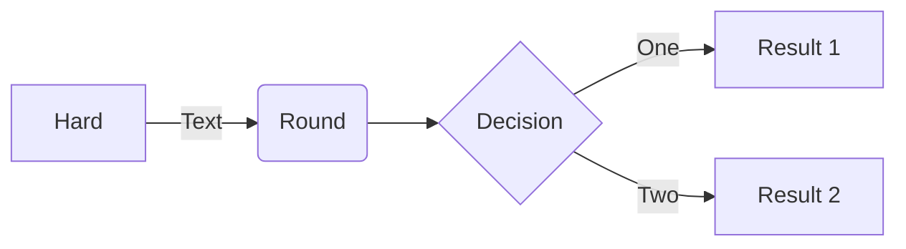

# Changelog

A summary of changes in the Jupyter notebook. For more detailed
information, see [GitHub](https://github.com/jupyter/notebook).

Use `pip install notebook --upgrade` or `conda upgrade notebook` to
upgrade to the latest release.

We strongly recommend that you upgrade pip to version 9+ of pip before
upgrading `notebook`.

Use `pip install pip --upgrade` to upgrade pip. Check pip version with
`pip --version`.

## v7.2

Jupyter Notebook 7.2 is based on JupyterLab 4.2, and includes a number of new features, bug fixes, and enhancements for extension developers. This release is compatible with extensions supporting JupyterLab 4.0. Extension authors are recommended to consult the [Extension Migration Guide](https://jupyterlab.readthedocs.io/en/latest/extension/extension_migration.html#jupyterlab-4-0-to-4-1) which lists deprecations and changes to the public API.

Below are a few highlights for this new release. Most of the new features and improvements come from the update to JupyterLab 4.2, although they are not all supported in Notebook 7.2.

For reference you may have a look at the JupyterLab 4.2 changelog to learn more: https://jupyterlab.readthedocs.io/en/latest/getting_started/changelog.html#v4-2

### Full notebook windowing mode by default

Notebooks in the `full` windowing mode only render the visible cells, significantly improving the performance of the application. One limitation of `full` mode is that the search function in your browser may produce false negatives; using the search function is recommended. To revert to the behaviour from Notebook 7.2, go to Settings → Settings Editor → Notebook, scroll to “Windowing mode”, and choose `defer`.

### Improved Shortcuts Editor

Among the numerous improvements and bug fixes for the keyboard shortcuts editor:

- it is now possible to remove the default shortcuts,
- shortcuts are correctly sorted when using a language pack,
- shortcuts with different arguments are now correctly displayed as individual entries.

### Dark high contrast theme

A new theme, JupyterLab Dark High Contrast, which is intended to benefit users with the need for higher contrast, following the WCAG AAA accessibility standard for color contrast. To select this theme, from the menu bar, choose Settings → Theme → JupyterLab Dark High Contrast. Please provide feedback and suggestions on further improvements to this theme.

<!-- <START NEW CHANGELOG ENTRY> -->

## 7.3.0a1

([Full Changelog](https://github.com/jupyter/notebook/compare/@jupyter-notebook/application-extension@7.3.0-alpha.0...ff2b822d066dc8d733a259f955177da4bd4d668c))

### Enhancements made

- Update to JupyterLab `4.3.0a1` [#7416](https://github.com/jupyter/notebook/pull/7416) ([@jtpio](https://github.com/jtpio))

### Bugs fixed

- Remove pseudoelement obstructing the cell collapser [#7392](https://github.com/jupyter/notebook/pull/7392) ([@krassowski](https://github.com/krassowski))

### Contributors to this release

([GitHub contributors page for this release](https://github.com/jupyter/notebook/graphs/contributors?from=2024-05-31&to=2024-07-01&type=c))

[@github-actions](https://github.com/search?q=repo%3Ajupyter%2Fnotebook+involves%3Agithub-actions+updated%3A2024-05-31..2024-07-01&type=Issues) | [@jtpio](https://github.com/search?q=repo%3Ajupyter%2Fnotebook+involves%3Ajtpio+updated%3A2024-05-31..2024-07-01&type=Issues) | [@krassowski](https://github.com/search?q=repo%3Ajupyter%2Fnotebook+involves%3Akrassowski+updated%3A2024-05-31..2024-07-01&type=Issues)

<!-- <END NEW CHANGELOG ENTRY> -->

## 7.3.0a0

([Full Changelog](https://github.com/jupyter/notebook/compare/@jupyter-notebook/application-extension@7.2.0...1a03b9d8e502f8177684e39d7b627bed1c772bb2))

### Enhancements made

- Support custom page_data_hook function [#7387](https://github.com/jupyter/notebook/pull/7387) ([@bluestealth](https://github.com/bluestealth))
- Add missing "Open..." file menu [#7385](https://github.com/jupyter/notebook/pull/7385) ([@martinRenou](https://github.com/martinRenou))
- Duplicate notebook menu option [#7374](https://github.com/jupyter/notebook/pull/7374) ([@JasonWeill](https://github.com/JasonWeill))

### Bugs fixed

- "Close and Shut Down Notebook" shuts down without the confirmation dialog [#7384](https://github.com/jupyter/notebook/pull/7384) ([@JasonWeill](https://github.com/JasonWeill))
- Adds message about building code before running 'develop' [#7382](https://github.com/jupyter/notebook/pull/7382) ([@JasonWeill](https://github.com/JasonWeill))

### Maintenance and upkeep improvements

- Update to JupyterLab 4.3.0a0 [#7378](https://github.com/jupyter/notebook/pull/7378) ([@jtpio](https://github.com/jtpio))

### Documentation improvements

- Adds message about building code before running 'develop' [#7382](https://github.com/jupyter/notebook/pull/7382) ([@JasonWeill](https://github.com/JasonWeill))

### Contributors to this release

([GitHub contributors page for this release](https://github.com/jupyter/notebook/graphs/contributors?from=2024-05-16&to=2024-05-31&type=c))

[@bluestealth](https://github.com/search?q=repo%3Ajupyter%2Fnotebook+involves%3Abluestealth+updated%3A2024-05-16..2024-05-31&type=Issues) | [@github-actions](https://github.com/search?q=repo%3Ajupyter%2Fnotebook+involves%3Agithub-actions+updated%3A2024-05-16..2024-05-31&type=Issues) | [@JasonWeill](https://github.com/search?q=repo%3Ajupyter%2Fnotebook+involves%3AJasonWeill+updated%3A2024-05-16..2024-05-31&type=Issues) | [@jtpio](https://github.com/search?q=repo%3Ajupyter%2Fnotebook+involves%3Ajtpio+updated%3A2024-05-16..2024-05-31&type=Issues) | [@martinRenou](https://github.com/search?q=repo%3Ajupyter%2Fnotebook+involves%3AmartinRenou+updated%3A2024-05-16..2024-05-31&type=Issues)

## 7.2.0

([Full Changelog](https://github.com/jupyter/notebook/compare/@jupyter-notebook/application-extension@7.1.2...31bf294e85175bbf39816a90dc8858dedaf73bde))

### Enhancements made

- Update to JupyterLab 4.2.0 [#7357](https://github.com/jupyter/notebook/pull/7357) ([@jtpio](https://github.com/jtpio))
- Update to JupyterLab 4.2.0rc0 [#7333](https://github.com/jupyter/notebook/pull/7333) ([@jtpio](https://github.com/jtpio))
- Add `@jupyterlab/theme-dark-high-contrast-extension` [#7331](https://github.com/jupyter/notebook/pull/7331) ([@jtpio](https://github.com/jtpio))
- Update to JupyterLab 4.2.0a2 [#7307](https://github.com/jupyter/notebook/pull/7307) ([@jtpio](https://github.com/jtpio))

### Bugs fixed

- Add the `@jupyterlab/notebook-extension:copy-output` plugin [#7353](https://github.com/jupyter/notebook/pull/7353) ([@jtpio](https://github.com/jtpio))
- Fix CSS for `full` windowing mode [#7337](https://github.com/jupyter/notebook/pull/7337) ([@jtpio](https://github.com/jtpio))
- Force notebook windowing mode to `defer` [#7335](https://github.com/jupyter/notebook/pull/7335) ([@jtpio](https://github.com/jtpio))
- Fix scrollbar always showing up by default [#7327](https://github.com/jupyter/notebook/pull/7327) ([@jtpio](https://github.com/jtpio))
- Default to the `full` windowing mode [#7321](https://github.com/jupyter/notebook/pull/7321) ([@jtpio](https://github.com/jtpio))

### Maintenance and upkeep improvements

- Fix emoji in create issue screen [#7363](https://github.com/jupyter/notebook/pull/7363) ([@JasonWeill](https://github.com/JasonWeill))
- Update `@jupyterlab/galata` [#7361](https://github.com/jupyter/notebook/pull/7361) ([@jtpio](https://github.com/jtpio))
- Pin on `macos-12` on CI for now [#7346](https://github.com/jupyter/notebook/pull/7346) ([@jtpio](https://github.com/jtpio))
- Update to JupyterLab `4.2.0b1` [#7319](https://github.com/jupyter/notebook/pull/7319) ([@jtpio](https://github.com/jtpio))
- Update to JupyterLab 4.2.0b0 [#7312](https://github.com/jupyter/notebook/pull/7312) ([@jtpio](https://github.com/jtpio))
- Ignore links to GitHub user and organisation profiles [#7308](https://github.com/jupyter/notebook/pull/7308) ([@jtpio](https://github.com/jtpio))

### Documentation improvements

- Add user facing changelog for 7.2 [#7372](https://github.com/jupyter/notebook/pull/7372) ([@jtpio](https://github.com/jtpio))
- Fix emoji in create issue screen [#7363](https://github.com/jupyter/notebook/pull/7363) ([@JasonWeill](https://github.com/JasonWeill))
- update RISE extension installation instructions [#7299](https://github.com/jupyter/notebook/pull/7299) ([@afeld](https://github.com/afeld))

### Contributors to this release

([GitHub contributors page for this release](https://github.com/jupyter/notebook/graphs/contributors?from=2024-03-14&to=2024-05-16&type=c))

[@afeld](https://github.com/search?q=repo%3Ajupyter%2Fnotebook+involves%3Aafeld+updated%3A2024-03-14..2024-05-16&type=Issues) | [@github-actions](https://github.com/search?q=repo%3Ajupyter%2Fnotebook+involves%3Agithub-actions+updated%3A2024-03-14..2024-05-16&type=Issues) | [@JasonWeill](https://github.com/search?q=repo%3Ajupyter%2Fnotebook+involves%3AJasonWeill+updated%3A2024-03-14..2024-05-16&type=Issues) | [@jtpio](https://github.com/search?q=repo%3Ajupyter%2Fnotebook+involves%3Ajtpio+updated%3A2024-03-14..2024-05-16&type=Issues) | [@krassowski](https://github.com/search?q=repo%3Ajupyter%2Fnotebook+involves%3Akrassowski+updated%3A2024-03-14..2024-05-16&type=Issues) | [@RRosio](https://github.com/search?q=repo%3Ajupyter%2Fnotebook+involves%3ARRosio+updated%3A2024-03-14..2024-05-16&type=Issues) | [@takluyver](https://github.com/search?q=repo%3Ajupyter%2Fnotebook+involves%3Atakluyver+updated%3A2024-03-14..2024-05-16&type=Issues)

## 7.2.0rc1

([Full Changelog](https://github.com/jupyter/notebook/compare/v7.2.0rc0...f5d8aea3bdc3eea25213792f9d101738f2a1f627))

### Enhancements made

- Update to JupyterLab 4.2.0 [#7357](https://github.com/jupyter/notebook/pull/7357) ([@jtpio](https://github.com/jtpio))

### Bugs fixed

- Add the `@jupyterlab/notebook-extension:copy-output` plugin [#7353](https://github.com/jupyter/notebook/pull/7353) ([@jtpio](https://github.com/jtpio))
- Default to the `full` windowing mode [#7321](https://github.com/jupyter/notebook/pull/7321) ([@jtpio](https://github.com/jtpio))

### Documentation improvements

- update RISE extension installation instructions [#7299](https://github.com/jupyter/notebook/pull/7299) ([@afeld](https://github.com/afeld))

### Contributors to this release

([GitHub contributors page for this release](https://github.com/jupyter/notebook/graphs/contributors?from=2024-05-01&to=2024-05-13&type=c))

[@afeld](https://github.com/search?q=repo%3Ajupyter%2Fnotebook+involves%3Aafeld+updated%3A2024-05-01..2024-05-13&type=Issues) | [@github-actions](https://github.com/search?q=repo%3Ajupyter%2Fnotebook+involves%3Agithub-actions+updated%3A2024-05-01..2024-05-13&type=Issues) | [@jtpio](https://github.com/search?q=repo%3Ajupyter%2Fnotebook+involves%3Ajtpio+updated%3A2024-05-01..2024-05-13&type=Issues) | [@krassowski](https://github.com/search?q=repo%3Ajupyter%2Fnotebook+involves%3Akrassowski+updated%3A2024-05-01..2024-05-13&type=Issues) | [@takluyver](https://github.com/search?q=repo%3Ajupyter%2Fnotebook+involves%3Atakluyver+updated%3A2024-05-01..2024-05-13&type=Issues)

## 7.2.0rc0

([Full Changelog](https://github.com/jupyter/notebook/compare/v7.2.0b1...49ddd0fe1e4d4bfa24f74042f2232c5b91d1c36e))

### Enhancements made

- Update to JupyterLab 4.2.0rc0 [#7333](https://github.com/jupyter/notebook/pull/7333) ([@jtpio](https://github.com/jtpio))

### Bugs fixed

- Fix CSS for `full` windowing mode [#7337](https://github.com/jupyter/notebook/pull/7337) ([@jtpio](https://github.com/jtpio))

### Maintenance and upkeep improvements

- Pin on `macos-12` on CI for now [#7346](https://github.com/jupyter/notebook/pull/7346) ([@jtpio](https://github.com/jtpio))

### Contributors to this release

([GitHub contributors page for this release](https://github.com/jupyter/notebook/graphs/contributors?from=2024-04-19&to=2024-05-01&type=c))

[@github-actions](https://github.com/search?q=repo%3Ajupyter%2Fnotebook+involves%3Agithub-actions+updated%3A2024-04-19..2024-05-01&type=Issues) | [@jtpio](https://github.com/search?q=repo%3Ajupyter%2Fnotebook+involves%3Ajtpio+updated%3A2024-04-19..2024-05-01&type=Issues) | [@krassowski](https://github.com/search?q=repo%3Ajupyter%2Fnotebook+involves%3Akrassowski+updated%3A2024-04-19..2024-05-01&type=Issues)

## 7.2.0b1

([Full Changelog](https://github.com/jupyter/notebook/compare/@jupyter-notebook/application-extension@7.2.0-beta.0...b45d666d5ee1ee053b55ac9cb6e9aecde5d53945))

### Enhancements made

- Add `@jupyterlab/theme-dark-high-contrast-extension` [#7331](https://github.com/jupyter/notebook/pull/7331) ([@jtpio](https://github.com/jtpio))

### Bugs fixed

- Force notebook windowing mode to `defer` [#7335](https://github.com/jupyter/notebook/pull/7335) ([@jtpio](https://github.com/jtpio))
- Fix scrollbar always showing up by default [#7327](https://github.com/jupyter/notebook/pull/7327) ([@jtpio](https://github.com/jtpio))

### Contributors to this release

([GitHub contributors page for this release](https://github.com/jupyter/notebook/graphs/contributors?from=2024-04-12&to=2024-04-19&type=c))

[@github-actions](https://github.com/search?q=repo%3Ajupyter%2Fnotebook+involves%3Agithub-actions+updated%3A2024-04-12..2024-04-19&type=Issues) | [@jtpio](https://github.com/search?q=repo%3Ajupyter%2Fnotebook+involves%3Ajtpio+updated%3A2024-04-12..2024-04-19&type=Issues) | [@RRosio](https://github.com/search?q=repo%3Ajupyter%2Fnotebook+involves%3ARRosio+updated%3A2024-04-12..2024-04-19&type=Issues)

## 7.2.0b0

([Full Changelog](https://github.com/jupyter/notebook/compare/@jupyter-notebook/application-extension@7.2.0-alpha.0...09bcd99e6dfffce92acc9a7f9d11a2a2122131c0))

### Maintenance and upkeep improvements

- Update to JupyterLab `4.2.0b1` [#7319](https://github.com/jupyter/notebook/pull/7319) ([@jtpio](https://github.com/jtpio))
- Update to JupyterLab 4.2.0b0 [#7312](https://github.com/jupyter/notebook/pull/7312) ([@jtpio](https://github.com/jtpio))

### Contributors to this release

([GitHub contributors page for this release](https://github.com/jupyter/notebook/graphs/contributors?from=2024-03-29&to=2024-04-12&type=c))

[@github-actions](https://github.com/search?q=repo%3Ajupyter%2Fnotebook+involves%3Agithub-actions+updated%3A2024-03-29..2024-04-12&type=Issues) | [@jtpio](https://github.com/search?q=repo%3Ajupyter%2Fnotebook+involves%3Ajtpio+updated%3A2024-03-29..2024-04-12&type=Issues) | [@krassowski](https://github.com/search?q=repo%3Ajupyter%2Fnotebook+involves%3Akrassowski+updated%3A2024-03-29..2024-04-12&type=Issues)

## 7.2.0a0

([Full Changelog](https://github.com/jupyter/notebook/compare/@jupyter-notebook/application-extension@7.1.2...80b582bce69e33e36e936af2ea981bcb22a4d285))

### Enhancements made

- Update to JupyterLab 4.2.0a2 [#7307](https://github.com/jupyter/notebook/pull/7307) ([@jtpio](https://github.com/jtpio))

### Maintenance and upkeep improvements

- Ignore links to GitHub user and organisation profiles [#7308](https://github.com/jupyter/notebook/pull/7308) ([@jtpio](https://github.com/jtpio))

### Contributors to this release

([GitHub contributors page for this release](https://github.com/jupyter/notebook/graphs/contributors?from=2024-03-14&to=2024-03-29&type=c))

[@github-actions](https://github.com/search?q=repo%3Ajupyter%2Fnotebook+involves%3Agithub-actions+updated%3A2024-03-14..2024-03-29&type=Issues) | [@jtpio](https://github.com/search?q=repo%3Ajupyter%2Fnotebook+involves%3Ajtpio+updated%3A2024-03-14..2024-03-29&type=Issues)

## v7.1

Jupyter Notebook 7.1 is based on JupyterLab 4.1, and includes a number of new features, bug fixes, and enhancements for extension developers. This release is compatible with extensions supporting JupyterLab 4.0. Extension authors are recommended to consult the [Extension Migration Guide](https://jupyterlab.readthedocs.io/en/latest/extension/extension_migration.html#jupyterlab-4-0-to-4-1) which lists deprecations and changes to the public API.

Below are a few highlights for this new release. Most of the new features and improvements come from the update to JupyterLab 4.1, although they are not all supported in Notebook 7.1.

For reference you may have a look at the JupyterLab 4.1 changelog to learn more: https://jupyterlab.readthedocs.io/en/latest/getting_started/changelog.html#v4-1

### Diagrams in Markdown

Matching GitHub-Flavoured Markdown, JupyterLab 4.1 now supports [Mermaid](https://github.com/mermaid-js/mermaid) diagrams.
To create a mermaid diagram use the `mermaid` language specifier for a code block in a markdown cell or document, for example:

~~~

~~~

which renders as:

### Inline completer

JupyterLab now supports completion presented as ghost text in the cell and file editors,
allowing generative AI models to provide multi-line completions. This can now also be leveraged in Jupyter Notebook.

The suggestions are provided by plugins implementing the ``IInlineCompletionProvider`` API;
by default a single provider which uses kernel history is available.

The suggestions can be invoked as-you-type or manually using a configurable shortcut (by default <kbd>Alt</kbd> + <kbd>\\</kbd>).
The default keyboard shortcuts are displayed in the small widget shown when hovering over the ghost suggestion:
- <kbd>Alt</kbd> + <kbd>End</kbd> - accept suggestion
- <kbd>Alt</kbd> + <kbd>[</kbd> - previous suggestion
- <kbd>Alt</kbd> + <kbd>]</kbd> - next suggestion

To enable the inline suggestions based on the kernel history, go to Settings → Inline Completer → History provider → check the "enabled" checkbox.

In addition to the built-in history suggestions,
the [`jupyter-ai`](https://github.com/jupyterlab/jupyter-ai) extension will provide
suggestions from supported models.

Note that the Jupyter AI extension is not yet compatible with Jupyter Notebook 7.

### Keyboard navigation improvements

Numerous improvements to keyboard navigation with focus on accessibility and usability are included in this release:
- the notebook cells now retain focus
- the focus can now be moved beyond the active notebook
- the toolbars can now be navigated using arrow keys

For more details, see [this post on Jupyter Blog](https://blog.jupyter.org/recent-keyboard-navigation-improvements-in-jupyter-4df32f97628d).

### Execution history in notebook

The code from previously executed cells can be used to populate empty cells,
allowing to iterate on code from previous cells or even sessions
(depending on how a specific kernel stores history).

To cycle between history items press <kbd>Alt</kbd> + <kbd>Arrow Up</kbd> and  <kbd>Alt</kbd> + <kbd>Arrow Down</kbd>.

To enable execution history, go to Settings → Notebook → check the "Kernel history access" checkbox.

This feature was already available in the console in previous releases; it only works with kernels supporting execution history requests.
To clear the execution history consult the documentation of the kernel you are using (e.g., IPython/ipykernel).

### Error indicator in the table of contents

When a cell fails during execution, an error indicator will be displayed by the corresponding heading,
increasing awareness of the notebook state and enabling users to quickly navigate to the cell which requires attention.

### Search improvements

- The search box will now grow automatically to accommodate longer text
- Search in selection can now be toggled using <kbd>Alt</kbd> + <kbd>L</kbd> and automatic search in selection can be configured in settings
- Tooltips with shortcuts were added to the buttons in the search box to improve discoverability of the shortcuts

### Miscellaneous

- The current theme (dark/light) can now be synced with the browser/system preference (Settings menu → Theme → Synchronise with System Settings)
- A blue "read-only" status indicator is now  displayed in the toolbar of documents which cannot be saved because their model is read-only.
- Native support for viewing jsonl/ndjson files was added
- Collapsing of breadcrumbs in the File Browser can be disabled in File Browser settings

## 7.1.2

([Full Changelog](https://github.com/jupyter/notebook/compare/@jupyter-notebook/application-extension@7.1.1...ca41222a9c8d75356c6d67d3bd36e34d71cce2d8))

### Maintenance and upkeep improvements

- Update Release Scripts [#7295](https://github.com/jupyter/notebook/pull/7295) ([@blink1073](https://github.com/blink1073))
- Fix jupyterlab install command in the releaser hook [#7294](https://github.com/jupyter/notebook/pull/7294) ([@jtpio](https://github.com/jtpio))
- Update to JupyterLab 4.1.5 packages [#7291](https://github.com/jupyter/notebook/pull/7291) ([@jtpio](https://github.com/jtpio))

### Documentation improvements

- Add a section to use local dependencies [#7292](https://github.com/jupyter/notebook/pull/7292) ([@brichet](https://github.com/brichet))

### Contributors to this release

([GitHub contributors page for this release](https://github.com/jupyter/notebook/graphs/contributors?from=2024-02-26&to=2024-03-14&type=c))

[@blink1073](https://github.com/search?q=repo%3Ajupyter%2Fnotebook+involves%3Ablink1073+updated%3A2024-02-26..2024-03-14&type=Issues) | [@brichet](https://github.com/search?q=repo%3Ajupyter%2Fnotebook+involves%3Abrichet+updated%3A2024-02-26..2024-03-14&type=Issues) | [@github-actions](https://github.com/search?q=repo%3Ajupyter%2Fnotebook+involves%3Agithub-actions+updated%3A2024-02-26..2024-03-14&type=Issues) | [@jtpio](https://github.com/search?q=repo%3Ajupyter%2Fnotebook+involves%3Ajtpio+updated%3A2024-02-26..2024-03-14&type=Issues)

## 7.1.1

([Full Changelog](https://github.com/jupyter/notebook/compare/@jupyter-notebook/application-extension@7.1.0...da7b8d400e96ceff0eec834badd891bc5d5f154d))

### Bugs fixed

- Grayout "Edit Notebook Metadata" for other file formats.  [#7265](https://github.com/jupyter/notebook/pull/7265) ([@itsmevichu](https://github.com/itsmevichu))

### Maintenance and upkeep improvements

- Fix flaky mobile UI tests [#7278](https://github.com/jupyter/notebook/pull/7278) ([@jtpio](https://github.com/jtpio))
- Update to JupyterLab 4.1.2 packages [#7277](https://github.com/jupyter/notebook/pull/7277) ([@jtpio](https://github.com/jtpio))
- Ignore stackoverflow link [#7274](https://github.com/jupyter/notebook/pull/7274) ([@jtpio](https://github.com/jtpio))
- Expose `version_info` [#7273](https://github.com/jupyter/notebook/pull/7273) ([@jtpio](https://github.com/jtpio))
- Bump ip from 2.0.0 to 2.0.1 in /ui-tests [#7268](https://github.com/jupyter/notebook/pull/7268) ([@dependabot](https://github.com/dependabot))
- Bump ip from 2.0.0 to 2.0.1 [#7267](https://github.com/jupyter/notebook/pull/7267) ([@dependabot](https://github.com/dependabot))

### Contributors to this release

([GitHub contributors page for this release](https://github.com/jupyter/notebook/graphs/contributors?from=2024-02-13&to=2024-02-26&type=c))

[@dependabot](https://github.com/search?q=repo%3Ajupyter%2Fnotebook+involves%3Adependabot+updated%3A2024-02-13..2024-02-26&type=Issues) | [@github-actions](https://github.com/search?q=repo%3Ajupyter%2Fnotebook+involves%3Agithub-actions+updated%3A2024-02-13..2024-02-26&type=Issues) | [@itsmevichu](https://github.com/search?q=repo%3Ajupyter%2Fnotebook+involves%3Aitsmevichu+updated%3A2024-02-13..2024-02-26&type=Issues) | [@jtpio](https://github.com/search?q=repo%3Ajupyter%2Fnotebook+involves%3Ajtpio+updated%3A2024-02-13..2024-02-26&type=Issues)

## 7.1.0

([Full Changelog](https://github.com/jupyter/notebook/compare/@jupyter-notebook/application-extension@7.0.6...b8ec7e4a8eda70a8d7dca19799acd3e96e019160))

### Enhancements made

- Create a new notebook with a specific kernel from the new dropdown [#7255](https://github.com/jupyter/notebook/pull/7255) ([@jtpio](https://github.com/jtpio))
- Add the plugin manager [#7198](https://github.com/jupyter/notebook/pull/7198) ([@jtpio](https://github.com/jtpio))
- Fix toggle functionality for widgets. [#7178](https://github.com/jupyter/notebook/pull/7178) ([@haok1402](https://github.com/haok1402))
- Bump to JupyterLab 4.1.0a4 bis [#7172](https://github.com/jupyter/notebook/pull/7172) ([@brichet](https://github.com/brichet))
- Update to JupyterLab `4.1.0a3` [#7161](https://github.com/jupyter/notebook/pull/7161) ([@jtpio](https://github.com/jtpio))
- Added Lumino Plugin Description (#7008) [#7127](https://github.com/jupyter/notebook/pull/7127) ([@Dilip-Jain](https://github.com/Dilip-Jain))
- Added Edit Notebook Metadata Option (#6402) [#7099](https://github.com/jupyter/notebook/pull/7099) ([@Dilip-Jain](https://github.com/Dilip-Jain))
- Update to JupyterLab 4.1 [#7096](https://github.com/jupyter/notebook/pull/7096) ([@jtpio](https://github.com/jtpio))
- Add the JupyterLab resources plugin [#6968](https://github.com/jupyter/notebook/pull/6968) ([@jtpio](https://github.com/jtpio))

### Bugs fixed

- Fix spurious kernel selection dialog on notebook creation [#7258](https://github.com/jupyter/notebook/pull/7258) ([@jtpio](https://github.com/jtpio))
- Workaround for the file browser tracker focus issue [#7224](https://github.com/jupyter/notebook/pull/7224) ([@jtpio](https://github.com/jtpio))

### Maintenance and upkeep improvements

- Update to JupyterLab 4.1.1 [#7256](https://github.com/jupyter/notebook/pull/7256) ([@jtpio](https://github.com/jtpio))
- Follow JupyterLab minor versions [#7250](https://github.com/jupyter/notebook/pull/7250) ([@jtpio](https://github.com/jtpio))
- chore: update pre-commit hooks [#7237](https://github.com/jupyter/notebook/pull/7237) ([@pre-commit-ci](https://github.com/pre-commit-ci))
- Update to JupyterLab 4.1.0 final [#7234](https://github.com/jupyter/notebook/pull/7234) ([@jtpio](https://github.com/jtpio))
- Update to JupyterLab 4.1.0rc1 [#7230](https://github.com/jupyter/notebook/pull/7230) ([@jtpio](https://github.com/jtpio))
- Update to JupyterLab 4.1.0rc0 [#7227](https://github.com/jupyter/notebook/pull/7227) ([@jtpio](https://github.com/jtpio))
- Update to JupyterLab 4.1.0b2 [#7222](https://github.com/jupyter/notebook/pull/7222) ([@jtpio](https://github.com/jtpio))
- Fix `check_links` on CI [#7219](https://github.com/jupyter/notebook/pull/7219) ([@jtpio](https://github.com/jtpio))
- Bump the actions group with 1 update [#7218](https://github.com/jupyter/notebook/pull/7218) ([@dependabot](https://github.com/dependabot))
- Bump the actions group with 2 updates [#7207](https://github.com/jupyter/notebook/pull/7207) ([@dependabot](https://github.com/dependabot))
- chore: update pre-commit hooks [#7206](https://github.com/jupyter/notebook/pull/7206) ([@pre-commit-ci](https://github.com/pre-commit-ci))
- Add nbviewer.jupyter.org to the ignore list [#7197](https://github.com/jupyter/notebook/pull/7197) ([@jtpio](https://github.com/jtpio))
- Update to JupyterLab 4.1.0b0 [#7196](https://github.com/jupyter/notebook/pull/7196) ([@jtpio](https://github.com/jtpio))
- Update ruff config [#7190](https://github.com/jupyter/notebook/pull/7190) ([@blink1073](https://github.com/blink1073))
- Bump @babel/traverse from 7.23.0 to 7.23.6 [#7187](https://github.com/jupyter/notebook/pull/7187) ([@dependabot](https://github.com/dependabot))
- Bump actions/setup-python from 4 to 5 [#7180](https://github.com/jupyter/notebook/pull/7180) ([@dependabot](https://github.com/dependabot))
- Update publish-release workflow for PyPI trusted publisher [#7176](https://github.com/jupyter/notebook/pull/7176) ([@jtpio](https://github.com/jtpio))
- chore: update pre-commit hooks [#7174](https://github.com/jupyter/notebook/pull/7174) ([@pre-commit-ci](https://github.com/pre-commit-ci))
- Update `yarn.lock` [#7170](https://github.com/jupyter/notebook/pull/7170) ([@jtpio](https://github.com/jtpio))
- Bump axios from 1.5.1 to 1.6.2 [#7165](https://github.com/jupyter/notebook/pull/7165) ([@dependabot](https://github.com/dependabot))
- Bump dessant/lock-threads from 4 to 5 [#7159](https://github.com/jupyter/notebook/pull/7159) ([@dependabot](https://github.com/dependabot))
- Update ruff config and typing [#7145](https://github.com/jupyter/notebook/pull/7145) ([@blink1073](https://github.com/blink1073))
- chore: update pre-commit hooks [#7143](https://github.com/jupyter/notebook/pull/7143) ([@pre-commit-ci](https://github.com/pre-commit-ci))
- Clean up lint handling [#7142](https://github.com/jupyter/notebook/pull/7142) ([@blink1073](https://github.com/blink1073))
- Adopt ruff format [#7132](https://github.com/jupyter/notebook/pull/7132) ([@blink1073](https://github.com/blink1073))
- Fix python bumping to `minor` [#7131](https://github.com/jupyter/notebook/pull/7131) ([@jtpio](https://github.com/jtpio))
- Add Python 3.12 classifier [#7111](https://github.com/jupyter/notebook/pull/7111) ([@jtpio](https://github.com/jtpio))
- Remove viewport workaround in the UI tests [#6887](https://github.com/jupyter/notebook/pull/6887) ([@jtpio](https://github.com/jtpio))

### Documentation improvements

- Add documentation for updating `notebook` imports [#7244](https://github.com/jupyter/notebook/pull/7244) ([@jtpio](https://github.com/jtpio))
- Fix link in `CONTRIBUTING.md` [#7235](https://github.com/jupyter/notebook/pull/7235) ([@jtpio](https://github.com/jtpio))
- Add user facing changelog for 7.1 [#7232](https://github.com/jupyter/notebook/pull/7232) ([@jtpio](https://github.com/jtpio))
- Clarify README about supported versions (post v7 release) [#7193](https://github.com/jupyter/notebook/pull/7193) ([@akx](https://github.com/akx))
- Set `navigation_with_keys` to `False` [#7129](https://github.com/jupyter/notebook/pull/7129) ([@jtpio](https://github.com/jtpio))
- Updated ui-tests Configuration in Contributing.md [#7124](https://github.com/jupyter/notebook/pull/7124) ([@jayeshsingh9767](https://github.com/jayeshsingh9767))

### Contributors to this release

([GitHub contributors page for this release](https://github.com/jupyter/notebook/graphs/contributors?from=2023-10-17&to=2024-02-13&type=c))

[@akx](https://github.com/search?q=repo%3Ajupyter%2Fnotebook+involves%3Aakx+updated%3A2023-10-17..2024-02-13&type=Issues) | [@blink1073](https://github.com/search?q=repo%3Ajupyter%2Fnotebook+involves%3Ablink1073+updated%3A2023-10-17..2024-02-13&type=Issues) | [@brichet](https://github.com/search?q=repo%3Ajupyter%2Fnotebook+involves%3Abrichet+updated%3A2023-10-17..2024-02-13&type=Issues) | [@d5423197](https://github.com/search?q=repo%3Ajupyter%2Fnotebook+involves%3Ad5423197+updated%3A2023-10-17..2024-02-13&type=Issues) | [@dependabot](https://github.com/search?q=repo%3Ajupyter%2Fnotebook+involves%3Adependabot+updated%3A2023-10-17..2024-02-13&type=Issues) | [@Dilip-Jain](https://github.com/search?q=repo%3Ajupyter%2Fnotebook+involves%3ADilip-Jain+updated%3A2023-10-17..2024-02-13&type=Issues) | [@github-actions](https://github.com/search?q=repo%3Ajupyter%2Fnotebook+involves%3Agithub-actions+updated%3A2023-10-17..2024-02-13&type=Issues) | [@haok1402](https://github.com/search?q=repo%3Ajupyter%2Fnotebook+involves%3Ahaok1402+updated%3A2023-10-17..2024-02-13&type=Issues) | [@jayeshsingh9767](https://github.com/search?q=repo%3Ajupyter%2Fnotebook+involves%3Ajayeshsingh9767+updated%3A2023-10-17..2024-02-13&type=Issues) | [@jtpio](https://github.com/search?q=repo%3Ajupyter%2Fnotebook+involves%3Ajtpio+updated%3A2023-10-17..2024-02-13&type=Issues) | [@krassowski](https://github.com/search?q=repo%3Ajupyter%2Fnotebook+involves%3Akrassowski+updated%3A2023-10-17..2024-02-13&type=Issues) | [@pre-commit-ci](https://github.com/search?q=repo%3Ajupyter%2Fnotebook+involves%3Apre-commit-ci+updated%3A2023-10-17..2024-02-13&type=Issues) | [@Zsailer](https://github.com/search?q=repo%3Ajupyter%2Fnotebook+involves%3AZsailer+updated%3A2023-10-17..2024-02-13&type=Issues)

## 7.1.0rc1

([Full Changelog](https://github.com/jupyter/notebook/compare/v7.1.0rc0...376a2f97c883e6e91f321d0a676e1ee9ff3b8d87))

### Maintenance and upkeep improvements

- Follow JupyterLab minor versions [#7250](https://github.com/jupyter/notebook/pull/7250) ([@jtpio](https://github.com/jtpio))

### Documentation improvements

- Add documentation for updating `notebook` imports [#7244](https://github.com/jupyter/notebook/pull/7244) ([@jtpio](https://github.com/jtpio))

### Contributors to this release

([GitHub contributors page for this release](https://github.com/jupyter/notebook/graphs/contributors?from=2024-02-07&to=2024-02-09&type=c))

[@github-actions](https://github.com/search?q=repo%3Ajupyter%2Fnotebook+involves%3Agithub-actions+updated%3A2024-02-07..2024-02-09&type=Issues) | [@jtpio](https://github.com/search?q=repo%3Ajupyter%2Fnotebook+involves%3Ajtpio+updated%3A2024-02-07..2024-02-09&type=Issues)

## 7.1.0rc0

([Full Changelog](https://github.com/jupyter/notebook/compare/v7.1.0b0...2d717f5896a1d4310baa2499c7e6197d1914201d))

### Enhancements made

- Added Edit Notebook Metadata Option (#6402) [#7099](https://github.com/jupyter/notebook/pull/7099) ([@Dilip-Jain](https://github.com/Dilip-Jain))

### Maintenance and upkeep improvements

- chore: update pre-commit hooks [#7237](https://github.com/jupyter/notebook/pull/7237) ([@pre-commit-ci](https://github.com/pre-commit-ci))
- Update to JupyterLab 4.1.0 final [#7234](https://github.com/jupyter/notebook/pull/7234) ([@jtpio](https://github.com/jtpio))
- Update to JupyterLab 4.1.0rc1 [#7230](https://github.com/jupyter/notebook/pull/7230) ([@jtpio](https://github.com/jtpio))
- Update to JupyterLab 4.1.0rc0 [#7227](https://github.com/jupyter/notebook/pull/7227) ([@jtpio](https://github.com/jtpio))

### Documentation improvements

- Fix link in `CONTRIBUTING.md` [#7235](https://github.com/jupyter/notebook/pull/7235) ([@jtpio](https://github.com/jtpio))
- Add user facing changelog for 7.1 [#7232](https://github.com/jupyter/notebook/pull/7232) ([@jtpio](https://github.com/jtpio))

### Contributors to this release

([GitHub contributors page for this release](https://github.com/jupyter/notebook/graphs/contributors?from=2024-01-26&to=2024-02-07&type=c))

[@Dilip-Jain](https://github.com/search?q=repo%3Ajupyter%2Fnotebook+involves%3ADilip-Jain+updated%3A2024-01-26..2024-02-07&type=Issues) | [@github-actions](https://github.com/search?q=repo%3Ajupyter%2Fnotebook+involves%3Agithub-actions+updated%3A2024-01-26..2024-02-07&type=Issues) | [@jtpio](https://github.com/search?q=repo%3Ajupyter%2Fnotebook+involves%3Ajtpio+updated%3A2024-01-26..2024-02-07&type=Issues) | [@pre-commit-ci](https://github.com/search?q=repo%3Ajupyter%2Fnotebook+involves%3Apre-commit-ci+updated%3A2024-01-26..2024-02-07&type=Issues)

## 7.1.0b0

([Full Changelog](https://github.com/jupyter/notebook/compare/v7.1.0a2...5d265b90ed5f097af4ca22d283ecdc705229ff92))

### Bugs fixed

- Workaround for the file browser tracker focus issue [#7224](https://github.com/jupyter/notebook/pull/7224) ([@jtpio](https://github.com/jtpio))

### Maintenance and upkeep improvements

- Update to JupyterLab 4.1.0b2 [#7222](https://github.com/jupyter/notebook/pull/7222) ([@jtpio](https://github.com/jtpio))
- Fix `check_links` on CI [#7219](https://github.com/jupyter/notebook/pull/7219) ([@jtpio](https://github.com/jtpio))
- Bump the actions group with 1 update [#7218](https://github.com/jupyter/notebook/pull/7218) ([@dependabot](https://github.com/dependabot))
- Bump the actions group with 2 updates [#7207](https://github.com/jupyter/notebook/pull/7207) ([@dependabot](https://github.com/dependabot))
- chore: update pre-commit hooks [#7206](https://github.com/jupyter/notebook/pull/7206) ([@pre-commit-ci](https://github.com/pre-commit-ci))

### Contributors to this release

([GitHub contributors page for this release](https://github.com/jupyter/notebook/graphs/contributors?from=2023-12-27&to=2024-01-26&type=c))

[@dependabot](https://github.com/search?q=repo%3Ajupyter%2Fnotebook+involves%3Adependabot+updated%3A2023-12-27..2024-01-26&type=Issues) | [@github-actions](https://github.com/search?q=repo%3Ajupyter%2Fnotebook+involves%3Agithub-actions+updated%3A2023-12-27..2024-01-26&type=Issues) | [@jtpio](https://github.com/search?q=repo%3Ajupyter%2Fnotebook+involves%3Ajtpio+updated%3A2023-12-27..2024-01-26&type=Issues) | [@pre-commit-ci](https://github.com/search?q=repo%3Ajupyter%2Fnotebook+involves%3Apre-commit-ci+updated%3A2023-12-27..2024-01-26&type=Issues) | [@Zsailer](https://github.com/search?q=repo%3Ajupyter%2Fnotebook+involves%3AZsailer+updated%3A2023-12-27..2024-01-26&type=Issues)

## 7.1.0a2

([Full Changelog](https://github.com/jupyter/notebook/compare/v7.1.0a1...251e0e360603b6e63b280b3bd04a5406f7da28da))

### Enhancements made

- Add the plugin manager [#7198](https://github.com/jupyter/notebook/pull/7198) ([@jtpio](https://github.com/jtpio))
- Fix toggle functionality for widgets. [#7178](https://github.com/jupyter/notebook/pull/7178) ([@haok1402](https://github.com/haok1402))

### Maintenance and upkeep improvements

- Add nbviewer.jupyter.org to the ignore list [#7197](https://github.com/jupyter/notebook/pull/7197) ([@jtpio](https://github.com/jtpio))
- Update to JupyterLab 4.1.0b0 [#7196](https://github.com/jupyter/notebook/pull/7196) ([@jtpio](https://github.com/jtpio))
- Update ruff config [#7190](https://github.com/jupyter/notebook/pull/7190) ([@blink1073](https://github.com/blink1073))
- Bump @babel/traverse from 7.23.0 to 7.23.6 [#7187](https://github.com/jupyter/notebook/pull/7187) ([@dependabot](https://github.com/dependabot))
- Bump actions/setup-python from 4 to 5 [#7180](https://github.com/jupyter/notebook/pull/7180) ([@dependabot](https://github.com/dependabot))
- Update publish-release workflow for PyPI trusted publisher [#7176](https://github.com/jupyter/notebook/pull/7176) ([@jtpio](https://github.com/jtpio))
- chore: update pre-commit hooks [#7174](https://github.com/jupyter/notebook/pull/7174) ([@pre-commit-ci](https://github.com/pre-commit-ci))
- Remove viewport workaround in the UI tests [#6887](https://github.com/jupyter/notebook/pull/6887) ([@jtpio](https://github.com/jtpio))

### Documentation improvements

- Clarify README about supported versions (post v7 release) [#7193](https://github.com/jupyter/notebook/pull/7193) ([@akx](https://github.com/akx))

### Contributors to this release

([GitHub contributors page for this release](https://github.com/jupyter/notebook/graphs/contributors?from=2023-12-04&to=2023-12-27&type=c))

[@akx](https://github.com/search?q=repo%3Ajupyter%2Fnotebook+involves%3Aakx+updated%3A2023-12-04..2023-12-27&type=Issues) | [@blink1073](https://github.com/search?q=repo%3Ajupyter%2Fnotebook+involves%3Ablink1073+updated%3A2023-12-04..2023-12-27&type=Issues) | [@dependabot](https://github.com/search?q=repo%3Ajupyter%2Fnotebook+involves%3Adependabot+updated%3A2023-12-04..2023-12-27&type=Issues) | [@github-actions](https://github.com/search?q=repo%3Ajupyter%2Fnotebook+involves%3Agithub-actions+updated%3A2023-12-04..2023-12-27&type=Issues) | [@haok1402](https://github.com/search?q=repo%3Ajupyter%2Fnotebook+involves%3Ahaok1402+updated%3A2023-12-04..2023-12-27&type=Issues) | [@jtpio](https://github.com/search?q=repo%3Ajupyter%2Fnotebook+involves%3Ajtpio+updated%3A2023-12-04..2023-12-27&type=Issues) | [@pre-commit-ci](https://github.com/search?q=repo%3Ajupyter%2Fnotebook+involves%3Apre-commit-ci+updated%3A2023-12-04..2023-12-27&type=Issues)

## 7.1.0a1

([Full Changelog](https://github.com/jupyter/notebook/compare/@jupyter-notebook/application-extension@7.1.0-alpha.0...a74cd91871fcc6037d384fe59af8986557e783e5))

### Enhancements made

- Bump to JupyterLab 4.1.0a4 bis [#7172](https://github.com/jupyter/notebook/pull/7172) ([@brichet](https://github.com/brichet))
- Update to JupyterLab `4.1.0a3` [#7161](https://github.com/jupyter/notebook/pull/7161) ([@jtpio](https://github.com/jtpio))
- Add the JupyterLab resources plugin [#6968](https://github.com/jupyter/notebook/pull/6968) ([@jtpio](https://github.com/jtpio))

### Maintenance and upkeep improvements

- Update `yarn.lock` [#7170](https://github.com/jupyter/notebook/pull/7170) ([@jtpio](https://github.com/jtpio))
- Bump axios from 1.5.1 to 1.6.2 [#7165](https://github.com/jupyter/notebook/pull/7165) ([@dependabot](https://github.com/dependabot))
- Bump dessant/lock-threads from 4 to 5 [#7159](https://github.com/jupyter/notebook/pull/7159) ([@dependabot](https://github.com/dependabot))
- Update ruff config and typing [#7145](https://github.com/jupyter/notebook/pull/7145) ([@blink1073](https://github.com/blink1073))
- chore: update pre-commit hooks [#7143](https://github.com/jupyter/notebook/pull/7143) ([@pre-commit-ci](https://github.com/pre-commit-ci))
- Clean up lint handling [#7142](https://github.com/jupyter/notebook/pull/7142) ([@blink1073](https://github.com/blink1073))
- Adopt ruff format [#7132](https://github.com/jupyter/notebook/pull/7132) ([@blink1073](https://github.com/blink1073))

### Contributors to this release

([GitHub contributors page for this release](https://github.com/jupyter/notebook/graphs/contributors?from=2023-10-27&to=2023-12-04&type=c))

[@blink1073](https://github.com/search?q=repo%3Ajupyter%2Fnotebook+involves%3Ablink1073+updated%3A2023-10-27..2023-12-04&type=Issues) | [@brichet](https://github.com/search?q=repo%3Ajupyter%2Fnotebook+involves%3Abrichet+updated%3A2023-10-27..2023-12-04&type=Issues) | [@dependabot](https://github.com/search?q=repo%3Ajupyter%2Fnotebook+involves%3Adependabot+updated%3A2023-10-27..2023-12-04&type=Issues) | [@github-actions](https://github.com/search?q=repo%3Ajupyter%2Fnotebook+involves%3Agithub-actions+updated%3A2023-10-27..2023-12-04&type=Issues) | [@jtpio](https://github.com/search?q=repo%3Ajupyter%2Fnotebook+involves%3Ajtpio+updated%3A2023-10-27..2023-12-04&type=Issues) | [@krassowski](https://github.com/search?q=repo%3Ajupyter%2Fnotebook+involves%3Akrassowski+updated%3A2023-10-27..2023-12-04&type=Issues) | [@pre-commit-ci](https://github.com/search?q=repo%3Ajupyter%2Fnotebook+involves%3Apre-commit-ci+updated%3A2023-10-27..2023-12-04&type=Issues)

## 7.1.0a0

([Full Changelog](https://github.com/jupyter/notebook/compare/@jupyter-notebook/application-extension@7.0.6...0cd6104b926a398b419f2433538cef437592796f))

### Enhancements made

- Added Lumino Plugin Description (#7008) [#7127](https://github.com/jupyter/notebook/pull/7127) ([@Dilip-Jain](https://github.com/Dilip-Jain))
- Update to JupyterLab 4.1 [#7096](https://github.com/jupyter/notebook/pull/7096) ([@jtpio](https://github.com/jtpio))

### Maintenance and upkeep improvements

- Fix python bumping to `minor` [#7131](https://github.com/jupyter/notebook/pull/7131) ([@jtpio](https://github.com/jtpio))
- Add Python 3.12 classifier [#7111](https://github.com/jupyter/notebook/pull/7111) ([@jtpio](https://github.com/jtpio))

### Documentation improvements

- Set `navigation_with_keys` to `False` [#7129](https://github.com/jupyter/notebook/pull/7129) ([@jtpio](https://github.com/jtpio))
- Updated ui-tests Configuration in Contributing.md [#7124](https://github.com/jupyter/notebook/pull/7124) ([@jayeshsingh9767](https://github.com/jayeshsingh9767))

### Contributors to this release

([GitHub contributors page for this release](https://github.com/jupyter/notebook/graphs/contributors?from=2023-10-17&to=2023-10-27&type=c))

[@Dilip-Jain](https://github.com/search?q=repo%3Ajupyter%2Fnotebook+involves%3ADilip-Jain+updated%3A2023-10-17..2023-10-27&type=Issues) | [@github-actions](https://github.com/search?q=repo%3Ajupyter%2Fnotebook+involves%3Agithub-actions+updated%3A2023-10-17..2023-10-27&type=Issues) | [@jayeshsingh9767](https://github.com/search?q=repo%3Ajupyter%2Fnotebook+involves%3Ajayeshsingh9767+updated%3A2023-10-17..2023-10-27&type=Issues) | [@jtpio](https://github.com/search?q=repo%3Ajupyter%2Fnotebook+involves%3Ajtpio+updated%3A2023-10-17..2023-10-27&type=Issues)

## v7.0

## 7.0.6

([Full Changelog](https://github.com/jupyter/notebook/compare/@jupyter-notebook/app@7.0.5...c62caffb02856737870cbc79a2cdb43b3e89c363))

### Bugs fixed

- Updated fav-icon Base URL from JupyterLab PageConfig. [#7109](https://github.com/jupyter/notebook/pull/7109) ([@jayeshsingh9767](https://github.com/jayeshsingh9767))

### Maintenance and upkeep improvements

- Fix typings [#7110](https://github.com/jupyter/notebook/pull/7110) ([@jtpio](https://github.com/jtpio))
- Bump postcss from 8.4.27 to 8.4.31 [#7089](https://github.com/jupyter/notebook/pull/7089) ([@dependabot](https://github.com/dependabot))

### Contributors to this release

([GitHub contributors page for this release](https://github.com/jupyter/notebook/graphs/contributors?from=2023-10-12&to=2023-10-17&type=c))

[@dependabot](https://github.com/search?q=repo%3Ajupyter%2Fnotebook+involves%3Adependabot+updated%3A2023-10-12..2023-10-17&type=Issues) | [@github-actions](https://github.com/search?q=repo%3Ajupyter%2Fnotebook+involves%3Agithub-actions+updated%3A2023-10-12..2023-10-17&type=Issues) | [@jayeshsingh9767](https://github.com/search?q=repo%3Ajupyter%2Fnotebook+involves%3Ajayeshsingh9767+updated%3A2023-10-12..2023-10-17&type=Issues) | [@jtpio](https://github.com/search?q=repo%3Ajupyter%2Fnotebook+involves%3Ajtpio+updated%3A2023-10-12..2023-10-17&type=Issues)

## 7.0.5

([Full Changelog](https://github.com/jupyter/notebook/compare/@jupyter-notebook/app@7.0.4...839193d07f0780ded6f559892517f061f3776b02))

### Enhancements made

- Update to JupyterLab 4.0.7 [#7103](https://github.com/jupyter/notebook/pull/7103) ([@jtpio](https://github.com/jtpio))

### Maintenance and upkeep improvements

- Update `permissions` in the galata snapshot workflow [#7105](https://github.com/jupyter/notebook/pull/7105) ([@jtpio](https://github.com/jtpio))
- Fix typings check on CI [#7104](https://github.com/jupyter/notebook/pull/7104) ([@jtpio](https://github.com/jtpio))
- Ignore yarn.lock for codespell [#7098](https://github.com/jupyter/notebook/pull/7098) ([@jtpio](https://github.com/jtpio))
- Remove link to the PDF documentation [#7094](https://github.com/jupyter/notebook/pull/7094) ([@jtpio](https://github.com/jtpio))
- Bump postcss from 8.4.23 to 8.4.31 in /ui-tests [#7088](https://github.com/jupyter/notebook/pull/7088) ([@dependabot](https://github.com/dependabot))
- React to the galata update comment [#7086](https://github.com/jupyter/notebook/pull/7086) ([@jtpio](https://github.com/jtpio))
- Switch from `hub` to `gh` in the Playwright snapshots update workflow [#7085](https://github.com/jupyter/notebook/pull/7085) ([@jtpio](https://github.com/jtpio))
- chore: update pre-commit hooks [#7084](https://github.com/jupyter/notebook/pull/7084) ([@pre-commit-ci](https://github.com/pre-commit-ci))
- Fix traitlets typing [#7082](https://github.com/jupyter/notebook/pull/7082) ([@jtpio](https://github.com/jtpio))
- Bump toshimaru/auto-author-assign from 2.0.0 to 2.0.1 [#7080](https://github.com/jupyter/notebook/pull/7080) ([@dependabot](https://github.com/dependabot))
- Bump toshimaru/auto-author-assign from 1.6.2 to 2.0.0 [#7072](https://github.com/jupyter/notebook/pull/7072) ([@dependabot](https://github.com/dependabot))
- ci: set minimal permissions to workflows [#7070](https://github.com/jupyter/notebook/pull/7070) ([@diogoteles08](https://github.com/diogoteles08))
- Bump systeminformation from 5.17.12 to 5.21.8 in /ui-tests [#7064](https://github.com/jupyter/notebook/pull/7064) ([@dependabot](https://github.com/dependabot))

### Documentation improvements

- Improve docs setup (SVG logos, repo links) [#7074](https://github.com/jupyter/notebook/pull/7074) ([@krassowski](https://github.com/krassowski))

### Contributors to this release

([GitHub contributors page for this release](https://github.com/jupyter/notebook/graphs/contributors?from=2023-09-20&to=2023-10-12&type=c))

[@dependabot](https://github.com/search?q=repo%3Ajupyter%2Fnotebook+involves%3Adependabot+updated%3A2023-09-20..2023-10-12&type=Issues) | [@diogoteles08](https://github.com/search?q=repo%3Ajupyter%2Fnotebook+involves%3Adiogoteles08+updated%3A2023-09-20..2023-10-12&type=Issues) | [@github-actions](https://github.com/search?q=repo%3Ajupyter%2Fnotebook+involves%3Agithub-actions+updated%3A2023-09-20..2023-10-12&type=Issues) | [@jtpio](https://github.com/search?q=repo%3Ajupyter%2Fnotebook+involves%3Ajtpio+updated%3A2023-09-20..2023-10-12&type=Issues) | [@krassowski](https://github.com/search?q=repo%3Ajupyter%2Fnotebook+involves%3Akrassowski+updated%3A2023-09-20..2023-10-12&type=Issues) | [@pre-commit-ci](https://github.com/search?q=repo%3Ajupyter%2Fnotebook+involves%3Apre-commit-ci+updated%3A2023-09-20..2023-10-12&type=Issues)

## 7.0.4

([Full Changelog](https://github.com/jupyter/notebook/compare/@jupyter-notebook/app@7.0.3...0e62386fc71ed4bd424c989f9d5493ca346f1d9a))

### Enhancements made

- Update to JupyterLab 4.0.6 [#7049](https://github.com/jupyter/notebook/pull/7049) ([@jtpio](https://github.com/jtpio))

### Bugs fixed

- Fix `app_version` [#7061](https://github.com/jupyter/notebook/pull/7061) ([@jtpio](https://github.com/jtpio))
- fix trusted status indication [#7036](https://github.com/jupyter/notebook/pull/7036) ([@adigaboy](https://github.com/adigaboy))

### Maintenance and upkeep improvements

- Update Binder environment [#7059](https://github.com/jupyter/notebook/pull/7059) ([@jtpio](https://github.com/jtpio))
- Add `deduplicate` top-level script [#7058](https://github.com/jupyter/notebook/pull/7058) ([@jtpio](https://github.com/jtpio))
- Move opening path in new browser tabs to a separate plugin [#7056](https://github.com/jupyter/notebook/pull/7056) ([@jtpio](https://github.com/jtpio))
- Enable the Playwright trace [#7050](https://github.com/jupyter/notebook/pull/7050) ([@jtpio](https://github.com/jtpio))
- Bump actions/checkout from 3 to 4 [#7040](https://github.com/jupyter/notebook/pull/7040) ([@dependabot](https://github.com/dependabot))
- Adopt sp-repo-review [#7039](https://github.com/jupyter/notebook/pull/7039) ([@blink1073](https://github.com/blink1073))
- Add `datetime.datetime.utc()` to the filter list [#7037](https://github.com/jupyter/notebook/pull/7037) ([@jtpio](https://github.com/jtpio))
- Fix docs build on Gitpod [#7026](https://github.com/jupyter/notebook/pull/7026) ([@jtpio](https://github.com/jtpio))

### Contributors to this release

([GitHub contributors page for this release](https://github.com/jupyter/notebook/graphs/contributors?from=2023-08-30&to=2023-09-20&type=c))

[@adigaboy](https://github.com/search?q=repo%3Ajupyter%2Fnotebook+involves%3Aadigaboy+updated%3A2023-08-30..2023-09-20&type=Issues) | [@blink1073](https://github.com/search?q=repo%3Ajupyter%2Fnotebook+involves%3Ablink1073+updated%3A2023-08-30..2023-09-20&type=Issues) | [@dependabot](https://github.com/search?q=repo%3Ajupyter%2Fnotebook+involves%3Adependabot+updated%3A2023-08-30..2023-09-20&type=Issues) | [@github-actions](https://github.com/search?q=repo%3Ajupyter%2Fnotebook+involves%3Agithub-actions+updated%3A2023-08-30..2023-09-20&type=Issues) | [@jtpio](https://github.com/search?q=repo%3Ajupyter%2Fnotebook+involves%3Ajtpio+updated%3A2023-08-30..2023-09-20&type=Issues) | [@pre-commit-ci](https://github.com/search?q=repo%3Ajupyter%2Fnotebook+involves%3Apre-commit-ci+updated%3A2023-08-30..2023-09-20&type=Issues)

## 7.0.3

([Full Changelog](https://github.com/jupyter/notebook/compare/@jupyter-notebook/app@7.0.2...e2eb8f2a166ba7b339309b8bfbff40e6c9e0a9b9))

### Bugs fixed

- Require importlib_resources for testing on Python \< 3.10 [#7016](https://github.com/jupyter/notebook/pull/7016) ([@bnavigator](https://github.com/bnavigator))
- Fix Python 3.12 compatibility [#6965](https://github.com/jupyter/notebook/pull/6965) ([@frenzymadness](https://github.com/frenzymadness))

### Maintenance and upkeep improvements

- Update to JupyterLab 4.0.5 [#7013](https://github.com/jupyter/notebook/pull/7013) ([@jtpio](https://github.com/jtpio))
- Test against Python 3.12 [#6999](https://github.com/jupyter/notebook/pull/6999) ([@jtpio](https://github.com/jtpio))

### Documentation improvements

- Mention the nx graph in the contributing guide [#7001](https://github.com/jupyter/notebook/pull/7001) ([@jtpio](https://github.com/jtpio))

### Contributors to this release

([GitHub contributors page for this release](https://github.com/jupyter/notebook/graphs/contributors?from=2023-08-04&to=2023-08-30&type=c))

[@bnavigator](https://github.com/search?q=repo%3Ajupyter%2Fnotebook+involves%3Abnavigator+updated%3A2023-08-04..2023-08-30&type=Issues) | [@defjaf](https://github.com/search?q=repo%3Ajupyter%2Fnotebook+involves%3Adefjaf+updated%3A2023-08-04..2023-08-30&type=Issues) | [@frenzymadness](https://github.com/search?q=repo%3Ajupyter%2Fnotebook+involves%3Afrenzymadness+updated%3A2023-08-04..2023-08-30&type=Issues) | [@github-actions](https://github.com/search?q=repo%3Ajupyter%2Fnotebook+involves%3Agithub-actions+updated%3A2023-08-04..2023-08-30&type=Issues) | [@jtpio](https://github.com/search?q=repo%3Ajupyter%2Fnotebook+involves%3Ajtpio+updated%3A2023-08-04..2023-08-30&type=Issues) | [@kevin-bates](https://github.com/search?q=repo%3Ajupyter%2Fnotebook+involves%3Akevin-bates+updated%3A2023-08-04..2023-08-30&type=Issues)

## 7.0.2

([Full Changelog](https://github.com/jupyter/notebook/compare/@jupyter-notebook/app@7.0.1...af5edd42374cadba65feed2e6828b1ef96295daf))

### Enhancements made

- Update to JupyterLab 4.0.4 packages [#6998](https://github.com/jupyter/notebook/pull/6998) ([@jtpio](https://github.com/jtpio))
- Improve about dialog [#6996](https://github.com/jupyter/notebook/pull/6996) ([@yjrab](https://github.com/yjrab))
- Added documentation link in Help menu [#6993](https://github.com/jupyter/notebook/pull/6993) ([@Mikil03](https://github.com/Mikil03))

### Bugs fixed

- Remove `RedirectHandler` [#6997](https://github.com/jupyter/notebook/pull/6997) ([@jtpio](https://github.com/jtpio))

### Maintenance and upkeep improvements

### Contributors to this release

([GitHub contributors page for this release](https://github.com/jupyter/notebook/graphs/contributors?from=2023-07-31&to=2023-08-04&type=c))

[@echarles](https://github.com/search?q=repo%3Ajupyter%2Fnotebook+involves%3Aecharles+updated%3A2023-07-31..2023-08-04&type=Issues) | [@github-actions](https://github.com/search?q=repo%3Ajupyter%2Fnotebook+involves%3Agithub-actions+updated%3A2023-07-31..2023-08-04&type=Issues) | [@jtpio](https://github.com/search?q=repo%3Ajupyter%2Fnotebook+involves%3Ajtpio+updated%3A2023-07-31..2023-08-04&type=Issues) | [@kevin-bates](https://github.com/search?q=repo%3Ajupyter%2Fnotebook+involves%3Akevin-bates+updated%3A2023-07-31..2023-08-04&type=Issues) | [@Mikil03](https://github.com/search?q=repo%3Ajupyter%2Fnotebook+involves%3AMikil03+updated%3A2023-07-31..2023-08-04&type=Issues) | [@pre-commit-ci](https://github.com/search?q=repo%3Ajupyter%2Fnotebook+involves%3Apre-commit-ci+updated%3A2023-07-31..2023-08-04&type=Issues) | [@shaneknapp](https://github.com/search?q=repo%3Ajupyter%2Fnotebook+involves%3Ashaneknapp+updated%3A2023-07-31..2023-08-04&type=Issues) | [@yjrab](https://github.com/search?q=repo%3Ajupyter%2Fnotebook+involves%3Ayjrab+updated%3A2023-07-31..2023-08-04&type=Issues) | [@Zsailer](https://github.com/search?q=repo%3Ajupyter%2Fnotebook+involves%3AZsailer+updated%3A2023-07-31..2023-08-04&type=Issues)

## 7.0.1

([Full Changelog](https://github.com/jupyter/notebook/compare/@jupyter-notebook/app@7.0.0...ac3c882a246b46c15c1963ef4b65427a4257b132))

### Enhancements made

- Update accessibly compliance section in the docs [#6982](https://github.com/jupyter/notebook/pull/6982) ([@andrii-i](https://github.com/andrii-i))
- Update the browser tab favicon on kernel busy [#6980](https://github.com/jupyter/notebook/pull/6980) ([@jtpio](https://github.com/jtpio))

### Maintenance and upkeep improvements

- Bump `word-wrap` and `semver` [#6979](https://github.com/jupyter/notebook/pull/6979) ([@jtpio](https://github.com/jtpio))
- Enable lerna caching for build scripts [#6767](https://github.com/jupyter/notebook/pull/6767) ([@jtpio](https://github.com/jtpio))

### Documentation improvements

- Update accessibly compliance section in the docs [#6982](https://github.com/jupyter/notebook/pull/6982) ([@andrii-i](https://github.com/andrii-i))
- Fix link in `README.md` [#6973](https://github.com/jupyter/notebook/pull/6973) ([@jtpio](https://github.com/jtpio))
- The future is now [#6972](https://github.com/jupyter/notebook/pull/6972) ([@frenzymadness](https://github.com/frenzymadness))

### Contributors to this release

([GitHub contributors page for this release](https://github.com/jupyter/notebook/graphs/contributors?from=2023-07-19&to=2023-07-31&type=c))

[@andrii-i](https://github.com/search?q=repo%3Ajupyter%2Fnotebook+involves%3Aandrii-i+updated%3A2023-07-19..2023-07-31&type=Issues) | [@echarles](https://github.com/search?q=repo%3Ajupyter%2Fnotebook+involves%3Aecharles+updated%3A2023-07-19..2023-07-31&type=Issues) | [@frenzymadness](https://github.com/search?q=repo%3Ajupyter%2Fnotebook+involves%3Afrenzymadness+updated%3A2023-07-19..2023-07-31&type=Issues) | [@github-actions](https://github.com/search?q=repo%3Ajupyter%2Fnotebook+involves%3Agithub-actions+updated%3A2023-07-19..2023-07-31&type=Issues) | [@jtpio](https://github.com/search?q=repo%3Ajupyter%2Fnotebook+involves%3Ajtpio+updated%3A2023-07-19..2023-07-31&type=Issues) | [@prof-lupin](https://github.com/search?q=repo%3Ajupyter%2Fnotebook+involves%3Aprof-lupin+updated%3A2023-07-19..2023-07-31&type=Issues)

## 7.0.0

Jupyter Notebook 7 is released :tada:

Check the changelog: https://jupyter-notebook.readthedocs.io/en/latest/changelog.html

And the new features in Notebook 7: https://jupyter-notebook.readthedocs.io/en/latest/notebook_7_features.html

Migration Guide: https://jupyter-notebook.readthedocs.io/en/latest/migrate_to_notebook7.html

______________________________________________________________________

For reference here is the changelog since the last `7.0.0rc2` release.

([Full Changelog](https://github.com/jupyter/notebook/compare/v7.0.0rc2...2be98e8f39af7f3ec2729006018f6baf0998f94b))

### Bugs fixed

- Update Jupytext Notebook url path [#6961](https://github.com/jupyter/notebook/pull/6961) ([@RRosio](https://github.com/RRosio))

### Maintenance and upkeep improvements

- Fix hatch version when going from rc [#6971](https://github.com/jupyter/notebook/pull/6971) ([@jtpio](https://github.com/jtpio))
- Update to JupyterLab 4.0.3 [#6967](https://github.com/jupyter/notebook/pull/6967) ([@jtpio](https://github.com/jtpio))
- Bump semver from 7.5.0 to 7.5.3 in /ui-tests [#6950](https://github.com/jupyter/notebook/pull/6950) ([@dependabot](https://github.com/dependabot))

### Documentation improvements

- fix: update link to troubleshooting guidelines [#6964](https://github.com/jupyter/notebook/pull/6964) ([@emmanuel-ferdman](https://github.com/emmanuel-ferdman))

### Contributors to this release

([GitHub contributors page for this release](https://github.com/jupyter/notebook/graphs/contributors?from=2023-06-26&to=2023-07-19&type=c))

[@dependabot](https://github.com/search?q=repo%3Ajupyter%2Fnotebook+involves%3Adependabot+updated%3A2023-06-26..2023-07-19&type=Issues) | [@emmanuel-ferdman](https://github.com/search?q=repo%3Ajupyter%2Fnotebook+involves%3Aemmanuel-ferdman+updated%3A2023-06-26..2023-07-19&type=Issues) | [@github-actions](https://github.com/search?q=repo%3Ajupyter%2Fnotebook+involves%3Agithub-actions+updated%3A2023-06-26..2023-07-19&type=Issues) | [@jtpio](https://github.com/search?q=repo%3Ajupyter%2Fnotebook+involves%3Ajtpio+updated%3A2023-06-26..2023-07-19&type=Issues) | [@parmentelat](https://github.com/search?q=repo%3Ajupyter%2Fnotebook+involves%3Aparmentelat+updated%3A2023-06-26..2023-07-19&type=Issues) | [@pre-commit-ci](https://github.com/search?q=repo%3Ajupyter%2Fnotebook+involves%3Apre-commit-ci+updated%3A2023-06-26..2023-07-19&type=Issues) | [@RRosio](https://github.com/search?q=repo%3Ajupyter%2Fnotebook+involves%3ARRosio+updated%3A2023-06-26..2023-07-19&type=Issues)

## 7.0.0rc2

([Full Changelog](https://github.com/jupyter/notebook/compare/v7.0.0rc1...27c00bc56afaa5b89713f760b0cc6eb88079224e))

### Bugs fixed

- Fix opening files from the CLI [#6946](https://github.com/jupyter/notebook/pull/6946) ([@jtpio](https://github.com/jtpio))
- Fix handling of the base url [#6943](https://github.com/jupyter/notebook/pull/6943) ([@jtpio](https://github.com/jtpio))

### Contributors to this release

([GitHub contributors page for this release](https://github.com/jupyter/notebook/graphs/contributors?from=2023-06-22&to=2023-06-26&type=c))

[@github-actions](https://github.com/search?q=repo%3Ajupyter%2Fnotebook+involves%3Agithub-actions+updated%3A2023-06-22..2023-06-26&type=Issues) | [@jtpio](https://github.com/search?q=repo%3Ajupyter%2Fnotebook+involves%3Ajtpio+updated%3A2023-06-22..2023-06-26&type=Issues) | [@parmentelat](https://github.com/search?q=repo%3Ajupyter%2Fnotebook+involves%3Aparmentelat+updated%3A2023-06-22..2023-06-26&type=Issues)

## 7.0.0rc1

([Full Changelog](https://github.com/jupyter/notebook/compare/v7.0.0rc0...8493e1ba21ebaca5c192d68bdc829ccc5b29a799))

### Enhancements made

- Close the browser tab when clicking on "Close and Shut Down Notebook" [#6937](https://github.com/jupyter/notebook/pull/6937) ([@jtpio](https://github.com/jtpio))

### Bugs fixed

- Fix the redirect handler [#6941](https://github.com/jupyter/notebook/pull/6941) ([@jtpio](https://github.com/jtpio))
- Make jupyter logo select properly (#6927) [#6938](https://github.com/jupyter/notebook/pull/6938) ([@Cheukting](https://github.com/Cheukting))

### Documentation improvements

- Update issue templates [#6939](https://github.com/jupyter/notebook/pull/6939) ([@RRosio](https://github.com/RRosio))
- Docs parity for find with JupyterLab. [#6917](https://github.com/jupyter/notebook/pull/6917) ([@ericsnekbytes](https://github.com/ericsnekbytes))

### Contributors to this release

([GitHub contributors page for this release](https://github.com/jupyter/notebook/graphs/contributors?from=2023-06-19&to=2023-06-22&type=c))

[@andrii-i](https://github.com/search?q=repo%3Ajupyter%2Fnotebook+involves%3Aandrii-i+updated%3A2023-06-19..2023-06-22&type=Issues) | [@Cheukting](https://github.com/search?q=repo%3Ajupyter%2Fnotebook+involves%3ACheukting+updated%3A2023-06-19..2023-06-22&type=Issues) | [@ericsnekbytes](https://github.com/search?q=repo%3Ajupyter%2Fnotebook+involves%3Aericsnekbytes+updated%3A2023-06-19..2023-06-22&type=Issues) | [@github-actions](https://github.com/search?q=repo%3Ajupyter%2Fnotebook+involves%3Agithub-actions+updated%3A2023-06-19..2023-06-22&type=Issues) | [@jtpio](https://github.com/search?q=repo%3Ajupyter%2Fnotebook+involves%3Ajtpio+updated%3A2023-06-19..2023-06-22&type=Issues) | [@RRosio](https://github.com/search?q=repo%3Ajupyter%2Fnotebook+involves%3ARRosio+updated%3A2023-06-19..2023-06-22&type=Issues)

## 7.0.0rc0

([Full Changelog](https://github.com/jupyter/notebook/compare/v7.0.0b4...d0692112a4b2db20c2178205d4b5630184acbf7b))

### Enhancements made

- Update JupyterLab, audit document viewers [#6922](https://github.com/jupyter/notebook/pull/6922) ([@jtpio](https://github.com/jtpio))
- Customize the shell layout with the settings [#6921](https://github.com/jupyter/notebook/pull/6921) ([@jtpio](https://github.com/jtpio))

### Bugs fixed

- Fix default viewers override [#6923](https://github.com/jupyter/notebook/pull/6923) ([@jtpio](https://github.com/jtpio))
- Align JupyterHub config with JupyterLab [#6918](https://github.com/jupyter/notebook/pull/6918) ([@jtpio](https://github.com/jtpio))

### Documentation improvements

- Added example of custom css files [#6919](https://github.com/jupyter/notebook/pull/6919) ([@RRosio](https://github.com/RRosio))

### API and Breaking Changes

- Customize the shell layout with the settings [#6921](https://github.com/jupyter/notebook/pull/6921) ([@jtpio](https://github.com/jtpio))

### Contributors to this release

([GitHub contributors page for this release](https://github.com/jupyter/notebook/graphs/contributors?from=2023-06-12&to=2023-06-19&type=c))

[@github-actions](https://github.com/search?q=repo%3Ajupyter%2Fnotebook+involves%3Agithub-actions+updated%3A2023-06-12..2023-06-19&type=Issues) | [@jtpio](https://github.com/search?q=repo%3Ajupyter%2Fnotebook+involves%3Ajtpio+updated%3A2023-06-12..2023-06-19&type=Issues) | [@RRosio](https://github.com/search?q=repo%3Ajupyter%2Fnotebook+involves%3ARRosio+updated%3A2023-06-12..2023-06-19&type=Issues)

## 7.0.0b4

([Full Changelog](https://github.com/jupyter/notebook/compare/v7.0.0b3...ee3e1c221226d482ca1c9bec6362c8af36f1da56))

### Enhancements made

- Rename browser tab title to Home [#6913](https://github.com/jupyter/notebook/pull/6913) ([@Cheukting](https://github.com/Cheukting))
- Add the notification plugin [#6900](https://github.com/jupyter/notebook/pull/6900) ([@jtpio](https://github.com/jtpio))
- Configurable `default_url` for JupyterNotebookApp [#6899](https://github.com/jupyter/notebook/pull/6899) ([@paulgb](https://github.com/paulgb))
- Enhancement: Added drop shadows to markdown, text, and tree views [#6893](https://github.com/jupyter/notebook/pull/6893) ([@rielAsh24](https://github.com/rielAsh24))
- Update to JupyterLab 4.0.1 [#6892](https://github.com/jupyter/notebook/pull/6892) ([@jtpio](https://github.com/jtpio))
- Add file browser actions to the file browser toolbar [#6888](https://github.com/jupyter/notebook/pull/6888) ([@jtpio](https://github.com/jtpio))
- Add option to open a notebook in NbClassic if it is installed; show "Open in..." dropdown menu if there are multiple options, show single button otherwise [#6866](https://github.com/jupyter/notebook/pull/6866) ([@andrii-i](https://github.com/andrii-i))
- Load custom CSS [#6841](https://github.com/jupyter/notebook/pull/6841) ([@RRosio](https://github.com/RRosio))

### Bugs fixed

- Add an empty splash screen on notebook launch to avoid a flash of unstyled content  [#6911](https://github.com/jupyter/notebook/pull/6911) ([@andrii-i](https://github.com/andrii-i))
- Fix for "find searches only part of the file" bug [#6905](https://github.com/jupyter/notebook/pull/6905) ([@ericsnekbytes](https://github.com/ericsnekbytes))
- Provide a custom rendermime plugin to handle local links [#6885](https://github.com/jupyter/notebook/pull/6885) ([@jtpio](https://github.com/jtpio))

### Maintenance and upkeep improvements

- Fix check links on CI [#6910](https://github.com/jupyter/notebook/pull/6910) ([@jtpio](https://github.com/jtpio))
- Add `JSONLicenseWebpackPlugin` [#6896](https://github.com/jupyter/notebook/pull/6896) ([@jtpio](https://github.com/jtpio))
- Simplify Gitpod setup [#6894](https://github.com/jupyter/notebook/pull/6894) ([@jtpio](https://github.com/jtpio))
- Fix action name in update workflow [#6884](https://github.com/jupyter/notebook/pull/6884) ([@jtpio](https://github.com/jtpio))
- Fix playwright bot [#6880](https://github.com/jupyter/notebook/pull/6880) ([@jtpio](https://github.com/jtpio))

### Documentation improvements

- Document how to manage plugins and extensions [#6909](https://github.com/jupyter/notebook/pull/6909) ([@jtpio](https://github.com/jtpio))
- Jupyter Notebook ecosystem docs improvements [#6877](https://github.com/jupyter/notebook/pull/6877) ([@ericsnekbytes](https://github.com/ericsnekbytes))

### Contributors to this release

([GitHub contributors page for this release](https://github.com/jupyter/notebook/graphs/contributors?from=2023-05-25&to=2023-06-12&type=c))

[@andrii-i](https://github.com/search?q=repo%3Ajupyter%2Fnotebook+involves%3Aandrii-i+updated%3A2023-05-25..2023-06-12&type=Issues) | [@Cheukting](https://github.com/search?q=repo%3Ajupyter%2Fnotebook+involves%3ACheukting+updated%3A2023-05-25..2023-06-12&type=Issues) | [@echarles](https://github.com/search?q=repo%3Ajupyter%2Fnotebook+involves%3Aecharles+updated%3A2023-05-25..2023-06-12&type=Issues) | [@ericsnekbytes](https://github.com/search?q=repo%3Ajupyter%2Fnotebook+involves%3Aericsnekbytes+updated%3A2023-05-25..2023-06-12&type=Issues) | [@github-actions](https://github.com/search?q=repo%3Ajupyter%2Fnotebook+involves%3Agithub-actions+updated%3A2023-05-25..2023-06-12&type=Issues) | [@henryiii](https://github.com/search?q=repo%3Ajupyter%2Fnotebook+involves%3Ahenryiii+updated%3A2023-05-25..2023-06-12&type=Issues) | [@jtpio](https://github.com/search?q=repo%3Ajupyter%2Fnotebook+involves%3Ajtpio+updated%3A2023-05-25..2023-06-12&type=Issues) | [@krassowski](https://github.com/search?q=repo%3Ajupyter%2Fnotebook+involves%3Akrassowski+updated%3A2023-05-25..2023-06-12&type=Issues) | [@paulgb](https://github.com/search?q=repo%3Ajupyter%2Fnotebook+involves%3Apaulgb+updated%3A2023-05-25..2023-06-12&type=Issues) | [@pre-commit-ci](https://github.com/search?q=repo%3Ajupyter%2Fnotebook+involves%3Apre-commit-ci+updated%3A2023-05-25..2023-06-12&type=Issues) | [@rielAsh24](https://github.com/search?q=repo%3Ajupyter%2Fnotebook+involves%3ArielAsh24+updated%3A2023-05-25..2023-06-12&type=Issues) | [@RRosio](https://github.com/search?q=repo%3Ajupyter%2Fnotebook+involves%3ARRosio+updated%3A2023-05-25..2023-06-12&type=Issues) | [@yuvipanda](https://github.com/search?q=repo%3Ajupyter%2Fnotebook+involves%3Ayuvipanda+updated%3A2023-05-25..2023-06-12&type=Issues)

## 7.0.0b3

([Full Changelog](https://github.com/jupyter/notebook/compare/v7.0.0b2...93e4d5e1c6ed7a3a4875eed284255587ac293819))

### Enhancements made

- Copy edits for `migrate_to_notebook7` [#6879](https://github.com/jupyter/notebook/pull/6879) ([@JasonWeill](https://github.com/JasonWeill))
- Enable add a cell button [#6872](https://github.com/jupyter/notebook/pull/6872) ([@tuncbkose](https://github.com/tuncbkose))
- Update to JupyterLab 4 final [#6871](https://github.com/jupyter/notebook/pull/6871) ([@jtpio](https://github.com/jtpio))
- Remove "Close Tab" menu entry [#6843](https://github.com/jupyter/notebook/pull/6843) ([@timmerk3](https://github.com/timmerk3))

### Bugs fixed

- Fix handling of the default factory in the URL [#6873](https://github.com/jupyter/notebook/pull/6873) ([@jtpio](https://github.com/jtpio))

### Maintenance and upkeep improvements

- Update to Playwright 1.33 [#6874](https://github.com/jupyter/notebook/pull/6874) ([@jtpio](https://github.com/jtpio))
- Fix check links on CI [#6870](https://github.com/jupyter/notebook/pull/6870) ([@jtpio](https://github.com/jtpio))

### Documentation improvements

- Copy edits for `migrate_to_notebook7` [#6879](https://github.com/jupyter/notebook/pull/6879) ([@JasonWeill](https://github.com/JasonWeill))

### Contributors to this release

([GitHub contributors page for this release](https://github.com/jupyter/notebook/graphs/contributors?from=2023-05-09&to=2023-05-25&type=c))

[@andrii-i](https://github.com/search?q=repo%3Ajupyter%2Fnotebook+involves%3Aandrii-i+updated%3A2023-05-09..2023-05-25&type=Issues) | [@github-actions](https://github.com/search?q=repo%3Ajupyter%2Fnotebook+involves%3Agithub-actions+updated%3A2023-05-09..2023-05-25&type=Issues) | [@JasonWeill](https://github.com/search?q=repo%3Ajupyter%2Fnotebook+involves%3AJasonWeill+updated%3A2023-05-09..2023-05-25&type=Issues) | [@jtpio](https://github.com/search?q=repo%3Ajupyter%2Fnotebook+involves%3Ajtpio+updated%3A2023-05-09..2023-05-25&type=Issues) | [@timmerk3](https://github.com/search?q=repo%3Ajupyter%2Fnotebook+involves%3Atimmerk3+updated%3A2023-05-09..2023-05-25&type=Issues) | [@tuncbkose](https://github.com/search?q=repo%3Ajupyter%2Fnotebook+involves%3Atuncbkose+updated%3A2023-05-09..2023-05-25&type=Issues)

## 7.0.0b2

([Full Changelog](https://github.com/jupyter/notebook/compare/v7.0.0b1...c0071d796019c0221df4900313b51c0529438bcf))

### Enhancements made

- Update to JupyterLab 4.0.0rc1 [#6864](https://github.com/jupyter/notebook/pull/6864) ([@jtpio](https://github.com/jtpio))
- Change "Interface" menu to "Open in...", shorten names of menu items inside [#6847](https://github.com/jupyter/notebook/pull/6847) ([@andrii-i](https://github.com/andrii-i))
- Add Skip Link to Notebook [#6844](https://github.com/jupyter/notebook/pull/6844) ([@seirani](https://github.com/seirani))

### Bugs fixed

- Fix top bar visibility not picking up settings overrides (#6833) [#6836](https://github.com/jupyter/notebook/pull/6836) ([@yumyumqing](https://github.com/yumyumqing))

### Maintenance and upkeep improvements

- Update RTD image [#6861](https://github.com/jupyter/notebook/pull/6861) ([@blink1073](https://github.com/blink1073))

### Contributors to this release

([GitHub contributors page for this release](https://github.com/jupyter/notebook/graphs/contributors?from=2023-04-28&to=2023-05-09&type=c))

[@andrii-i](https://github.com/search?q=repo%3Ajupyter%2Fnotebook+involves%3Aandrii-i+updated%3A2023-04-28..2023-05-09&type=Issues) | [@blink1073](https://github.com/search?q=repo%3Ajupyter%2Fnotebook+involves%3Ablink1073+updated%3A2023-04-28..2023-05-09&type=Issues) | [@github-actions](https://github.com/search?q=repo%3Ajupyter%2Fnotebook+involves%3Agithub-actions+updated%3A2023-04-28..2023-05-09&type=Issues) | [@jtpio](https://github.com/search?q=repo%3Ajupyter%2Fnotebook+involves%3Ajtpio+updated%3A2023-04-28..2023-05-09&type=Issues) | [@pre-commit-ci](https://github.com/search?q=repo%3Ajupyter%2Fnotebook+involves%3Apre-commit-ci+updated%3A2023-04-28..2023-05-09&type=Issues) | [@seirani](https://github.com/search?q=repo%3Ajupyter%2Fnotebook+involves%3Aseirani+updated%3A2023-04-28..2023-05-09&type=Issues) | [@yumyumqing](https://github.com/search?q=repo%3Ajupyter%2Fnotebook+involves%3Ayumyumqing+updated%3A2023-04-28..2023-05-09&type=Issues)

## 7.0.0b1

([Full Changelog](https://github.com/jupyter/notebook/compare/v7.0.0b0...4b6af274b24bcc20e43ad2330c9243c8d2c7d552))

### Enhancements made

- Update to JupyterLab 4.0.0rc0 [#6853](https://github.com/jupyter/notebook/pull/6853) ([@jtpio](https://github.com/jtpio))
- Update to JupyterLab `4.0.0b1` and `4.0.0b2` [#6838](https://github.com/jupyter/notebook/pull/6838) ([@jtpio](https://github.com/jtpio))

### Bugs fixed

- Fixes the notebooktools [#6834](https://github.com/jupyter/notebook/pull/6834) ([@brichet](https://github.com/brichet))

### Maintenance and upkeep improvements

- Use local coverage [#6839](https://github.com/jupyter/notebook/pull/6839) ([@blink1073](https://github.com/blink1073))

### Documentation improvements

- Added extra information and user-action summaries to 7 migration docs. [#6850](https://github.com/jupyter/notebook/pull/6850) ([@ericsnekbytes](https://github.com/ericsnekbytes))
- Rename migration file to `migrate_to_notebook7` [#6831](https://github.com/jupyter/notebook/pull/6831) ([@jtpio](https://github.com/jtpio))
- Use correct canonical URL while building docs [#6829](https://github.com/jupyter/notebook/pull/6829) ([@ashwinvis](https://github.com/ashwinvis))

### Contributors to this release

([GitHub contributors page for this release](https://github.com/jupyter/notebook/graphs/contributors?from=2023-04-04&to=2023-04-28&type=c))

[@ashwinvis](https://github.com/search?q=repo%3Ajupyter%2Fnotebook+involves%3Aashwinvis+updated%3A2023-04-04..2023-04-28&type=Issues) | [@blink1073](https://github.com/search?q=repo%3Ajupyter%2Fnotebook+involves%3Ablink1073+updated%3A2023-04-04..2023-04-28&type=Issues) | [@brichet](https://github.com/search?q=repo%3Ajupyter%2Fnotebook+involves%3Abrichet+updated%3A2023-04-04..2023-04-28&type=Issues) | [@ericsnekbytes](https://github.com/search?q=repo%3Ajupyter%2Fnotebook+involves%3Aericsnekbytes+updated%3A2023-04-04..2023-04-28&type=Issues) | [@github-actions](https://github.com/search?q=repo%3Ajupyter%2Fnotebook+involves%3Agithub-actions+updated%3A2023-04-04..2023-04-28&type=Issues) | [@jtpio](https://github.com/search?q=repo%3Ajupyter%2Fnotebook+involves%3Ajtpio+updated%3A2023-04-04..2023-04-28&type=Issues)

## 7.0.0b0

([Full Changelog](https://github.com/jupyter/notebook/compare/v7.0.0a18...b99718f57a8beac7b4019901a57c94984781dd49))

### Enhancements made

- Update to JupyterLab `4.0.0b0` [#6803](https://github.com/jupyter/notebook/pull/6803) ([@jtpio](https://github.com/jtpio))

### Bugs fixed

- added white space to bottom of edit files [#6804](https://github.com/jupyter/notebook/pull/6804) ([@jesuscastillx](https://github.com/jesuscastillx))
- Hides 'micro' toolbars in notebook [#6791](https://github.com/jupyter/notebook/pull/6791) ([@JasonWeill](https://github.com/JasonWeill))

### Maintenance and upkeep improvements

- Add missing singleton packages for RTC [#6816](https://github.com/jupyter/notebook/pull/6816) ([@jtpio](https://github.com/jtpio))

### Documentation improvements

- Improve the documentation for Notebook 7 [#6813](https://github.com/jupyter/notebook/pull/6813) ([@jtpio](https://github.com/jtpio))
- fix typo in the migration guide [#6812](https://github.com/jupyter/notebook/pull/6812) ([@Tiksagol](https://github.com/Tiksagol))

### Contributors to this release

([GitHub contributors page for this release](https://github.com/jupyter/notebook/graphs/contributors?from=2023-03-24&to=2023-04-04&type=c))

[@github-actions](https://github.com/search?q=repo%3Ajupyter%2Fnotebook+involves%3Agithub-actions+updated%3A2023-03-24..2023-04-04&type=Issues) | [@j-publius](https://github.com/search?q=repo%3Ajupyter%2Fnotebook+involves%3Aj-publius+updated%3A2023-03-24..2023-04-04&type=Issues) | [@JasonWeill](https://github.com/search?q=repo%3Ajupyter%2Fnotebook+involves%3AJasonWeill+updated%3A2023-03-24..2023-04-04&type=Issues) | [@jtpio](https://github.com/search?q=repo%3Ajupyter%2Fnotebook+involves%3Ajtpio+updated%3A2023-03-24..2023-04-04&type=Issues) | [@pre-commit-ci](https://github.com/search?q=repo%3Ajupyter%2Fnotebook+involves%3Apre-commit-ci+updated%3A2023-03-24..2023-04-04&type=Issues) | [@Tiksagol](https://github.com/search?q=repo%3Ajupyter%2Fnotebook+involves%3ATiksagol+updated%3A2023-03-24..2023-04-04&type=Issues)

## 7.0.0a18

([Full Changelog](https://github.com/jupyter/notebook/compare/v7.0.0a17...253efe279f8c8005f016f3dfe28c22233ee1d2dd))

### Enhancements made

- Add back the `csvviewer-extension` [#6799](https://github.com/jupyter/notebook/pull/6799) ([@jtpio](https://github.com/jtpio))
- Fix JSON setting editor not opening issue [#6795](https://github.com/jupyter/notebook/pull/6795) ([@yumyumqing](https://github.com/yumyumqing))

### Contributors to this release

([GitHub contributors page for this release](https://github.com/jupyter/notebook/graphs/contributors?from=2023-03-20&to=2023-03-24&type=c))

[@github-actions](https://github.com/search?q=repo%3Ajupyter%2Fnotebook+involves%3Agithub-actions+updated%3A2023-03-20..2023-03-24&type=Issues) | [@jtpio](https://github.com/search?q=repo%3Ajupyter%2Fnotebook+involves%3Ajtpio+updated%3A2023-03-20..2023-03-24&type=Issues) | [@yumyumqing](https://github.com/search?q=repo%3Ajupyter%2Fnotebook+involves%3Ayumyumqing+updated%3A2023-03-20..2023-03-24&type=Issues)

## 7.0.0a17

([Full Changelog](https://github.com/jupyter/notebook/compare/v7.0.0a16...7903de83e83a6ce342d71895dc1e8c2ec8128174))

### Highlights

This major change in this release is the update to the latest JupyterLab `4.0.0a37`.

Check out the [JupyterLab `4.0.0a37` release notes](https://github.com/jupyterlab/jupyterlab/releases/tag/v4.0.0a37) for more details.

### Enhancements made

- Update to JupyterLab 4.0.0a37 [#6777](https://github.com/jupyter/notebook/pull/6777) ([@jtpio](https://github.com/jtpio))

### Maintenance and upkeep improvements

- Replace the use of `toArray` by `Array.from` [#6775](https://github.com/jupyter/notebook/pull/6775) (`@tarunsamanta2k20`)

### Contributors to this release

([GitHub contributors page for this release](https://github.com/jupyter/notebook/graphs/contributors?from=2023-03-15&to=2023-03-20&type=c))

[@github-actions](https://github.com/search?q=repo%3Ajupyter%2Fnotebook+involves%3Agithub-actions+updated%3A2023-03-15..2023-03-20&type=Issues) | [@jtpio](https://github.com/search?q=repo%3Ajupyter%2Fnotebook+involves%3Ajtpio+updated%3A2023-03-15..2023-03-20&type=Issues) | [@tarunsamanta2k20](https://github.com/search?q=repo%3Ajupyter%2Fnotebook+involves%3Atarunsamanta2k20+updated%3A2023-03-15..2023-03-20&type=Issues)

## 7.0.0a16

([Full Changelog](https://github.com/jupyter/notebook/compare/v7.0.0a15...0faa88c8b65e0302f1904e4ca9cd2e551525f352))

### Enhancements made

- Update to JupyterLab 4.0.0a36 [#6773](https://github.com/jupyter/notebook/pull/6773) ([@jtpio](https://github.com/jtpio))

### Maintenance and upkeep improvements

- Clean up interface switcher plugin in preparation for release [#6766](https://github.com/jupyter/notebook/pull/6766) ([@afshin](https://github.com/afshin))
- Remove empty `py.test` file [#6764](https://github.com/jupyter/notebook/pull/6764) ([@frenzymadness](https://github.com/frenzymadness))

### Documentation improvements

- Add documentation for contributing to the docs [#6771](https://github.com/jupyter/notebook/pull/6771) ([@jtpio](https://github.com/jtpio))
- Convert docs to Markdown [#6770](https://github.com/jupyter/notebook/pull/6770) ([@jtpio](https://github.com/jtpio))

### Contributors to this release

([GitHub contributors page for this release](https://github.com/jupyter/notebook/graphs/contributors?from=2023-03-08&to=2023-03-15&type=c))

[@afshin](https://github.com/search?q=repo%3Ajupyter%2Fnotebook+involves%3Aafshin+updated%3A2023-03-08..2023-03-15&type=Issues) | [@frenzymadness](https://github.com/search?q=repo%3Ajupyter%2Fnotebook+involves%3Afrenzymadness+updated%3A2023-03-08..2023-03-15&type=Issues) | [@github-actions](https://github.com/search?q=repo%3Ajupyter%2Fnotebook+involves%3Agithub-actions+updated%3A2023-03-08..2023-03-15&type=Issues) | [@jtpio](https://github.com/search?q=repo%3Ajupyter%2Fnotebook+involves%3Ajtpio+updated%3A2023-03-08..2023-03-15&type=Issues)

## 7.0.0a15

([Full Changelog](https://github.com/jupyter/notebook/compare/v7.0.0a14...1ccb8f15d6bf3557eed2405438a9df3c1d6cd040))

### Enhancements made

- Update to JupyterLab 4.0.0a35 [#6757](https://github.com/jupyter/notebook/pull/6757) ([@jtpio](https://github.com/jtpio))

### Maintenance and upkeep improvements

- Bump vega from 5.22.1 to 5.23.0 in /ui-tests [#6756](https://github.com/jupyter/notebook/pull/6756) ([@dependabot](https://github.com/dependabot))
- Bump vega-functions from 5.13.0 to 5.13.1 in /ui-tests [#6754](https://github.com/jupyter/notebook/pull/6754) ([@dependabot](https://github.com/dependabot))

### Contributors to this release

([GitHub contributors page for this release](https://github.com/jupyter/notebook/graphs/contributors?from=2023-03-01&to=2023-03-08&type=c))

[@dependabot](https://github.com/search?q=repo%3Ajupyter%2Fnotebook+involves%3Adependabot+updated%3A2023-03-01..2023-03-08&type=Issues) | [@github-actions](https://github.com/search?q=repo%3Ajupyter%2Fnotebook+involves%3Agithub-actions+updated%3A2023-03-01..2023-03-08&type=Issues) | [@jtpio](https://github.com/search?q=repo%3Ajupyter%2Fnotebook+involves%3Ajtpio+updated%3A2023-03-01..2023-03-08&type=Issues) | [@pre-commit-ci](https://github.com/search?q=repo%3Ajupyter%2Fnotebook+involves%3Apre-commit-ci+updated%3A2023-03-01..2023-03-08&type=Issues)

## 7.0.0a14

([Full Changelog](https://github.com/jupyter/notebook/compare/v7.0.0a13...f9e427cf4e92dbaa5794fe0331ca92b41d45d52c))

### Enhancements made

- Fix loading of plugins [#6750](https://github.com/jupyter/notebook/pull/6750) ([@jtpio](https://github.com/jtpio))
- Add the extension manager [#6747](https://github.com/jupyter/notebook/pull/6747) ([@jtpio](https://github.com/jtpio))
- File browser CSS tweaks [#6738](https://github.com/jupyter/notebook/pull/6738) ([@jtpio](https://github.com/jtpio))
- Add trusted indicator [#6736](https://github.com/jupyter/notebook/pull/6736) ([@jtpio](https://github.com/jtpio))

### Maintenance and upkeep improvements

- Clean up license [#6743](https://github.com/jupyter/notebook/pull/6743) ([@dcsaba89](https://github.com/dcsaba89))
- Update to TypeScript 5 [#6735](https://github.com/jupyter/notebook/pull/6735) ([@jtpio](https://github.com/jtpio))
- Enable `nx` [#6718](https://github.com/jupyter/notebook/pull/6718) ([@jtpio](https://github.com/jtpio))

### Documentation improvements

- Corrected "Recomment" to "Recommend" [#6741](https://github.com/jupyter/notebook/pull/6741) ([@Tony-j77](https://github.com/Tony-j77))
- Docs: add migrate to notebook7 page [#6737](https://github.com/jupyter/notebook/pull/6737) ([@echarles](https://github.com/echarles))
- Add section about updating reference snapshots [#6733](https://github.com/jupyter/notebook/pull/6733) ([@jtpio](https://github.com/jtpio))

### Contributors to this release

([GitHub contributors page for this release](https://github.com/jupyter/notebook/graphs/contributors?from=2023-02-15&to=2023-03-01&type=c))

[@dcsaba89](https://github.com/search?q=repo%3Ajupyter%2Fnotebook+involves%3Adcsaba89+updated%3A2023-02-15..2023-03-01&type=Issues) | [@echarles](https://github.com/search?q=repo%3Ajupyter%2Fnotebook+involves%3Aecharles+updated%3A2023-02-15..2023-03-01&type=Issues) | [@github-actions](https://github.com/search?q=repo%3Ajupyter%2Fnotebook+involves%3Agithub-actions+updated%3A2023-02-15..2023-03-01&type=Issues) | [@jtpio](https://github.com/search?q=repo%3Ajupyter%2Fnotebook+involves%3Ajtpio+updated%3A2023-02-15..2023-03-01&type=Issues) | [@RRosio](https://github.com/search?q=repo%3Ajupyter%2Fnotebook+involves%3ARRosio+updated%3A2023-02-15..2023-03-01&type=Issues) | [@Tony-j77](https://github.com/search?q=repo%3Ajupyter%2Fnotebook+involves%3ATony-j77+updated%3A2023-02-15..2023-03-01&type=Issues)

## 7.0.0a13

([Full Changelog](https://github.com/jupyter/notebook/compare/v7.0.0a12...ef67879306b27dfa78b8d639d9cc142b50f8c7ba))

### Enhancements made

- Update to JupyterLab 4.0.0a34 [#6732](https://github.com/jupyter/notebook/pull/6732) ([@jtpio](https://github.com/jtpio))
- Hide the debugger button on mobile [#6731](https://github.com/jupyter/notebook/pull/6731) ([@jtpio](https://github.com/jtpio))
- Adds translator to the NotebookShell [#6725](https://github.com/jupyter/notebook/pull/6725) ([@brichet](https://github.com/brichet))
- Resolving some accessibility issues [#6719](https://github.com/jupyter/notebook/pull/6719) ([@brichet](https://github.com/brichet))

### Maintenance and upkeep improvements

- Fix Playwright snapshot update workflow [#6724](https://github.com/jupyter/notebook/pull/6724) ([@jtpio](https://github.com/jtpio))
- Add workflow to update snapshots [#6723](https://github.com/jupyter/notebook/pull/6723) ([@jtpio](https://github.com/jtpio))
- Use Playwright `webServer` [#6720](https://github.com/jupyter/notebook/pull/6720) ([@jtpio](https://github.com/jtpio))

### Contributors to this release

([GitHub contributors page for this release](https://github.com/jupyter/notebook/graphs/contributors?from=2023-02-08&to=2023-02-15&type=c))

[@brichet](https://github.com/search?q=repo%3Ajupyter%2Fnotebook+involves%3Abrichet+updated%3A2023-02-08..2023-02-15&type=Issues) | [@github-actions](https://github.com/search?q=repo%3Ajupyter%2Fnotebook+involves%3Agithub-actions+updated%3A2023-02-08..2023-02-15&type=Issues) | [@jtpio](https://github.com/search?q=repo%3Ajupyter%2Fnotebook+involves%3Ajtpio+updated%3A2023-02-08..2023-02-15&type=Issues) | [@pre-commit-ci](https://github.com/search?q=repo%3Ajupyter%2Fnotebook+involves%3Apre-commit-ci+updated%3A2023-02-08..2023-02-15&type=Issues)

## 7.0.0a12

([Full Changelog](https://github.com/jupyter/notebook/compare/v7.0.0a11...27c2bfbb80d42a3fd2541b13fae6143e2e91e4dd))

### Enhancements made

- Update to JupyterLab 4.0.0a33 [#6713](https://github.com/jupyter/notebook/pull/6713) ([@jtpio](https://github.com/jtpio))

### Maintenance and upkeep improvements

- Add more lint checks [#6706](https://github.com/jupyter/notebook/pull/6706) ([@blink1073](https://github.com/blink1073))
- Reintroduce desktop file [#6705](https://github.com/jupyter/notebook/pull/6705) ([@frenzymadness](https://github.com/frenzymadness))

### Contributors to this release

([GitHub contributors page for this release](https://github.com/jupyter/notebook/graphs/contributors?from=2023-01-19&to=2023-02-08&type=c))

[@blink1073](https://github.com/search?q=repo%3Ajupyter%2Fnotebook+involves%3Ablink1073+updated%3A2023-01-19..2023-02-08&type=Issues) | [@frenzymadness](https://github.com/search?q=repo%3Ajupyter%2Fnotebook+involves%3Afrenzymadness+updated%3A2023-01-19..2023-02-08&type=Issues) | [@github-actions](https://github.com/search?q=repo%3Ajupyter%2Fnotebook+involves%3Agithub-actions+updated%3A2023-01-19..2023-02-08&type=Issues) | [@jtpio](https://github.com/search?q=repo%3Ajupyter%2Fnotebook+involves%3Ajtpio+updated%3A2023-01-19..2023-02-08&type=Issues)

## 7.0.0a11

([Full Changelog](https://github.com/jupyter/notebook/compare/v7.0.0a10...6d4eeed9d176e2523be7874ae4d9f46a99422d72))

### Enhancements made

- Tree view enhancement [#6588](https://github.com/jupyter/notebook/pull/6588) ([@brichet](https://github.com/brichet))
- Add the Settings Editor to the landing page [#6316](https://github.com/jupyter/notebook/pull/6316) ([@jtpio](https://github.com/jtpio))

### Bugs fixed

- Fix console error when adding a widget to a side panel [#6694](https://github.com/jupyter/notebook/pull/6694) ([@jtpio](https://github.com/jtpio))

### Maintenance and upkeep improvements

- Help-extension split into multiple plugins [#6700](https://github.com/jupyter/notebook/pull/6700) ([@RRosio](https://github.com/RRosio))
- Add releaser workflows [#6698](https://github.com/jupyter/notebook/pull/6698) ([@blink1073](https://github.com/blink1073))
- Create `auto_author_assign.yml` workflow [#6696](https://github.com/jupyter/notebook/pull/6696) ([@jtpio](https://github.com/jtpio))
- Add back `# type:ignore` [#6695](https://github.com/jupyter/notebook/pull/6695) ([@jtpio](https://github.com/jtpio))
- Fix environment activation on Gitpod [#6693](https://github.com/jupyter/notebook/pull/6693) ([@jtpio](https://github.com/jtpio))

### Contributors to this release

([GitHub contributors page for this release](https://github.com/jupyter/notebook/graphs/contributors?from=2023-01-09&to=2023-01-19&type=c))

[@blink1073](https://github.com/search?q=repo%3Ajupyter%2Fnotebook+involves%3Ablink1073+updated%3A2023-01-09..2023-01-19&type=Issues) | [@brichet](https://github.com/search?q=repo%3Ajupyter%2Fnotebook+involves%3Abrichet+updated%3A2023-01-09..2023-01-19&type=Issues) | [@github-actions](https://github.com/search?q=repo%3Ajupyter%2Fnotebook+involves%3Agithub-actions+updated%3A2023-01-09..2023-01-19&type=Issues) | [@jtpio](https://github.com/search?q=repo%3Ajupyter%2Fnotebook+involves%3Ajtpio+updated%3A2023-01-09..2023-01-19&type=Issues) | [@RRosio](https://github.com/search?q=repo%3Ajupyter%2Fnotebook+involves%3ARRosio+updated%3A2023-01-09..2023-01-19&type=Issues)

## 7.0.0a10

([Full Changelog](https://github.com/jupyter/notebook/compare/v7.0.0a9...6205bf376f783b7202af71e1074f44086ee7056c))

### Enhancements made

- Update to JupyterLab 4.0.0a32 [#6678](https://github.com/jupyter/notebook/pull/6678) ([@jtpio](https://github.com/jtpio))

### Maintenance and upkeep improvements

- Bump json5 from 2.2.1 to 2.2.3 in /ui-tests [#6684](https://github.com/jupyter/notebook/pull/6684) ([@dependabot](https://github.com/dependabot))
- Bump json5 from 1.0.1 to 1.0.2 [#6681](https://github.com/jupyter/notebook/pull/6681) ([@dependabot](https://github.com/dependabot))
- Update the copyright date to 2023 in the about dialog [#6679](https://github.com/jupyter/notebook/pull/6679) ([@jtpio](https://github.com/jtpio))
- Fix `check_links` and  `Test Lint` CI failures [#6675](https://github.com/jupyter/notebook/pull/6675) ([@jtpio](https://github.com/jtpio))
- Add spelling and docstring enforcement [#6669](https://github.com/jupyter/notebook/pull/6669) ([@blink1073](https://github.com/blink1073))
- CI Cleanup [#6667](https://github.com/jupyter/notebook/pull/6667) ([@blink1073](https://github.com/blink1073))
- Adopt ruff and typing [#6658](https://github.com/jupyter/notebook/pull/6658) ([@blink1073](https://github.com/blink1073))
- Bump decode-uri-component from 0.2.0 to 0.2.2 [#6651](https://github.com/jupyter/notebook/pull/6651) ([@dependabot](https://github.com/dependabot))
- Bump dessant/lock-threads from 3 to 4 [#6650](https://github.com/jupyter/notebook/pull/6650) ([@dependabot](https://github.com/dependabot))
- Update to TypeScript 4.9 [#6640](https://github.com/jupyter/notebook/pull/6640) ([@jtpio](https://github.com/jtpio))
- Add more Python tests [#6639](https://github.com/jupyter/notebook/pull/6639) ([@blink1073](https://github.com/blink1073))
- use main branch for config [#6638](https://github.com/jupyter/notebook/pull/6638) ([@blink1073](https://github.com/blink1073))
- Clean up workflows [#6635](https://github.com/jupyter/notebook/pull/6635) ([@blink1073](https://github.com/blink1073))
- CI Cleanup [#6631](https://github.com/jupyter/notebook/pull/6631) ([@blink1073](https://github.com/blink1073))
- Fix issue template formatting [#6626](https://github.com/jupyter/notebook/pull/6626) ([@jtpio](https://github.com/jtpio))

### Documentation improvements

- Remove PDF link to Jupyter Notebook docs [#6648](https://github.com/jupyter/notebook/pull/6648) ([@jtpio](https://github.com/jtpio))

### Contributors to this release

([GitHub contributors page for this release](https://github.com/jupyter/notebook/graphs/contributors?from=2022-11-21&to=2023-01-09&type=c))

[@blink1073](https://github.com/search?q=repo%3Ajupyter%2Fnotebook+involves%3Ablink1073+updated%3A2022-11-21..2023-01-09&type=Issues) | [@dependabot](https://github.com/search?q=repo%3Ajupyter%2Fnotebook+involves%3Adependabot+updated%3A2022-11-21..2023-01-09&type=Issues) | [@github-actions](https://github.com/search?q=repo%3Ajupyter%2Fnotebook+involves%3Agithub-actions+updated%3A2022-11-21..2023-01-09&type=Issues) | [@jtpio](https://github.com/search?q=repo%3Ajupyter%2Fnotebook+involves%3Ajtpio+updated%3A2022-11-21..2023-01-09&type=Issues) | [@pre-commit-ci](https://github.com/search?q=repo%3Ajupyter%2Fnotebook+involves%3Apre-commit-ci+updated%3A2022-11-21..2023-01-09&type=Issues) | [@RRosio](https://github.com/search?q=repo%3Ajupyter%2Fnotebook+involves%3ARRosio+updated%3A2022-11-21..2023-01-09&type=Issues) | [@yacchin1205](https://github.com/search?q=repo%3Ajupyter%2Fnotebook+involves%3Ayacchin1205+updated%3A2022-11-21..2023-01-09&type=Issues)

## 7.0.0a9

([Full Changelog](https://github.com/jupyter/notebook/compare/v7.0.0a8...b4006ce47bf37b31a7049a77971d7e5db1070660))

### Enhancements made

- Update to JupyterLab 4.0.0a31 [#6627](https://github.com/jupyter/notebook/pull/6627) ([@jtpio](https://github.com/jtpio))

### Bugs fixed

- Explicitly specify favicon for /tree view in Notebook [#6608](https://github.com/jupyter/notebook/pull/6608) ([@mcrutch](https://github.com/mcrutch))

### Maintenance and upkeep improvements

- Add run-p (npm-run-all) to dev dependencies [#6629](https://github.com/jupyter/notebook/pull/6629) ([@gabalafou](https://github.com/gabalafou))
- Moves panel related objects to a dedicated module file [#6625](https://github.com/jupyter/notebook/pull/6625) ([@brichet](https://github.com/brichet))
- Use pathlib instead of os.path.join in `tests/conftest.py` [#6624](https://github.com/jupyter/notebook/pull/6624) ([@kianelbo](https://github.com/kianelbo))
- Bump loader-utils from 1.4.1 to 1.4.2 [#6623](https://github.com/jupyter/notebook/pull/6623) ([@dependabot](https://github.com/dependabot))
- Bump to Python 3.11 on CI [#6600](https://github.com/jupyter/notebook/pull/6600) ([@jtpio](https://github.com/jtpio))

### Contributors to this release

([GitHub contributors page for this release](https://github.com/jupyter/notebook/graphs/contributors?from=2022-11-11&to=2022-11-21&type=c))

[@brichet](https://github.com/search?q=repo%3Ajupyter%2Fnotebook+involves%3Abrichet+updated%3A2022-11-11..2022-11-21&type=Issues) | [@dependabot](https://github.com/search?q=repo%3Ajupyter%2Fnotebook+involves%3Adependabot+updated%3A2022-11-11..2022-11-21&type=Issues) | [@fcollonval](https://github.com/search?q=repo%3Ajupyter%2Fnotebook+involves%3Afcollonval+updated%3A2022-11-11..2022-11-21&type=Issues) | [@gabalafou](https://github.com/search?q=repo%3Ajupyter%2Fnotebook+involves%3Agabalafou+updated%3A2022-11-11..2022-11-21&type=Issues) | [@github-actions](https://github.com/search?q=repo%3Ajupyter%2Fnotebook+involves%3Agithub-actions+updated%3A2022-11-11..2022-11-21&type=Issues) | [@jtpio](https://github.com/search?q=repo%3Ajupyter%2Fnotebook+involves%3Ajtpio+updated%3A2022-11-11..2022-11-21&type=Issues) | [@kianelbo](https://github.com/search?q=repo%3Ajupyter%2Fnotebook+involves%3Akianelbo+updated%3A2022-11-11..2022-11-21&type=Issues) | [@mcrutch](https://github.com/search?q=repo%3Ajupyter%2Fnotebook+involves%3Amcrutch+updated%3A2022-11-11..2022-11-21&type=Issues) | [@pre-commit-ci](https://github.com/search?q=repo%3Ajupyter%2Fnotebook+involves%3Apre-commit-ci+updated%3A2022-11-11..2022-11-21&type=Issues)

## 7.0.0a8

([Full Changelog](https://github.com/jupyter/notebook/compare/v7.0.0a7...9141f3eabb6a10a5bf742b26713405f9768cb6d2))

### Enhancements made

- Restyle about dialog [#6592](https://github.com/jupyter/notebook/pull/6592) ([@kostyafarber](https://github.com/kostyafarber))

### Bugs fixed

- Fix async contents handling and add test [#6616](https://github.com/jupyter/notebook/pull/6616) ([@blink1073](https://github.com/blink1073))
- Fix PDF renderer [#6584](https://github.com/jupyter/notebook/pull/6584) ([@brichet](https://github.com/brichet))
- Fix HTML viewer [#6583](https://github.com/jupyter/notebook/pull/6583) ([@brichet](https://github.com/brichet))

### Maintenance and upkeep improvements

- Bump loader-utils from 1.4.0 to 1.4.1 [#6615](https://github.com/jupyter/notebook/pull/6615) ([@dependabot](https://github.com/dependabot))
- Bump dessant/lock-threads from 2 to 3 [#6587](https://github.com/jupyter/notebook/pull/6587) ([@dependabot](https://github.com/dependabot))
- Add dependabot config to update GitHub Actions [#6586](https://github.com/jupyter/notebook/pull/6586) ([@jtpio](https://github.com/jtpio))
- Update `actions/checkout` and `actions/download-artifact` [#6585](https://github.com/jupyter/notebook/pull/6585) ([@jtpio](https://github.com/jtpio))
- Maintenance cleanup [#6581](https://github.com/jupyter/notebook/pull/6581) ([@blink1073](https://github.com/blink1073))
- Update to lerna 6 [#6579](https://github.com/jupyter/notebook/pull/6579) ([@jtpio](https://github.com/jtpio))
- Remove the `nbclassic` explicit uninstall on Binder [#6548](https://github.com/jupyter/notebook/pull/6548) ([@jtpio](https://github.com/jtpio))

### Contributors to this release

([GitHub contributors page for this release](https://github.com/jupyter/notebook/graphs/contributors?from=2022-10-13&to=2022-11-11&type=c))

[@blink1073](https://github.com/search?q=repo%3Ajupyter%2Fnotebook+involves%3Ablink1073+updated%3A2022-10-13..2022-11-11&type=Issues) | [@bnavigator](https://github.com/search?q=repo%3Ajupyter%2Fnotebook+involves%3Abnavigator+updated%3A2022-10-13..2022-11-11&type=Issues) | [@brichet](https://github.com/search?q=repo%3Ajupyter%2Fnotebook+involves%3Abrichet+updated%3A2022-10-13..2022-11-11&type=Issues) | [@dependabot](https://github.com/search?q=repo%3Ajupyter%2Fnotebook+involves%3Adependabot+updated%3A2022-10-13..2022-11-11&type=Issues) | [@echarles](https://github.com/search?q=repo%3Ajupyter%2Fnotebook+involves%3Aecharles+updated%3A2022-10-13..2022-11-11&type=Issues) | [@fcollonval](https://github.com/search?q=repo%3Ajupyter%2Fnotebook+involves%3Afcollonval+updated%3A2022-10-13..2022-11-11&type=Issues) | [@github-actions](https://github.com/search?q=repo%3Ajupyter%2Fnotebook+involves%3Agithub-actions+updated%3A2022-10-13..2022-11-11&type=Issues) | [@jtpio](https://github.com/search?q=repo%3Ajupyter%2Fnotebook+involves%3Ajtpio+updated%3A2022-10-13..2022-11-11&type=Issues) | [@kostyafarber](https://github.com/search?q=repo%3Ajupyter%2Fnotebook+involves%3Akostyafarber+updated%3A2022-10-13..2022-11-11&type=Issues) | [@pre-commit-ci](https://github.com/search?q=repo%3Ajupyter%2Fnotebook+involves%3Apre-commit-ci+updated%3A2022-10-13..2022-11-11&type=Issues) | [@RRosio](https://github.com/search?q=repo%3Ajupyter%2Fnotebook+involves%3ARRosio+updated%3A2022-10-13..2022-11-11&type=Issues) | [@venkatasg](https://github.com/search?q=repo%3Ajupyter%2Fnotebook+involves%3Avenkatasg+updated%3A2022-10-13..2022-11-11&type=Issues)

## 7.0.0a7

([Full Changelog](https://github.com/jupyter/notebook/compare/v7.0.0a6...caa0a11e36901c08ae80100fe2bbc5161c47dfee))

### Enhancements made

- Fixed user menu alignment [#6565](https://github.com/jupyter/notebook/pull/6565) ([@Mieju](https://github.com/Mieju))
- Support for Left and Right panels [#6487](https://github.com/jupyter/notebook/pull/6487) ([@brichet](https://github.com/brichet))

### Maintenance and upkeep improvements

- Update to JupyterLab 4.0.0a30 [#6566](https://github.com/jupyter/notebook/pull/6566) ([@jtpio](https://github.com/jtpio))

### Documentation improvements

- Fix typo in CHANGELOG.md [#6561](https://github.com/jupyter/notebook/pull/6561) ([@eltociear](https://github.com/eltociear))

### Contributors to this release

([GitHub contributors page for this release](https://github.com/jupyter/notebook/graphs/contributors?from=2022-10-03&to=2022-10-13&type=c))

[@brichet](https://github.com/search?q=repo%3Ajupyter%2Fnotebook+involves%3Abrichet+updated%3A2022-10-03..2022-10-13&type=Issues) | [@eltociear](https://github.com/search?q=repo%3Ajupyter%2Fnotebook+involves%3Aeltociear+updated%3A2022-10-03..2022-10-13&type=Issues) | [@github-actions](https://github.com/search?q=repo%3Ajupyter%2Fnotebook+involves%3Agithub-actions+updated%3A2022-10-03..2022-10-13&type=Issues) | [@jtpio](https://github.com/search?q=repo%3Ajupyter%2Fnotebook+involves%3Ajtpio+updated%3A2022-10-03..2022-10-13&type=Issues) | [@kevin-bates](https://github.com/search?q=repo%3Ajupyter%2Fnotebook+involves%3Akevin-bates+updated%3A2022-10-03..2022-10-13&type=Issues) | [@Mieju](https://github.com/search?q=repo%3Ajupyter%2Fnotebook+involves%3AMieju+updated%3A2022-10-03..2022-10-13&type=Issues) | [@pre-commit-ci](https://github.com/search?q=repo%3Ajupyter%2Fnotebook+involves%3Apre-commit-ci+updated%3A2022-10-03..2022-10-13&type=Issues) | [@RRosio](https://github.com/search?q=repo%3Ajupyter%2Fnotebook+involves%3ARRosio+updated%3A2022-10-03..2022-10-13&type=Issues)

## 7.0.0a6

([Full Changelog](https://github.com/jupyter/notebook/compare/v7.0.0a5...acbec17feca2ae8a0f56c5ec04ba2475a42619ee))

### Enhancements made

- Add token on tree widget [#6496](https://github.com/jupyter/notebook/pull/6496) ([@brichet](https://github.com/brichet))
- Updates README to document maintained versions [#6480](https://github.com/jupyter/notebook/pull/6480) ([@JasonWeill](https://github.com/JasonWeill))
- Change the tab renderer to allow adding closable tab [#6477](https://github.com/jupyter/notebook/pull/6477) ([@brichet](https://github.com/brichet))

### Bugs fixed

- Fix: No mouse pointer when hovering on the Jupyter icon [#6550](https://github.com/jupyter/notebook/pull/6550) ([@hawkeyes21](https://github.com/hawkeyes21))

### Maintenance and upkeep improvements

- Switch to hatch for python version [#6544](https://github.com/jupyter/notebook/pull/6544) ([@blink1073](https://github.com/blink1073))
- Update to Lumino 2 and JupyterLab 4.0.0a29 [#6539](https://github.com/jupyter/notebook/pull/6539) ([@afshin](https://github.com/afshin))
- Update lerna version [#6535](https://github.com/jupyter/notebook/pull/6535) ([@blink1073](https://github.com/blink1073))
- Add task to auto activate the dev environment on Gitpod [#6527](https://github.com/jupyter/notebook/pull/6527) ([@jtpio](https://github.com/jtpio))
- Troubleshoot failing `macos` check on CI [#6523](https://github.com/jupyter/notebook/pull/6523) ([@jtpio](https://github.com/jtpio))
- Update reference snapshots [#6520](https://github.com/jupyter/notebook/pull/6520) ([@jtpio](https://github.com/jtpio))
- Add Gitpod files [#6518](https://github.com/jupyter/notebook/pull/6518) ([@jtpio](https://github.com/jtpio))
- Adding jupyterlab-probot yml file for labeling new issues [#6506](https://github.com/jupyter/notebook/pull/6506) ([@RRosio](https://github.com/RRosio))
- Uninstall `nbclassic` on Binder so Notebook v7 can load [#6505](https://github.com/jupyter/notebook/pull/6505) ([@jtpio](https://github.com/jtpio))
- Pin `ypy-websocket` to `0.2` [#6499](https://github.com/jupyter/notebook/pull/6499) ([@jtpio](https://github.com/jtpio))
- Bump moment from 2.29.3 to 2.29.4 [#6483](https://github.com/jupyter/notebook/pull/6483) ([@dependabot](https://github.com/dependabot))
- Bump moment from 2.29.2 to 2.29.4 in /ui-tests [#6482](https://github.com/jupyter/notebook/pull/6482) ([@dependabot](https://github.com/dependabot))
- Bump terser from 5.13.1 to 5.14.2 [#6481](https://github.com/jupyter/notebook/pull/6481) ([@dependabot](https://github.com/dependabot))
- Bump parse-url from 6.0.0 to 6.0.2 [#6465](https://github.com/jupyter/notebook/pull/6465) ([@dependabot](https://github.com/dependabot))
- Fix tests [#6464](https://github.com/jupyter/notebook/pull/6464) ([@jtpio](https://github.com/jtpio))
- Bump jpeg-js from 0.4.3 to 0.4.4 in /ui-tests [#6455](https://github.com/jupyter/notebook/pull/6455) ([@dependabot](https://github.com/dependabot))

### Documentation improvements

- Updates README to document maintained versions [#6480](https://github.com/jupyter/notebook/pull/6480) ([@JasonWeill](https://github.com/JasonWeill))

### Contributors to this release

([GitHub contributors page for this release](https://github.com/jupyter/notebook/graphs/contributors?from=2022-06-14&to=2022-10-03&type=c))

[@afshin](https://github.com/search?q=repo%3Ajupyter%2Fnotebook+involves%3Aafshin+updated%3A2022-06-14..2022-10-03&type=Issues) | [@blink1073](https://github.com/search?q=repo%3Ajupyter%2Fnotebook+involves%3Ablink1073+updated%3A2022-06-14..2022-10-03&type=Issues) | [@brichet](https://github.com/search?q=repo%3Ajupyter%2Fnotebook+involves%3Abrichet+updated%3A2022-06-14..2022-10-03&type=Issues) | [@dependabot](https://github.com/search?q=repo%3Ajupyter%2Fnotebook+involves%3Adependabot+updated%3A2022-06-14..2022-10-03&type=Issues) | [@echarles](https://github.com/search?q=repo%3Ajupyter%2Fnotebook+involves%3Aecharles+updated%3A2022-06-14..2022-10-03&type=Issues) | [@github-actions](https://github.com/search?q=repo%3Ajupyter%2Fnotebook+involves%3Agithub-actions+updated%3A2022-06-14..2022-10-03&type=Issues) | [@hawkeyes21](https://github.com/search?q=repo%3Ajupyter%2Fnotebook+involves%3Ahawkeyes21+updated%3A2022-06-14..2022-10-03&type=Issues) | [@jtpio](https://github.com/search?q=repo%3Ajupyter%2Fnotebook+involves%3Ajtpio+updated%3A2022-06-14..2022-10-03&type=Issues) | [@JasonWeill](https://github.com/search?q=repo%3Ajupyter%2Fnotebook+involves%3AJasonWeill+updated%3A2022-06-14..2022-10-03&type=Issues) | [@pre-commit-ci](https://github.com/search?q=repo%3Ajupyter%2Fnotebook+involves%3Apre-commit-ci+updated%3A2022-06-14..2022-10-03&type=Issues) | [@RRosio](https://github.com/search?q=repo%3Ajupyter%2Fnotebook+involves%3ARRosio+updated%3A2022-06-14..2022-10-03&type=Issues)

## 7.0.0a5

([Full Changelog](https://github.com/jupyter/notebook/compare/v7.0.0a4...614e4780b88f5cf5e2bfda39a55357a0be5ef161))

### Enhancements made

- Add shadow to cells [#6433](https://github.com/jupyter/notebook/pull/6433) ([@trungleduc](https://github.com/trungleduc))

### Maintenance and upkeep improvements

- Fix docs build [#6447](https://github.com/jupyter/notebook/pull/6447) ([@jtpio](https://github.com/jtpio))
- \[pre-commit.ci\] pre-commit autoupdate [#6444](https://github.com/jupyter/notebook/pull/6444) ([@pre-commit-ci](https://github.com/pre-commit-ci))
- \[pre-commit.ci\] pre-commit autoupdate [#6439](https://github.com/jupyter/notebook/pull/6439) ([@pre-commit-ci](https://github.com/pre-commit-ci))
- \[pre-commit.ci\] pre-commit autoupdate [#6434](https://github.com/jupyter/notebook/pull/6434) ([@pre-commit-ci](https://github.com/pre-commit-ci))
- Use hatch backend [#6425](https://github.com/jupyter/notebook/pull/6425) ([@blink1073](https://github.com/blink1073))

### Contributors to this release

([GitHub contributors page for this release](https://github.com/jupyter/notebook/graphs/contributors?from=2022-05-20&to=2022-06-14&type=c))

[@blink1073](https://github.com/search?q=repo%3Ajupyter%2Fnotebook+involves%3Ablink1073+updated%3A2022-05-20..2022-06-14&type=Issues) | [@github-actions](https://github.com/search?q=repo%3Ajupyter%2Fnotebook+involves%3Agithub-actions+updated%3A2022-05-20..2022-06-14&type=Issues) | [@jtpio](https://github.com/search?q=repo%3Ajupyter%2Fnotebook+involves%3Ajtpio+updated%3A2022-05-20..2022-06-14&type=Issues) | [@ofek](https://github.com/search?q=repo%3Ajupyter%2Fnotebook+involves%3Aofek+updated%3A2022-05-20..2022-06-14&type=Issues) | [@pre-commit-ci](https://github.com/search?q=repo%3Ajupyter%2Fnotebook+involves%3Apre-commit-ci+updated%3A2022-05-20..2022-06-14&type=Issues) | [@trungleduc](https://github.com/search?q=repo%3Ajupyter%2Fnotebook+involves%3Atrungleduc+updated%3A2022-05-20..2022-06-14&type=Issues)

## 7.0.0a4

([Full Changelog](https://github.com/jupyter/notebook/compare/v7.0.0a3...4bfaaac148a25ba76fcc7416e3a7b2c714b36fcd))

### Enhancements made

- Update to JupyterLab 4.0.0a25 [#6429](https://github.com/jupyter/notebook/pull/6429) ([@jtpio](https://github.com/jtpio))
- Add cell toolbar extension [#6418](https://github.com/jupyter/notebook/pull/6418) ([@jtpio](https://github.com/jtpio))
- add the show header command to the command palette [#6415](https://github.com/jupyter/notebook/pull/6415) ([@jeewonkoo](https://github.com/jeewonkoo))
- Remove the "Appearance" menu entry [#6412](https://github.com/jupyter/notebook/pull/6412) ([@jtpio](https://github.com/jtpio))

### Maintenance and upkeep improvements

- \[pre-commit.ci\] pre-commit autoupdate [#6426](https://github.com/jupyter/notebook/pull/6426) ([@pre-commit-ci](https://github.com/pre-commit-ci))
- Allow bot PRs to be automatically labeled [#6414](https://github.com/jupyter/notebook/pull/6414) ([@blink1073](https://github.com/blink1073))
- Add Visual Regression Test for the export submenu [#6383](https://github.com/jupyter/notebook/pull/6383) ([@jtpio](https://github.com/jtpio))
- Fix ESLint config for tests [#6382](https://github.com/jupyter/notebook/pull/6382) ([@jtpio](https://github.com/jtpio))

### Contributors to this release

([GitHub contributors page for this release](https://github.com/jupyter/notebook/graphs/contributors?from=2022-04-27&to=2022-05-20&type=c))

[@blink1073](https://github.com/search?q=repo%3Ajupyter%2Fnotebook+involves%3Ablink1073+updated%3A2022-04-27..2022-05-20&type=Issues) | [@github-actions](https://github.com/search?q=repo%3Ajupyter%2Fnotebook+involves%3Agithub-actions+updated%3A2022-04-27..2022-05-20&type=Issues) | [@jeewonkoo](https://github.com/search?q=repo%3Ajupyter%2Fnotebook+involves%3Ajeewonkoo+updated%3A2022-04-27..2022-05-20&type=Issues) | [@jtpio](https://github.com/search?q=repo%3Ajupyter%2Fnotebook+involves%3Ajtpio+updated%3A2022-04-27..2022-05-20&type=Issues) | [@ofek](https://github.com/search?q=repo%3Ajupyter%2Fnotebook+involves%3Aofek+updated%3A2022-04-27..2022-05-20&type=Issues) | [@pre-commit-ci](https://github.com/search?q=repo%3Ajupyter%2Fnotebook+involves%3Apre-commit-ci+updated%3A2022-04-27..2022-05-20&type=Issues)

## 7.0.0a3

([Full Changelog](https://github.com/jupyter/notebook/compare/v7.0.0a2...4076882c0e08875dd719945835f8cbe5b10eac9e))

### Enhancements made

- Show file checkboxes by default in the file browser [#6377](https://github.com/jupyter/notebook/pull/6377) ([@jtpio](https://github.com/jtpio))
- Remove blank space at the bottom of the notebook [#6376](https://github.com/jupyter/notebook/pull/6376) ([@jtpio](https://github.com/jtpio))
- Add a label to the upload button [#6374](https://github.com/jupyter/notebook/pull/6374) ([@jtpio](https://github.com/jtpio))
- Update to JupyterLab 4.0.0a24 [#6371](https://github.com/jupyter/notebook/pull/6371) ([@jtpio](https://github.com/jtpio))
- Initialize handler page_config from Server traitlets [#6366](https://github.com/jupyter/notebook/pull/6366) ([@bollwyvl](https://github.com/bollwyvl))
- Add project URLs to setup.cfg [#6346](https://github.com/jupyter/notebook/pull/6346) ([@tlinhart](https://github.com/tlinhart))
- Update to JupyterLab 4.0.0a23 [#6336](https://github.com/jupyter/notebook/pull/6336) ([@jtpio](https://github.com/jtpio))

### Bugs fixed

- Fix opening JupyterLab from Notebook [#6379](https://github.com/jupyter/notebook/pull/6379) ([@jtpio](https://github.com/jtpio))

### Maintenance and upkeep improvements

- Add UI tests for a simple notebook [#6380](https://github.com/jupyter/notebook/pull/6380) ([@jtpio](https://github.com/jtpio))
- Bump async from 2.6.3 to 2.6.4 in /ui-tests [#6370](https://github.com/jupyter/notebook/pull/6370) ([@dependabot](https://github.com/dependabot))
- Fix build workflow on CI [#6369](https://github.com/jupyter/notebook/pull/6369) ([@jtpio](https://github.com/jtpio))
- \[pre-commit.ci\] pre-commit autoupdate [#6365](https://github.com/jupyter/notebook/pull/6365) ([@pre-commit-ci](https://github.com/pre-commit-ci))
- \[pre-commit.ci\] pre-commit autoupdate [#6355](https://github.com/jupyter/notebook/pull/6355) ([@pre-commit-ci](https://github.com/pre-commit-ci))
- Bump moment from 2.29.1 to 2.29.2 [#6352](https://github.com/jupyter/notebook/pull/6352) ([@dependabot](https://github.com/dependabot))
- Bump moment from 2.29.1 to 2.29.2 in /ui-tests [#6351](https://github.com/jupyter/notebook/pull/6351) ([@dependabot](https://github.com/dependabot))
- Clean up pre-commit [#6349](https://github.com/jupyter/notebook/pull/6349) ([@blink1073](https://github.com/blink1073))
- Update to TypeScript 4.6 [#6345](https://github.com/jupyter/notebook/pull/6345) ([@jtpio](https://github.com/jtpio))
- \[pre-commit.ci\] pre-commit autoupdate [#6343](https://github.com/jupyter/notebook/pull/6343) ([@pre-commit-ci](https://github.com/pre-commit-ci))
- Add pytest and handle warnings [#6338](https://github.com/jupyter/notebook/pull/6338) ([@blink1073](https://github.com/blink1073))
- Add flake8 and git-blame-ignore-revs [#6337](https://github.com/jupyter/notebook/pull/6337) ([@blink1073](https://github.com/blink1073))
- Run Autoformatters [#6335](https://github.com/jupyter/notebook/pull/6335) ([@blink1073](https://github.com/blink1073))
- Bump minimist from 1.2.5 to 1.2.6 [#6334](https://github.com/jupyter/notebook/pull/6334) ([@dependabot](https://github.com/dependabot))
- Bump minimist from 1.2.5 to 1.2.6 in /ui-tests [#6333](https://github.com/jupyter/notebook/pull/6333) ([@dependabot](https://github.com/dependabot))
- Bump ansi-regex from 3.0.0 to 3.0.1 in /ui-tests [#6332](https://github.com/jupyter/notebook/pull/6332) ([@dependabot](https://github.com/dependabot))
- Adopt pre-commit [#6331](https://github.com/jupyter/notebook/pull/6331) ([@blink1073](https://github.com/blink1073))

### Documentation improvements

- Link to v6 plan in the README [#6375](https://github.com/jupyter/notebook/pull/6375) ([@echarles](https://github.com/echarles))
- Copy edits in config, edits bug report template [#6364](https://github.com/jupyter/notebook/pull/6364) ([@JasonWeill](https://github.com/JasonWeill))

### Contributors to this release

([GitHub contributors page for this release](https://github.com/jupyter/notebook/graphs/contributors?from=2022-03-21&to=2022-04-27&type=c))

[@blink1073](https://github.com/search?q=repo%3Ajupyter%2Fnotebook+involves%3Ablink1073+updated%3A2022-03-21..2022-04-27&type=Issues) | [@bollwyvl](https://github.com/search?q=repo%3Ajupyter%2Fnotebook+involves%3Abollwyvl+updated%3A2022-03-21..2022-04-27&type=Issues) | [@dependabot](https://github.com/search?q=repo%3Ajupyter%2Fnotebook+involves%3Adependabot+updated%3A2022-03-21..2022-04-27&type=Issues) | [@echarles](https://github.com/search?q=repo%3Ajupyter%2Fnotebook+involves%3Aecharles+updated%3A2022-03-21..2022-04-27&type=Issues) | [@github-actions](https://github.com/search?q=repo%3Ajupyter%2Fnotebook+involves%3Agithub-actions+updated%3A2022-03-21..2022-04-27&type=Issues) | [@jtpio](https://github.com/search?q=repo%3Ajupyter%2Fnotebook+involves%3Ajtpio+updated%3A2022-03-21..2022-04-27&type=Issues) | [@JasonWeill](https://github.com/search?q=repo%3Ajupyter%2Fnotebook+involves%3AJasonWeill+updated%3A2022-03-21..2022-04-27&type=Issues) | [@pre-commit-ci](https://github.com/search?q=repo%3Ajupyter%2Fnotebook+involves%3Apre-commit-ci+updated%3A2022-03-21..2022-04-27&type=Issues) | [@tlinhart](https://github.com/search?q=repo%3Ajupyter%2Fnotebook+involves%3Atlinhart+updated%3A2022-03-21..2022-04-27&type=Issues)

## 7.0.0a2

([Full Changelog](https://github.com/jupyter/notebook/compare/v7.0.0a1...9be03f5f27232d50b16dbbaa50a222260166694c))

### Enhancements made

- Add support for opening a document with a different factory [#6315](https://github.com/jupyter/notebook/pull/6315) ([@jtpio](https://github.com/jtpio))
- Minor copy edit in README [#6313](https://github.com/jupyter/notebook/pull/6313) ([@JasonWeill](https://github.com/JasonWeill))

### Bugs fixed

- Fix rendering of markdown [#6318](https://github.com/jupyter/notebook/pull/6318) ([@jtpio](https://github.com/jtpio))

### Maintenance and upkeep improvements

- Update to JupyterLab 4.0.0a22 [#6314](https://github.com/jupyter/notebook/pull/6314) ([@jtpio](https://github.com/jtpio))

### Documentation improvements

- docs: fix spelling [#6317](https://github.com/jupyter/notebook/pull/6317) ([@dijonkitchen](https://github.com/dijonkitchen))
- Minor copy edit in README [#6313](https://github.com/jupyter/notebook/pull/6313) ([@JasonWeill](https://github.com/JasonWeill))
- Update example notebook on Binder [#6306](https://github.com/jupyter/notebook/pull/6306) ([@jtpio](https://github.com/jtpio))

### Contributors to this release

([GitHub contributors page for this release](https://github.com/jupyter/notebook/graphs/contributors?from=2022-03-09&to=2022-03-21&type=c))

[@dijonkitchen](https://github.com/search?q=repo%3Ajupyter%2Fnotebook+involves%3Adijonkitchen+updated%3A2022-03-09..2022-03-21&type=Issues) | [@fcollonval](https://github.com/search?q=repo%3Ajupyter%2Fnotebook+involves%3Afcollonval+updated%3A2022-03-09..2022-03-21&type=Issues) | [@github-actions](https://github.com/search?q=repo%3Ajupyter%2Fnotebook+involves%3Agithub-actions+updated%3A2022-03-09..2022-03-21&type=Issues) | [@jtpio](https://github.com/search?q=repo%3Ajupyter%2Fnotebook+involves%3Ajtpio+updated%3A2022-03-09..2022-03-21&type=Issues) | [@JasonWeill](https://github.com/search?q=repo%3Ajupyter%2Fnotebook+involves%3AJasonWeill+updated%3A2022-03-09..2022-03-21&type=Issues)

## 7.0.0a1

([Full Changelog](https://github.com/jupyter/notebook/compare/v6.4.8...22fe46f3e806aa346625f6ef2f2a024d030a068d))

### Enhancements made

- Notebook v7 scaffolding [#6294](https://github.com/jupyter/notebook/pull/6294) ([@jtpio](https://github.com/jtpio))

### Maintenance and upkeep improvements

- Clean up CI [#6304](https://github.com/jupyter/notebook/pull/6304) ([@blink1073](https://github.com/blink1073))
- Remove the custom run keyboard shortcut [#6303](https://github.com/jupyter/notebook/pull/6303) ([@jtpio](https://github.com/jtpio))
- Bump nanoid from 3.1.30 to 3.3.1 in /ui-tests [#6302](https://github.com/jupyter/notebook/pull/6302) ([@dependabot](https://github.com/dependabot))
- Bump simple-get from 3.1.0 to 3.1.1 in /ui-tests [#6301](https://github.com/jupyter/notebook/pull/6301) ([@dependabot](https://github.com/dependabot))
- Bump url-parse from 1.5.4 to 1.5.10 in /ui-tests [#6300](https://github.com/jupyter/notebook/pull/6300) ([@dependabot](https://github.com/dependabot))
- Bump node-fetch from 2.6.6 to 2.6.7 in /ui-tests [#6299](https://github.com/jupyter/notebook/pull/6299) ([@dependabot](https://github.com/dependabot))
- Bump follow-redirects from 1.14.5 to 1.14.9 in /ui-tests [#6298](https://github.com/jupyter/notebook/pull/6298) ([@dependabot](https://github.com/dependabot))

### Contributors to this release

([GitHub contributors page for this release](https://github.com/jupyter/notebook/graphs/contributors?from=2022-01-25&to=2022-03-09&type=c))

[@blink1073](https://github.com/search?q=repo%3Ajupyter%2Fnotebook+involves%3Ablink1073+updated%3A2022-01-25..2022-03-09&type=Issues) | [@dependabot](https://github.com/search?q=repo%3Ajupyter%2Fnotebook+involves%3Adependabot+updated%3A2022-01-25..2022-03-09&type=Issues) | [@github-actions](https://github.com/search?q=repo%3Ajupyter%2Fnotebook+involves%3Agithub-actions+updated%3A2022-01-25..2022-03-09&type=Issues) | [@jtpio](https://github.com/search?q=repo%3Ajupyter%2Fnotebook+involves%3Ajtpio+updated%3A2022-01-25..2022-03-09&type=Issues) | [@kevin-bates](https://github.com/search?q=repo%3Ajupyter%2Fnotebook+involves%3Akevin-bates+updated%3A2022-01-25..2022-03-09&type=Issues) | [@Zsailer](https://github.com/search?q=repo%3Ajupyter%2Fnotebook+involves%3AZsailer+updated%3A2022-01-25..2022-03-09&type=Issues)

## 6.4.8

([Full Changelog](https://github.com/jupyter/notebook/compare/v6.4.7...479902d83a691253e0cff8439a33577e82408317))

### Bugs fixed

- Fix to remove potential memory leak on Jupyter Notebooks ZMQChannelHandler code [#6251](https://github.com/jupyter/notebook/pull/6251) ([@Vishwajeet0510](https://github.com/Vishwajeet0510))

### Contributors to this release

([GitHub contributors page for this release](https://github.com/jupyter/notebook/graphs/contributors?from=2022-01-12&to=2022-01-25&type=c))

[@Vishwajeet0510](https://github.com/search?q=repo%3Ajupyter%2Fnotebook+involves%3AVishwajeet0510+updated%3A2022-01-12..2022-01-25&type=Issues)

## 6.4.7

([Full Changelog](https://github.com/jupyter/notebook/compare/v6.4.6...b77b5e38b8fa1a20150d7fa4d735dbf1c4f00418))

### Bugs fixed

- Fix Chinese punctuation [#6268](https://github.com/jupyter/notebook/pull/6268) ([@LiHua-Official](https://github.com/LiHua-Official))
- Add date field to kernel message header [#6265](https://github.com/jupyter/notebook/pull/6265) ([@kevin-bates](https://github.com/kevin-bates))
- Fix deprecation warning [#6253](https://github.com/jupyter/notebook/pull/6253) ([@tornaria](https://github.com/tornaria))

### Maintenance and upkeep improvements

- Enforce labels on PRs [#6235](https://github.com/jupyter/notebook/pull/6235) ([@blink1073](https://github.com/blink1073))
- Fix: CI error for python 3.6 & macOS [#6215](https://github.com/jupyter/notebook/pull/6215) ([@penguinolog](https://github.com/penguinolog))

### Other merged PRs

- handle KeyError when get session [#6245](https://github.com/jupyter/notebook/pull/6245) ([@ccw630](https://github.com/ccw630))
- Updated doc for passwd [#6209](https://github.com/jupyter/notebook/pull/6209) ([@antoinecarme](https://github.com/antoinecarme))

### Contributors to this release

([GitHub contributors page for this release](https://github.com/jupyter/notebook/graphs/contributors?from=2021-11-16&to=2022-01-12&type=c))

[@antoinecarme](https://github.com/search?q=repo%3Ajupyter%2Fnotebook+involves%3Aantoinecarme+updated%3A2021-11-16..2022-01-12&type=Issues) | [@blink1073](https://github.com/search?q=repo%3Ajupyter%2Fnotebook+involves%3Ablink1073+updated%3A2021-11-16..2022-01-12&type=Issues) | [@ccw630](https://github.com/search?q=repo%3Ajupyter%2Fnotebook+involves%3Accw630+updated%3A2021-11-16..2022-01-12&type=Issues) | [@kevin-bates](https://github.com/search?q=repo%3Ajupyter%2Fnotebook+involves%3Akevin-bates+updated%3A2021-11-16..2022-01-12&type=Issues) | [@LiHua-Official](https://github.com/search?q=repo%3Ajupyter%2Fnotebook+involves%3ALiHua-Official+updated%3A2021-11-16..2022-01-12&type=Issues) | [@penguinolog](https://github.com/search?q=repo%3Ajupyter%2Fnotebook+involves%3Apenguinolog+updated%3A2021-11-16..2022-01-12&type=Issues) | [@tornaria](https://github.com/search?q=repo%3Ajupyter%2Fnotebook+involves%3Atornaria+updated%3A2021-11-16..2022-01-12&type=Issues)

## 6.4.6

([Full Changelog](https://github.com/jupyter/notebook/compare/v6.4.5...160c27d3c23dafe8b42240571db21b0d5cbae2fe))

### Bugs fixed

- Fix `asyncio` error when opening notebooks [#6221](https://github.com/jupyter/notebook/pull/6221) ([@dleen](https://github.com/dleen))
- Change to use a universal Chinese translation on certain words [#6218](https://github.com/jupyter/notebook/pull/6218) ([@jackexu](https://github.com/jackexu))
- Fix Chinese translation typo [#6211](https://github.com/jupyter/notebook/pull/6211) ([@maliubiao](https://github.com/maliubiao)
- Fix `send2trash` tests failing on Windows [#6127](https://github.com/jupyter/notebook/pull/6127) ([@dolfinus](https://github.com/dolfinus))

### Maintenance and upkeep improvements

- TST: don't look in user site for serverextensions [#6233](https://github.com/jupyter/notebook/pull/6233) ([@bnavigator](https://github.com/bnavigator))
- Enable terminal tests as `pywinpty` is ported for python 3.9 [#6228](https://github.com/jupyter/notebook/pull/6228) (`@nsait-linaro`)

### Contributors to this release

([GitHub contributors page for this release](https://github.com/jupyter/notebook/graphs/contributors?from=2021-10-19&to=2021-11-16&type=c))

[@bnavigator](https://github.com/search?q=repo%3Ajupyter%2Fnotebook+involves%3Abnavigator+updated%3A2021-10-19..2021-11-16&type=Issues) | [@dleen](https://github.com/search?q=repo%3Ajupyter%2Fnotebook+involves%3Adleen+updated%3A2021-10-19..2021-11-16&type=Issues) | [@dolfinus](https://github.com/search?q=repo%3Ajupyter%2Fnotebook+involves%3Adolfinus+updated%3A2021-10-19..2021-11-16&type=Issues) | [@jackexu](https://github.com/search?q=repo%3Ajupyter%2Fnotebook+involves%3Ajackexu+updated%3A2021-10-19..2021-11-16&type=Issues) | [@kevin-bates](https://github.com/search?q=repo%3Ajupyter%2Fnotebook+involves%3Akevin-bates+updated%3A2021-10-19..2021-11-16&type=Issues) | [@maliubiao](https://github.com/search?q=repo%3Ajupyter%2Fnotebook+involves%3Amaliubiao+updated%3A2021-10-19..2021-11-16&type=Issues) | `@nsait-linaro` | [@takluyver](https://github.com/search?q=repo%3Ajupyter%2Fnotebook+involves%3Atakluyver+updated%3A2021-10-19..2021-11-16&type=Issues) | [@Zsailer](https://github.com/search?q=repo%3Ajupyter%2Fnotebook+involves%3AZsailer+updated%3A2021-10-19..2021-11-16&type=Issues)

## 6.4.5

([Full Changelog](https://github.com/jupyter/notebook/compare/v6.4.4...ccd9665571107e02a325a738b8baebd6532b2d3d))

### Bug fixes

- Recover from failure to render mimetype [#6181](https://github.com/jupyter/notebook/pull/6181) ([@martinRenou](https://github.com/martinRenou))

### Maintenance and upkeep improvements

- Fix crypto handling [#6197](https://github.com/jupyter/notebook/pull/6197) ([@blink1073](https://github.com/blink1073))
- Fix `jupyter_client` warning [#6178](https://github.com/jupyter/notebook/pull/6178) ([@martinRenou](https://github.com/martinRenou))

### Documentation improvements

- Fix nbsphinx settings [#6200](https://github.com/jupyter/notebook/pull/6200) ([@mgeier](https://github.com/mgeier))
- Fully revert the pinning of `nbsphinx` to 0.8.6 [#6201](https://github.com/jupyter/notebook/pull/6201) ([@kevin-bates](https://github.com/kevin-bates))
- Pin `nbsphinx` to 0.8.6, clean up orphaned resources [#6194](https://github.com/jupyter/notebook/pull/6194) ([@kevin-bates](https://github.com/kevin-bates))
- Fix typo in docstring [#6188](https://github.com/jupyter/notebook/pull/6188) ([@jgarte](https://github.com/jgarte))

### Contributors to this release

([GitHub contributors page for this release](https://github.com/jupyter/notebook/graphs/contributors?from=2021-09-03&to=2021-10-19&type=c))

[@blink1073](https://github.com/search?q=repo%3Ajupyter%2Fnotebook+involves%3Ablink1073+updated%3A2021-09-03..2021-10-19&type=Issues) | [@jgarte](https://github.com/search?q=repo%3Ajupyter%2Fnotebook+involves%3Ajgarte+updated%3A2021-09-03..2021-10-19&type=Issues) | [@kevin-bates](https://github.com/search?q=repo%3Ajupyter%2Fnotebook+involves%3Akevin-bates+updated%3A2021-09-03..2021-10-19&type=Issues) | [@martinRenou](https://github.com/search?q=repo%3Ajupyter%2Fnotebook+involves%3AmartinRenou+updated%3A2021-09-03..2021-10-19&type=Issues) | [@mgeier](https://github.com/search?q=repo%3Ajupyter%2Fnotebook+involves%3Amgeier+updated%3A2021-09-03..2021-10-19&type=Issues)

## 6.4.4

([Full Changelog](https://github.com/jupyter/notebook/compare/v6.4.3...c06c340574e1d2207940c5bd1190eb73d82ab945))

### Documentation improvements

- Update Manual Release Instructions [#6152](https://github.com/jupyter/notebook/pull/6152) ([@blink1073](https://github.com/blink1073))

### Other merged PRs

- Use default JupyterLab CSS sanitizer options for Markdown [#6160](https://github.com/jupyter/notebook/pull/6160) ([@krassowski](https://github.com/krassowski))
- Fix syntax highlight [#6128](https://github.com/jupyter/notebook/pull/6128) ([@massongit](https://github.com/massongit))

### Contributors to this release

([GitHub contributors page for this release](https://github.com/jupyter/notebook/graphs/contributors?from=2021-08-11&to=2021-09-03&type=c))

[@blink1073](https://github.com/search?q=repo%3Ajupyter%2Fnotebook+involves%3Ablink1073+updated%3A2021-08-11..2021-09-03&type=Issues) | [@kevin-bates](https://github.com/search?q=repo%3Ajupyter%2Fnotebook+involves%3Akevin-bates+updated%3A2021-08-11..2021-09-03&type=Issues) | [@krassowski](https://github.com/search?q=repo%3Ajupyter%2Fnotebook+involves%3Akrassowski+updated%3A2021-08-11..2021-09-03&type=Issues) | [@massongit](https://github.com/search?q=repo%3Ajupyter%2Fnotebook+involves%3Amassongit+updated%3A2021-08-11..2021-09-03&type=Issues) | [@minrk](https://github.com/search?q=repo%3Ajupyter%2Fnotebook+involves%3Aminrk+updated%3A2021-08-11..2021-09-03&type=Issues) | [@Zsailer](https://github.com/search?q=repo%3Ajupyter%2Fnotebook+involves%3AZsailer+updated%3A2021-08-11..2021-09-03&type=Issues)

## 6.4.3

([Full Changelog](https://github.com/jupyter/notebook/compare/v6.4.2...c373bd89adaaddffbb71747ebbcfe8a749cae0a8))

### Bugs fixed

- Add @babel/core dependency [#6133](https://github.com/jupyter/notebook/pull/6133) ([@afshin](https://github.com/afshin))
- Switch webpack to production mode [#6131](https://github.com/jupyter/notebook/pull/6131) ([@afshin](https://github.com/afshin))

### Maintenance and upkeep improvements

- Clean up link checking [#6130](https://github.com/jupyter/notebook/pull/6130) ([@blink1073](https://github.com/blink1073))

### Contributors to this release

([GitHub contributors page for this release](https://github.com/jupyter/notebook/graphs/contributors?from=2021-08-06&to=2021-08-10&type=c))

[@afshin](https://github.com/search?q=repo%3Ajupyter%2Fnotebook+involves%3Aafshin+updated%3A2021-08-06..2021-08-10&type=Issues) | [@blink1073](https://github.com/search?q=repo%3Ajupyter%2Fnotebook+involves%3Ablink1073+updated%3A2021-08-06..2021-08-10&type=Issues) | [@Zsailer](https://github.com/search?q=repo%3Ajupyter%2Fnotebook+involves%3AZsailer+updated%3A2021-08-06..2021-08-10&type=Issues)

## 6.4.2

([Full Changelog](https://github.com/jupyter/notebook/compare/v6.4.0...999e8322bcd24e0ed62b180c19ec13db3f48165b))

### Bugs fixed

- Add missing file to manifest [#6122](https://github.com/jupyter/notebook/pull/6122) ([@afshin](https://github.com/afshin))
- Fix issue #3218 [#6108](https://github.com/jupyter/notebook/pull/6108) ([@Nazeeh21](https://github.com/Nazeeh21))
- Fix version of jupyter-packaging in pyproject.toml [#6101](https://github.com/jupyter/notebook/pull/6101) ([@frenzymadness](https://github.com/frenzymadness))
- "#element".tooltip is not a function on home page fixed. [#6070](https://github.com/jupyter/notebook/pull/6070) @ilayh123

### Maintenance and upkeep improvements

- Enhancements to the desktop entry [#6099](https://github.com/jupyter/notebook/pull/6099) ([@Amr-Ibra](https://github.com/Amr-Ibra))
- Add missing spaces to help messages in config file [#6085](https://github.com/jupyter/notebook/pull/6085) ([@saiwing-yeung](https://github.com/saiwing-yeung))

### Contributors to this release

([GitHub contributors page for this release](https://github.com/jupyter/notebook/graphs/contributors?from=2021-05-17&to=2021-08-06&type=c))

[@afshin](https://github.com/search?q=repo%3Ajupyter%2Fnotebook+involves%3Aafshin+updated%3A2021-05-17..2021-08-06&type=Issues) | [@Amr-Ibra](https://github.com/search?q=repo%3Ajupyter%2Fnotebook+involves%3AAmr-Ibra+updated%3A2021-05-17..2021-08-06&type=Issues) | [@frenzymadness](https://github.com/search?q=repo%3Ajupyter%2Fnotebook+involves%3Afrenzymadness+updated%3A2021-05-17..2021-08-06&type=Issues) | [@ilayh123](https://github.com/search?q=repo%3Ajupyter%2Fnotebook+involves%3Ailayh123+updated%3A2021-05-17..2021-08-06&type=Issues) | [@kevin-bates](https://github.com/search?q=repo%3Ajupyter%2Fnotebook+involves%3Akevin-bates+updated%3A2021-05-17..2021-08-06&type=Issues) | [@Nazeeh21](https://github.com/search?q=repo%3Ajupyter%2Fnotebook+involves%3ANazeeh21+updated%3A2021-05-17..2021-08-06&type=Issues) | [@saiwing-yeung](https://github.com/search?q=repo%3Ajupyter%2Fnotebook+involves%3Asaiwing-yeung+updated%3A2021-05-17..2021-08-06&type=Issues)

## 6.4.0

([Full Changelog](https://github.com/jupyter/notebook/compare/6.3.0...80eb286f316838afc76a9a84b06f54e7dccb6c86))

### Bugs fixed

- Fix Handling of Encoded Paths in Save As Dialog [#6030](https://github.com/jupyter/notebook/pull/6030) ([@afshin](https://github.com/afshin))
- Fix: split_cell doesn't always split cell [#6017](https://github.com/jupyter/notebook/pull/6017) ([@gamestrRUS](https://github.com/gamestrRUS))
- Correct 'Content-Type' headers [#6026](https://github.com/jupyter/notebook/pull/6026) ([@faucct](https://github.com/faucct))
- Fix skipped tests & remove deprecation warnings [#6018](https://github.com/jupyter/notebook/pull/6018) ([@befeleme](https://github.com/befeleme))
- \[Gateway\] Track only this server's kernels [#5980](https://github.com/jupyter/notebook/pull/5980) ([@kevin-bates](https://github.com/kevin-bates))
- Bind the HTTPServer in start [#6061](https://github.com/jupyter/notebook/pull/6061)

### Maintenance and upkeep improvements

- Revert "do not apply asyncio patch for tornado >=6.1" [#6052](https://github.com/jupyter/notebook/pull/6052) ([@minrk](https://github.com/minrk))
- Use Jupyter Releaser [#6048](https://github.com/jupyter/notebook/pull/6048) ([@afshin](https://github.com/afshin))
- Add Workflow Permissions for Lock Bot [#6042](https://github.com/jupyter/notebook/pull/6042) ([@jtpio](https://github.com/jtpio))
- Fixes related to the recent changes in the documentation [#6021](https://github.com/jupyter/notebook/pull/6021) ([@frenzymadness](https://github.com/frenzymadness))
- Add maths checks in CSS reference test [#6035](https://github.com/jupyter/notebook/pull/6035) ([@stef4k](https://github.com/stef4k))
- Add Issue Lock and Answered Bots [#6019](https://github.com/jupyter/notebook/pull/6019) ([@afshin](https://github.com/afshin))

### Documentation improvements

- Spelling correction [#6045](https://github.com/jupyter/notebook/pull/6045) ([@wggillen](https://github.com/wggillen))
- Minor typographical and comment changes [#6025](https://github.com/jupyter/notebook/pull/6025) ([@misterhay](https://github.com/misterhay))
- Fixes related to the recent changes in the documentation [#6021](https://github.com/jupyter/notebook/pull/6021) ([@frenzymadness](https://github.com/frenzymadness))
- Fix readthedocs environment [#6020](https://github.com/jupyter/notebook/pull/6020) ([@blink1073](https://github.com/blink1073))

### Contributors to this release

([GitHub contributors page for this release](https://github.com/jupyter/notebook/graphs/contributors?from=2021-03-22&to=2021-05-12&type=c))

[@afshin](https://github.com/search?q=repo%3Ajupyter%2Fnotebook+involves%3Aafshin+updated%3A2021-03-22..2021-05-12&type=Issues) | [@befeleme](https://github.com/search?q=repo%3Ajupyter%2Fnotebook+involves%3Abefeleme+updated%3A2021-03-22..2021-05-12&type=Issues) | [@blink1073](https://github.com/search?q=repo%3Ajupyter%2Fnotebook+involves%3Ablink1073+updated%3A2021-03-22..2021-05-12&type=Issues) | [@faucct](https://github.com/search?q=repo%3Ajupyter%2Fnotebook+involves%3Afaucct+updated%3A2021-03-22..2021-05-12&type=Issues) | [@frenzymadness](https://github.com/search?q=repo%3Ajupyter%2Fnotebook+involves%3Afrenzymadness+updated%3A2021-03-22..2021-05-12&type=Issues) | [@gamestrRUS](https://github.com/search?q=repo%3Ajupyter%2Fnotebook+involves%3AgamestrRUS+updated%3A2021-03-22..2021-05-12&type=Issues) | [@jtpio](https://github.com/search?q=repo%3Ajupyter%2Fnotebook+involves%3Ajtpio+updated%3A2021-03-22..2021-05-12&type=Issues) | [@kevin-bates](https://github.com/search?q=repo%3Ajupyter%2Fnotebook+involves%3Akevin-bates+updated%3A2021-03-22..2021-05-12&type=Issues) | [@minrk](https://github.com/search?q=repo%3Ajupyter%2Fnotebook+involves%3Aminrk+updated%3A2021-03-22..2021-05-12&type=Issues) | [@misterhay](https://github.com/search?q=repo%3Ajupyter%2Fnotebook+involves%3Amisterhay+updated%3A2021-03-22..2021-05-12&type=Issues) | [@stef4k](https://github.com/search?q=repo%3Ajupyter%2Fnotebook+involves%3Astef4k+updated%3A2021-03-22..2021-05-12&type=Issues) | [@wggillen](https://github.com/search?q=repo%3Ajupyter%2Fnotebook+involves%3Awggillen+updated%3A2021-03-22..2021-05-12&type=Issues)

## 6.3.0

### Merged PRs

- Add square logo and desktop entry files [#6010](https://github.com/jupyter/notebook/pull/6010) ([@befeleme](https://github.com/befeleme))
- Modernize Changelog [#6008](https://github.com/jupyter/notebook/pull/6008) ([@afshin](https://github.com/afshin))
- Add missing "import inspect" [#5999](https://github.com/jupyter/notebook/pull/5999) ([@mgeier](https://github.com/mgeier))
- Add Codecov badge to README [#5989](https://github.com/jupyter/notebook/pull/5989) ([@thomasrockhu](https://github.com/thomasrockhu))
- Remove configuration for nosetests from setup.cfg [#5986](https://github.com/jupyter/notebook/pull/5986) ([@frenzymadness](https://github.com/frenzymadness))
- Update security.rst [#5978](https://github.com/jupyter/notebook/pull/5978) ([@dlrice](https://github.com/dlrice))
- Docs-Translations: Updated Hindi and Chinese Readme.md [#5976](https://github.com/jupyter/notebook/pull/5976) ([@rjn01](https://github.com/rjn01))
- Allow /metrics by default if auth is off [#5974](https://github.com/jupyter/notebook/pull/5974) ([@blairdrummond](https://github.com/blairdrummond))
- Skip terminal tests on Windows 3.9+ (temporary) [#5968](https://github.com/jupyter/notebook/pull/5968) ([@kevin-bates](https://github.com/kevin-bates))
- Update GatewayKernelManager to derive from AsyncMappingKernelManager [#5966](https://github.com/jupyter/notebook/pull/5966) ([@kevin-bates](https://github.com/kevin-bates))
- Drop use of deprecated pyzmq.ioloop [#5965](https://github.com/jupyter/notebook/pull/5965) ([@kevin-bates](https://github.com/kevin-bates))
- Drop support for Python 3.5 [#5962](https://github.com/jupyter/notebook/pull/5962) ([@kevin-bates](https://github.com/kevin-bates))
- Allow jupyter_server-based contents managers in notebook [#5957](https://github.com/jupyter/notebook/pull/5957) ([@afshin](https://github.com/afshin))
- Russian translation fixes [#5954](https://github.com/jupyter/notebook/pull/5954) ([@insolor](https://github.com/insolor))
- Increase culling test idle timeout [#5952](https://github.com/jupyter/notebook/pull/5952) ([@kevin-bates](https://github.com/kevin-bates))
- Re-enable support for answer_yes flag [#5941](https://github.com/jupyter/notebook/pull/5941) ([@afshin](https://github.com/afshin))
- Replace Travis and Appveyor with Github Actions [#5938](https://github.com/jupyter/notebook/pull/5938) ([@kevin-bates](https://github.com/kevin-bates))
- DOC: Server extension, extra docs on configuration/authentication. [#5937](https://github.com/jupyter/notebook/pull/5937) ([@Carreau](https://github.com/Carreau))

### Contributors to this release

([GitHub contributors page for this release](https://github.com/jupyter/notebook/graphs/contributors?from=2021-01-13&to=2021-03-18&type=c))

[@abielhammonds](https://github.com/search?q=repo%3Ajupyter%2Fnotebook+involves%3Aabielhammonds+updated%3A2021-01-13..2021-03-18&type=Issues) | [@afshin](https://github.com/search?q=repo%3Ajupyter%2Fnotebook+involves%3Aafshin+updated%3A2021-01-13..2021-03-18&type=Issues) | [@ajharry](https://github.com/search?q=repo%3Ajupyter%2Fnotebook+involves%3Aajharry+updated%3A2021-01-13..2021-03-18&type=Issues) | [@Alokrar](https://github.com/search?q=repo%3Ajupyter%2Fnotebook+involves%3AAlokrar+updated%3A2021-01-13..2021-03-18&type=Issues) | [@befeleme](https://github.com/search?q=repo%3Ajupyter%2Fnotebook+involves%3Abefeleme+updated%3A2021-01-13..2021-03-18&type=Issues) | [@blairdrummond](https://github.com/search?q=repo%3Ajupyter%2Fnotebook+involves%3Ablairdrummond+updated%3A2021-01-13..2021-03-18&type=Issues) | [@blink1073](https://github.com/search?q=repo%3Ajupyter%2Fnotebook+involves%3Ablink1073+updated%3A2021-01-13..2021-03-18&type=Issues) | [@bollwyvl](https://github.com/search?q=repo%3Ajupyter%2Fnotebook+involves%3Abollwyvl+updated%3A2021-01-13..2021-03-18&type=Issues) | [@Carreau](https://github.com/search?q=repo%3Ajupyter%2Fnotebook+involves%3ACarreau+updated%3A2021-01-13..2021-03-18&type=Issues) | [@ChenChenDS](https://github.com/search?q=repo%3Ajupyter%2Fnotebook+involves%3AChenChenDS+updated%3A2021-01-13..2021-03-18&type=Issues) | [@cosmoscalibur](https://github.com/search?q=repo%3Ajupyter%2Fnotebook+involves%3Acosmoscalibur+updated%3A2021-01-13..2021-03-18&type=Issues) | [@dlrice](https://github.com/search?q=repo%3Ajupyter%2Fnotebook+involves%3Adlrice+updated%3A2021-01-13..2021-03-18&type=Issues) | [@dwanneruchi](https://github.com/search?q=repo%3Ajupyter%2Fnotebook+involves%3Adwanneruchi+updated%3A2021-01-13..2021-03-18&type=Issues) | [@ElisonSherton](https://github.com/search?q=repo%3Ajupyter%2Fnotebook+involves%3AElisonSherton+updated%3A2021-01-13..2021-03-18&type=Issues) | [@FazeelUsmani](https://github.com/search?q=repo%3Ajupyter%2Fnotebook+involves%3AFazeelUsmani+updated%3A2021-01-13..2021-03-18&type=Issues) | [@frenzymadness](https://github.com/search?q=repo%3Ajupyter%2Fnotebook+involves%3Afrenzymadness+updated%3A2021-01-13..2021-03-18&type=Issues) | [@goerz](https://github.com/search?q=repo%3Ajupyter%2Fnotebook+involves%3Agoerz+updated%3A2021-01-13..2021-03-18&type=Issues) | [@insolor](https://github.com/search?q=repo%3Ajupyter%2Fnotebook+involves%3Ainsolor+updated%3A2021-01-13..2021-03-18&type=Issues) | [@jasongrout](https://github.com/search?q=repo%3Ajupyter%2Fnotebook+involves%3Ajasongrout+updated%3A2021-01-13..2021-03-18&type=Issues) | [@JianghuiDu](https://github.com/search?q=repo%3Ajupyter%2Fnotebook+involves%3AJianghuiDu+updated%3A2021-01-13..2021-03-18&type=Issues) | [@JuzerShakir](https://github.com/search?q=repo%3Ajupyter%2Fnotebook+involves%3AJuzerShakir+updated%3A2021-01-13..2021-03-18&type=Issues) | [@kevin-bates](https://github.com/search?q=repo%3Ajupyter%2Fnotebook+involves%3Akevin-bates+updated%3A2021-01-13..2021-03-18&type=Issues) | [@Khalilsqu](https://github.com/search?q=repo%3Ajupyter%2Fnotebook+involves%3AKhalilsqu+updated%3A2021-01-13..2021-03-18&type=Issues) | [@meeseeksdev](https://github.com/search?q=repo%3Ajupyter%2Fnotebook+involves%3Ameeseeksdev+updated%3A2021-01-13..2021-03-18&type=Issues) | [@mgeier](https://github.com/search?q=repo%3Ajupyter%2Fnotebook+involves%3Amgeier+updated%3A2021-01-13..2021-03-18&type=Issues) | [@michaelpedota](https://github.com/search?q=repo%3Ajupyter%2Fnotebook+involves%3Amichaelpedota+updated%3A2021-01-13..2021-03-18&type=Issues) | [@mjbright](https://github.com/search?q=repo%3Ajupyter%2Fnotebook+involves%3Amjbright+updated%3A2021-01-13..2021-03-18&type=Issues) | [@MSeal](https://github.com/search?q=repo%3Ajupyter%2Fnotebook+involves%3AMSeal+updated%3A2021-01-13..2021-03-18&type=Issues) | [@ncoughlin](https://github.com/search?q=repo%3Ajupyter%2Fnotebook+involves%3Ancoughlin+updated%3A2021-01-13..2021-03-18&type=Issues) | [@NTimmons](https://github.com/search?q=repo%3Ajupyter%2Fnotebook+involves%3ANTimmons+updated%3A2021-01-13..2021-03-18&type=Issues) | [@ProsperousHeart](https://github.com/search?q=repo%3Ajupyter%2Fnotebook+involves%3AProsperousHeart+updated%3A2021-01-13..2021-03-18&type=Issues) | [@rjn01](https://github.com/search?q=repo%3Ajupyter%2Fnotebook+involves%3Arjn01+updated%3A2021-01-13..2021-03-18&type=Issues) | [@slw07g](https://github.com/search?q=repo%3Ajupyter%2Fnotebook+involves%3Aslw07g+updated%3A2021-01-13..2021-03-18&type=Issues) | [@stenivan](https://github.com/search?q=repo%3Ajupyter%2Fnotebook+involves%3Astenivan+updated%3A2021-01-13..2021-03-18&type=Issues) | [@takluyver](https://github.com/search?q=repo%3Ajupyter%2Fnotebook+involves%3Atakluyver+updated%3A2021-01-13..2021-03-18&type=Issues) | [@thomasrockhu](https://github.com/search?q=repo%3Ajupyter%2Fnotebook+involves%3Athomasrockhu+updated%3A2021-01-13..2021-03-18&type=Issues) | [@wgilpin](https://github.com/search?q=repo%3Ajupyter%2Fnotebook+involves%3Awgilpin+updated%3A2021-01-13..2021-03-18&type=Issues) | [@wxtt522](https://github.com/search?q=repo%3Ajupyter%2Fnotebook+involves%3Awxtt522+updated%3A2021-01-13..2021-03-18&type=Issues) | [@yuvipanda](https://github.com/search?q=repo%3Ajupyter%2Fnotebook+involves%3Ayuvipanda+updated%3A2021-01-13..2021-03-18&type=Issues) | [@Zsailer](https://github.com/search?q=repo%3Ajupyter%2Fnotebook+involves%3AZsailer+updated%3A2021-01-13..2021-03-18&type=Issues)

## 6.2.0

## Merged PRs

- Increase minimum tornado version ([5933](https://github.com/jupyter/notebook/pull/5933))
- Adjust skip decorators to avoid remaining dependency on nose ([5932](https://github.com/jupyter/notebook/pull/5932))
- Ensure that cell ids persist after save ([5928](https://github.com/jupyter/notebook/pull/5928))
- Add reconnection to Gateway (form nb2kg) ([5924](https://github.com/jupyter/notebook/pull/5924))
- Fix some typos ([5917](https://github.com/jupyter/notebook/pull/5917))
- Handle TrashPermissionError, now that it exist ([5894](https://github.com/jupyter/notebook/pull/5894))

Thank you to all the contributors:

- @kevin-bates
- @mishaschwartz
- @oyvsyo
- @user202729
- @stefanor

## 6.1.6

## Merged PRs

- do not require nose for testing ([5826](https://github.com/jupyter/notebook/pull/5826))
- \[docs\] Update Chinese and Hindi readme.md ([5823](https://github.com/jupyter/notebook/pull/5823))
- Add support for creating terminals via GET ([5813](https://github.com/jupyter/notebook/pull/5813))
- Made doc translations in Hindi and Chinese ([5787](https://github.com/jupyter/notebook/pull/5787))

Thank you to all the contributors:

- @pgajdos
- @rjn01
- @kevin-bates
- @virejdasani

## 6.1.5

6.1.5 is a security release, fixing one vulnerability:

- Fix open redirect vulnerability GHSA-c7vm-f5p4-8fqh (CVE to be assigned)

## 6.1.4

- Fix broken links to jupyter documentation ([5686](https://github.com/jupyter/notebook/pull/5686))
- Add additional entries to troubleshooting section ([5695](https://github.com/jupyter/notebook/pull/5695))
- Revert change in page alignment ([5703](https://github.com/jupyter/notebook/pull/5703))
- Bug fix: remove double encoding in download files ([5720](https://github.com/jupyter/notebook/pull/5720))
- Fix typo for Check in zh_CN ([5730](https://github.com/jupyter/notebook/pull/5730))
- Require a file name in the "Save As" dialog ([5733](https://github.com/jupyter/notebook/pull/5733))

Thank you to all the contributors:

- bdbai
- Jaipreet Singh
- Kevin Bates
- Pavel Panchekha
- Zach Sailer

## 6.1.3

- Title new buttons with label if action undefined ([5676](https://github.com/jupyter/notebook/pull/5676))

Thank you to all the contributors:

- Kyle Kelley

## 6.1.2

- Fix russian message format for delete/duplicate actions ([5662](https://github.com/jupyter/notebook/pull/5662))
- Remove unnecessary import of bind_unix_socket ([5666](https://github.com/jupyter/notebook/pull/5666))
- Tooltip style scope fix ([5672](https://github.com/jupyter/notebook/pull/5672))

Thank you to all the contributors:

- Dmitry Akatov
- Kevin Bates
- Magda Stenius

## 6.1.1

- Prevent inclusion of requests_unixsocket on Windows ([5650](https://github.com/jupyter/notebook/pull/5650))

Thank you to all the contributors:

- Kevin Bates

## 6.1.0

Please note that this repository is currently maintained by a skeleton
crew of maintainers from the Jupyter community. For our approach moving
forward, please see this
[notice](https://github.com/jupyter/notebook#notice) from the README.
Thank you.

Here is an enumeration of changes made since the last release and
included in 6.1.0.

- Remove deprecated encoding parameter for Python 3.9 compatibility. ([5174](https://github.com/jupyter/notebook/pull/5174))
- Add support for async kernel management ([4479](https://github.com/jupyter/notebook/pull/4479))
- Fix typo in password_required help message ([5320](https://github.com/jupyter/notebook/pull/5320))
- Gateway only: Ensure launch and request timeouts are in sync ([5317](https://github.com/jupyter/notebook/pull/5317))
- Update Markdown Cells example to HTML5 video tag ([5411](https://github.com/jupyter/notebook/pull/5411))
- Integrated LoginWidget into edit to enable users to logout from the t... ([5406](https://github.com/jupyter/notebook/pull/5406))
- Update message about minimum Tornado version ([5222](https://github.com/jupyter/notebook/pull/5222))
- Logged notebook type ([5425](https://github.com/jupyter/notebook/pull/5425))
- Added nl language ([5354](https://github.com/jupyter/notebook/pull/5354))
- Add UNIX socket support to notebook server. ([4835](https://github.com/jupyter/notebook/pull/4835))
- Update CodeMirror dependency ([5198](https://github.com/jupyter/notebook/pull/5198))
- Tree added download multiple files ([5351](https://github.com/jupyter/notebook/pull/5351))
- Toolbar buttons tooltip: show help instead of label ([5107](https://github.com/jupyter/notebook/pull/5107))
- Remove unnecessary import of requests_unixsocket ([5451](https://github.com/jupyter/notebook/pull/5451))
- Add ability to cull terminals and track last activity ([5372](https://github.com/jupyter/notebook/pull/5372))
- Code refactoring notebook.js ([5352](https://github.com/jupyter/notebook/pull/5352))
- Install terminado for docs build ([5462](https://github.com/jupyter/notebook/pull/5462))
- Convert notifications JS test to selenium ([5455](https://github.com/jupyter/notebook/pull/5455))
- Add cell attachments to markdown example ([5412](https://github.com/jupyter/notebook/pull/5412))
- Add Japanese document ([5231](https://github.com/jupyter/notebook/pull/5231))
- Migrate Move multiselection test to selenium ([5158](https://github.com/jupyter/notebook/pull/5158))
- Use `cmdtrl-enter` to run a cell ([5120](https://github.com/jupyter/notebook/pull/5120))
- Fix broken "Raw cell MIME type" dialog ([5385](https://github.com/jupyter/notebook/pull/5385))
- Make a notebook writable after successful save-as ([5296](https://github.com/jupyter/notebook/pull/5296))
- Add actual watch script ([4738](https://github.com/jupyter/notebook/pull/4738))
- Added `--autoreload` flag to `NotebookApp` ([4795](https://github.com/jupyter/notebook/pull/4795))
- Enable check_origin on gateway websocket communication ([5471](https://github.com/jupyter/notebook/pull/5471))
- Restore detection of missing terminado package ([5465](https://github.com/jupyter/notebook/pull/5465))
- Culling: ensure `last_activity` attr exists before use ([5355](https://github.com/jupyter/notebook/pull/5355))
- Added functionality to allow filter kernels by Jupyter Enterprise Gat... ([5484](https://github.com/jupyter/notebook/pull/5484))
- 'Play' icon for run-cell toolbar button ([2922](https://github.com/jupyter/notebook/pull/2922))
- Bump minimum version of jQuery to 3.5.0 ([5491](https://github.com/jupyter/notebook/pull/5491))
- Remove old JS markdown tests, add a new one in selenium ([5497](https://github.com/jupyter/notebook/pull/5497))
- Add support for more RTL languages ([5036](https://github.com/jupyter/notebook/pull/5036))
- Make markdown cells stay RTL in edit mode ([5037](https://github.com/jupyter/notebook/pull/5037))
- Unforce RTL output display ([5039](https://github.com/jupyter/notebook/pull/5039))
- Fixed multicursor backspacing ([4880](https://github.com/jupyter/notebook/pull/4880))
- Implemented Split Cell for multicursor ([4824](https://github.com/jupyter/notebook/pull/4824))
- Alignment issue \[FIXED\] ([3173](https://github.com/jupyter/notebook/pull/3173))
- MathJax: Support for `\gdef` ([4407](https://github.com/jupyter/notebook/pull/4407))
- Another (Minor) Duplicate Code Reduction ([5316](https://github.com/jupyter/notebook/pull/5316))
- Update readme regarding maintenance ([5500](https://github.com/jupyter/notebook/pull/5500))
- Document contents chunks ([5508](https://github.com/jupyter/notebook/pull/5508))
- Backspace deletes empty line ([5516](https://github.com/jupyter/notebook/pull/5516))
- The dropdown submenu at notebook page is not keyboard accessible ([4732](https://github.com/jupyter/notebook/pull/4732))
- Tooltips visible through keyboard navigation for specified buttons ([4729](https://github.com/jupyter/notebook/pull/4729))
- Fix for recursive symlink ([4670](https://github.com/jupyter/notebook/pull/4670))
- Fix for the terminal shutdown issue ([4180](https://github.com/jupyter/notebook/pull/4180))
- Add japanese translation files ([4490](https://github.com/jupyter/notebook/pull/4490))
- Workaround for socket permission errors on Cygwin ([4584](https://github.com/jupyter/notebook/pull/4584))
- Implement optional markdown header and footer files ([4043](https://github.com/jupyter/notebook/pull/4043))
- Remove double link when using `custom_display_url` ([5544](https://github.com/jupyter/notebook/pull/5544))
- Respect `cell.is_editable` during find-and-replace ([5545](https://github.com/jupyter/notebook/pull/5545))
- Fix exception causes all over the codebase ([5556](https://github.com/jupyter/notebook/pull/5556)
- Improve login shell heuristics ([5588](https://github.com/jupyter/notebook/pull/5588))
- Added support for `JUPYTER_TOKEN_FILE` ([5587](https://github.com/jupyter/notebook/pull/5587))
- Kill notebook itself when server cull idle kernel ([5593](https://github.com/jupyter/notebook/pull/5593))
- Implement password hashing with bcrypt ([3793](https://github.com/jupyter/notebook/pull/3793))
- Fix broken links ([5600](https://github.com/jupyter/notebook/pull/5600))
- Russian internationalization support ([5571](https://github.com/jupyter/notebook/pull/5571))
- Add a metadata tag to override notebook direction (ltr/rtl) ([5052](https://github.com/jupyter/notebook/pull/5052))
- Paste two images from clipboard in markdown cell ([5598](https://github.com/jupyter/notebook/pull/5598))
- Add keyboard shortcuts to menu dropdowns ([5525](https://github.com/jupyter/notebook/pull/5525))
- Update codemirror to `5.56.0+components1` ([5637](https://github.com/jupyter/notebook/pull/5637))

Thank you to all the contributors:

- Aaron Myatt
- Adam Blake
- Afshin Taylor Darian
- Aman Bansal
- Ben Thayer
- berendjan
- Bruno P. Kinoshita
- bzinberg
- Christophe Cadilhac
- Daiki Katsuragawa
- David Lukes
- Dmitriy Q
- dmpe
- dylanzjy
- dSchurch
- E. M. Bray
- ErwinRussel
- Felix Mönckemeyer
- Grant Nestor
- Jarrad Whitaker
- Jesus Panales Castillo
- Joshua Zeltser
- Karthikeyan Singaravelan
- Kenichi Ito
- Kevin Bates
- Koki Nishihara
- Kris Wilson
- Kyle Kelley
- Laura Merlo
- levinxo
- Luciano Resende
- Luis Cabezon Manchado
- Madhusudhan Srinivasa
- Matthias Geier
- mattn
- Max Klein
- Min RK
- Mingxuan Lin
- Mohammad Mostafa Farzan
- Niko Felger
- Norah Abanumay
- Onno Broekmans
- PierreMB
- pinarkavak
- Ram Rachum
- Reece Hart
- Remi Rampin
- Rohit Sanjay
- Shane Canon
- Simon Li
- Steinar Sturlaugsson
- Steven Silvester
- taohan16
- Thew Dhanat
- Thomas Kluyver
- Toon Baeyens
- Vidar Tonaas Fauske
- Zachary Sailer

## 6.0.3

- Dependency updates to fix startup issues on Windows platform
- Add support for nbconvert 6.x
- Creation of recent tab

Thanks for all the contributors:

- Luciano Resende
- Kevin Bates
- ahangsleben
- Zachary Sailer
- Pallavi Bharadwaj
- Thomas Kluyver
- Min RK
- forest0
- Bibo Hao
- Michal Charemza
- Sergey Shevelev
- Shuichiro MAKIGAKI
- krinsman
- TPartida
- Landen McDonald
- Tres DuBiel

## 6.0.2

- Update JQuery dependency to version 3.4.1 to fix security vulnerability (CVE-2019-11358)
- Update CodeMirror to version 5.48.4 to fix Python formatting issues
- Continue removing obsolete Python 2.x code/dependencies
- Multiple documentation updates

Thanks for all the contributors:

- David Robles
- Jason Grout
- Kerwin Sun
- Kevin Bates
- Kyle Kelley
- Luciano Resende
- Marcus D Sherman
- Sasaki Takeru
- Tom Jarosz
- Vidar Tonaas Fauske
- Wes Turner
- Zachary Sailer

## 6.0.1

- Attempt to re-establish websocket connection to Gateway ([4777](https://github.com/jupyter/notebook/pull/4777))
- Add missing react-dom js to package data ([4772](https://github.com/jupyter/notebook/pull/4772))

Thanks for all the contributors:

- Eunsoo Park
- Min RK

## 6.0

This is the first major release of the Jupyter Notebook since version
5.0 (March 2017).

We encourage users to start trying JupyterLab, which has just announced
it's 1.0 release in preparation for a future transition.

- Remove Python 2.x support in favor of Python 3.5 and higher.
- Multiple accessibility enhancements and bug-fixes.
- Multiple translation enhancements and bug-fixes.
- Remove deprecated ANSI CSS styles.
- Native support to forward requests to Jupyter Gateway(s) (Embedded
  NB2KG).
- Use JavaScript to redirect users to notebook homepage.
- Enhanced SSL/TLS security by using PROTOCOL_TLS which selects the
  highest ssl/tls protocol version available that both the client and
  server support. When PROTOCOL_TLS is not available use
  PROTOCOL_SSLv23.
- Add `?no_track_activity=1` argument to allow API requests. to not be
  registered as activity (e.g. API calls by external activity
  monitors).
- Kernels shutting down due to an idle timeout is no longer considered
  an activity-updating event.
- Further improve compatibility with tornado 6 with improved checks
  for when websockets are closed.
- Launch the browser with a local file which redirects to the server
  address including the authentication token. This prevents another
  logged-in user from stealing the token from command line arguments
  and authenticating to the server. The single-use token previously
  used to mitigate this has been removed. Thanks to Dr. Owain Kenway
  for suggesting the local file approach.
- Respect nbconvert entrypoints as sources for exporters
- Update to CodeMirror to 5.37, which includes f-string syntax for
  Python 3.6.
- Update jquery-ui to 1.12
- Execute cells by clicking icon in input prompt.
- New "Save as" menu option.
- When serving on a loopback interface, protect against DNS rebinding
  by checking the `Host` header from the browser. This check can be
  disabled if necessary by setting `NotebookApp.allow_remote_access`. (Disabled by default while we work out some Mac issues in
  [3754](https://github.com/jupyter/notebook/issues/3754)).
- Add kernel_info_timeout traitlet to enable restarting slow kernels.
- Add `custom_display_host` config option to override displayed URL.
- Add /metrics endpoint for Prometheus Metrics.
- Optimize large file uploads.
- Allow access control headers to be overridden in
  jupyter_notebook_config.py to support greater CORS and proxy
  configuration flexibility.
- Add support for terminals on windows.
- Add a "restart and run all" button to the toolbar.
- Frontend/extension-config: allow default json files in a .d
  directory.
- Allow setting token via jupyter_token env.
- Cull idle kernels using `--MappingKernelManager.cull_idle_timeout`.
- Allow read-only notebooks to be trusted.
- Convert JS tests to Selenium.

Security Fixes included in previous minor releases of Jupyter Notebook
and also included in version 6.0.

- Fix Open Redirect vulnerability (CVE-2019-10255) where certain
  malicious URLs could redirect from the Jupyter login page to a
  malicious site after a successful login.
- Contains a security fix for a cross-site inclusion (XSSI)
  vulnerability (CVE-2019--9644), where files at a known URL could be
  included in a page from an unauthorized website if the user is
  logged into a Jupyter server. The fix involves setting the
  `X-Content-Type-Options: nosniff` header, and applying CSRF checks
  previously on all non-GET API requests to GET requests to API
  endpoints and the /files/ endpoint.
- Check Host header to more securely protect localhost deployments
  from DNS rebinding. This is a pre-emptive measure, not fixing a
  known vulnerability. Use `.NotebookApp.allow_remote_access` and
  `.NotebookApp.local_hostnames` to configure access.
- Upgrade bootstrap to 3.4, fixing an XSS vulnerability, which has
  been assigned
  [CVE-2018-14041](https://nvd.nist.gov/vuln/detail/CVE-2018-14041).
- Contains a security fix preventing malicious directory names from
  being able to execute javascript.
- Contains a security fix preventing nbconvert endpoints from
  executing javascript with access to the server API. CVE request
  pending.

Thanks for all the contributors:

- AAYUSH SINHA
- Aaron Hall, MBA
- Abhinav Sagar
- Adam Rule
- Adeel Ahmad
- Alex Rothberg
- Amy Skerry-Ryan
- Anastasis Germanidis
- Andrés Sánchez
- Arjun Radhakrishna
- Arovit Narula
- Benda Xu
- Björn Grüning
- Brian E. Granger
- Carol Willing
- Celina Kilcrease
- Chris Holdgraf
- Chris Miller
- Ciaran Langton
- Damian Avila
- Dana Lee
- Daniel Farrell
- Daniel Nicolai
- Darío Hereñú
- Dave Aitken
- Dave Foster
- Dave Hirschfeld
- Denis Ledoux
- Dmitry Mikushin
- Dominic Kuang
- Douglas Hanley
- Elliott Sales de Andrade
- Emilio Talamante Lugo
- Eric Perry
- Ethan T. Hendrix
- Evan Van Dam
- Francesco Franchina
- Frédéric Chapoton
- Félix-Antoine Fortin
- Gabriel
- Gabriel Nützi
- Gabriel Ruiz
- Gestalt LUR
- Grant Nestor
- Gustavo Efeiche
- Harsh Vardhan
- Heng GAO
- Hisham Elsheshtawy
- Hong Xu
- Ian Rose
- Ivan Ogasawara
- J Forde
- Jason Grout
- Jessica B. Hamrick
- Jiaqi Liu
- John Emmons
- Josh Barnes
- Karthik Balakrishnan
- Kevin Bates
- Kirit Thadaka
- Kristian Gregorius Hustad
- Kyle Kelley
- Leo Gallucci
- Lilian Besson
- Lucas Seiki Oshiro
- Luciano Resende
- Luis Angel Rodriguez Guerrero
- M Pacer
- Maarten Breddels
- Mac Knight
- Madicken Munk
- Maitiú Ó Ciaráin
- Marc Udoff
- Mathis HAMMEL
- Mathis Rosenhauer
- Matthias Bussonnier
- Matthias Geier
- Max Vovshin
- Maxime Mouchet
- Michael Chirico
- Michael Droettboom
- Michael Heilman
- Michael Scott Cuthbert
- Michal Charemza
- Mike Boyle
- Milos Miljkovic
- Min RK
- Miro Hrončok
- Nicholas Bollweg
- Nitesh Sawant
- Ondrej Jariabka
- Park Hae Jin
- Paul Ivanov
- Paul Masson
- Peter Parente
- Pierre Tholoniat
- Remco Verhoef
- Roland Weber
- Roman Kornev
- Rosa Swaby
- Roy Hyunjin Han
- Sally
- Sam Lau
- Samar Sultan
- Shiti Saxena
- Simon Biggs
- Spencer Park
- Stephen Ward
- Steve (Gadget) Barnes
- Steven Silvester
- Surya Prakash Susarla
- Syed Shah
- Sylvain Corlay
- Thomas Aarholt
- Thomas Kluyver
- Tim
- Tim Head
- Tim Klever
- Tim Metzler
- Todd
- Tom Jorquera
- Tyler Makaro
- Vaibhav Sagar
- Victor
- Vidar Tonaas Fauske
- Vu Minh Tam
- Vít Tuček
- Will Costello
- Will Starms
- William Hosford
- Xiaohan Li
- Yuvi Panda
- ashley teoh
- nullptr

## 5.7.8

- Fix regression in restarting kernels in 5.7.5. The restart handler
  would return before restart was completed.
- Further improve compatibility with tornado 6 with improved checks
  for when websockets are closed.
- Fix regression in 5.7.6 on Windows where .js files could have the
  wrong mime-type.
- Fix Open Redirect vulnerability (CVE-2019-10255) where certain
  malicious URLs could redirect from the Jupyter login page to a
  malicious site after a successful login. 5.7.7 contained only a
  partial fix for this issue.

## 5.7.6

5.7.6 contains a security fix for a cross-site inclusion (XSSI)
vulnerability (CVE-2019--9644), where files at a known URL could be
included in a page from an unauthorized website if the user is logged
into a Jupyter server. The fix involves setting the
`X-Content-Type-Options: nosniff` header, and applying CSRF checks
previously on all non-GET API requests to GET requests to API endpoints
and the /files/ endpoint.

The attacking page is able to access some contents of files when using
Internet Explorer through script errors, but this has not been
demonstrated with other browsers.

## 5.7.5

- Fix compatibility with tornado 6 ([4392](https://github.com/jupyter/notebook/pull/4392), [4449](https://github.com/jupyter/notebook/pull/4449)).
- Fix opening integer filedescriptor during startup on Python 2 ([4349](https://github.com/jupyter/notebook/pull/4349))
- Fix compatibility with asynchronous
  \[KernelManager.restart_kernel\]{.title-ref} methods ([4412](https://github.com/jupyter/notebook/pull/4412))

## 5.7.4

5.7.4 fixes a bug introduced in 5.7.3, in which the
`list_running_servers()` function attempts to parse HTML files as JSON,
and consequently crashes ([4284](https://github.com/jupyter/notebook/pull/4284)).

## 5.7.3

5.7.3 contains one security improvement and one security fix:

- Launch the browser with a local file which redirects to the server
  address including the authentication token ([4260](https://github.com/jupyter/notebook/pull/4260)). This prevents another logged-in user from stealing
  the token from command line arguments and authenticating to the
  server. The single-use token previously used to mitigate this has
  been removed. Thanks to Dr. Owain Kenway for suggesting the local
  file approach.
- Upgrade bootstrap to 3.4, fixing an XSS vulnerability, which has
  been assigned
  [CVE-2018-14041](https://nvd.nist.gov/vuln/detail/CVE-2018-14041) ([4271](https://github.com/jupyter/notebook/pull/4271)).

## 5.7.2

5.7.2 contains a security fix preventing malicious directory names from
being able to execute javascript. CVE request pending.

## 5.7.1

5.7.1 contains a security fix preventing nbconvert endpoints from
executing javascript with access to the server API. CVE request pending.

## 5.7.0

New features:

- Update to CodeMirror to 5.37, which includes f-string syntax for
  Python 3.6 ([3816](https://github.com/jupyter/notebook/pull/3816))
- Update jquery-ui to 1.12 ([3836](https://github.com/jupyter/notebook/pull/3836))
- Check Host header to more securely protect localhost deployments
  from DNS rebinding. This is a pre-emptive measure, not fixing a
  known vulnerability ([3766](https://github.com/jupyter/notebook/pull/3766)). Use
  `.NotebookApp.allow_remote_access` and
  `.NotebookApp.local_hostnames` to configure access.
- Allow access-control-allow-headers to be overridden ([3886](https://github.com/jupyter/notebook/pull/3886))
- Allow configuring max_body_size and max_buffer_size ([3829](https://github.com/jupyter/notebook/pull/3829))
- Allow configuring get_secure_cookie keyword-args ([3778](https://github.com/jupyter/notebook/pull/3778))
- Respect nbconvert entrypoints as sources for exporters ([3879](https://github.com/jupyter/notebook/pull/3879))
- Include translation sources in source distributions ([3925](https://github.com/jupyter/notebook/pull/3925), [3931](https://github.com/jupyter/notebook/pull/3931))
- Various improvements to documentation ([3799](https://github.com/jupyter/notebook/pull/3799), [3800](https://github.com/jupyter/notebook/pull/3800),
  [3806](https://github.com/jupyter/notebook/pull/3806), [3883](https://github.com/jupyter/notebook/pull/3883), [3908](https://github.com/jupyter/notebook/pull/3908))

Fixing problems:

- Fix breadcrumb link when running with a base url ([3905](https://github.com/jupyter/notebook/pull/3905))
- Fix possible type error when closing activity stream ([3907](https://github.com/jupyter/notebook/pull/3907))
- Disable metadata editing for non-editable cells ([3744](https://github.com/jupyter/notebook/pull/3744))
- Fix some styling and alignment of prompts caused by regressions in
  5.6.0.
- Enter causing page reload in shortcuts editor ([3871](https://github.com/jupyter/notebook/pull/3871))
- Fix uploading to the same file twice ([3712](https://github.com/jupyter/notebook/pull/3712))

See the 5.7 milestone on GitHub for a complete list of [pull
requests](https://github.com/jupyter/notebook/pulls?utf8=%E2%9C%93&q=is%3Apr%20milestone%3A5.7)
involved in this release.

Thanks to the following contributors:

- Aaron Hall
- Benjamin Ragan-Kelley
- Bill Major
- bxy007
- Dave Aitken
- Denis Ledoux
- Félix-Antoine Fortin
- Gabriel
- Grant Nestor
- Kevin Bates
- Kristian Gregorius Hustad
- M Pacer
- Madicken Munk
- Maitiu O Ciarain
- Matthias Bussonnier
- Michael Boyle
- Michael Chirico
- Mokkapati, Praneet(ES)
- Peter Parente
- Sally Wilsak
- Steven Silvester
- Thomas Kluyver
- Walter Martin

## 5.6.0

New features:

- Execute cells by clicking icon in input prompt ([3535](https://github.com/jupyter/notebook/pull/3535), [3687](https://github.com/jupyter/notebook/pull/3687))
- New "Save as" menu option ([3289](https://github.com/jupyter/notebook/pull/3289))
- When serving on a loopback interface, protect against DNS rebinding
  by checking the `Host` header from the browser ([3714](https://github.com/jupyter/notebook/pull/3714)). This check can be
  disabled if necessary by setting `NotebookApp.allow_remote_access`. (Disabled by default while we work out some Mac issues in
  [3754](https://github.com/jupyter/notebook/issues/3754)).
- Add kernel_info_timeout traitlet to enable restarting slow kernels ([3665](https://github.com/jupyter/notebook/pull/3665))
- Add `custom_display_host` config option to override displayed URL ([3668](https://github.com/jupyter/notebook/pull/3668))
- Add /metrics endpoint for Prometheus Metrics ([3490](https://github.com/jupyter/notebook/pull/3490))
- Update to MathJax 2.7.4 ([3751](https://github.com/jupyter/notebook/pull/3751))
- Update to jQuery 3.3 ([3655](https://github.com/jupyter/notebook/pull/3655))
- Update marked to 0.4 ([3686](https://github.com/jupyter/notebook/pull/3686))

Fixing problems:

- Don't duplicate token in displayed URL ([3656](https://github.com/jupyter/notebook/pull/3656))
- Clarify displayed URL when listening on all interfaces ([3703](https://github.com/jupyter/notebook/pull/3703))
- Don't trash non-empty directories on Windows ([3673](https://github.com/jupyter/notebook/pull/3673))
- Include LICENSE file in wheels ([3671](https://github.com/jupyter/notebook/pull/3671))
- Don't show "0 active kernels" when starting the notebook ([3696](https://github.com/jupyter/notebook/pull/3696))

Testing:

- Add find replace test ([3630](https://github.com/jupyter/notebook/pull/3630))
- Selenium test for deleting all cells ([3601](https://github.com/jupyter/notebook/pull/3601))
- Make creating a new notebook more robust ([3726](https://github.com/jupyter/notebook/pull/3726))

Thanks to the following contributors:

- Arovit Narula ([arovit](https://github.com/arovit))
- lucasoshiro ([lucasoshiro](https://github.com/lucasoshiro))
- M Pacer ([mpacer](https://github.com/mpacer))
- Thomas Kluyver ([takluyver](https://github.com/takluyver))
- Todd ([toddrme2178](https://github.com/toddrme2178))
- Yuvi Panda ([yuvipanda](https://github.com/yuvipanda))

See the 5.6 milestone on GitHub for a complete list of [pull
requests](https://github.com/jupyter/notebook/pulls?utf8=%E2%9C%93&q=is%3Apr%20milestone%3A5.6)
involved in this release.

## 5.5.0

New features:

- The files list now shows file sizes ([3539](https://github.com/jupyter/notebook/pull/3539))
- Add a quit button in the dashboard ([3004](https://github.com/jupyter/notebook/pull/3004))
- Display hostname in the terminal when running remotely ([3356](https://github.com/jupyter/notebook/pull/3356), [3593](https://github.com/jupyter/notebook/pull/3593))
- Add slides exportation/download to the menu ([3287](https://github.com/jupyter/notebook/pull/3287))
- Add any extra installed nbconvert exporters to the "Download as"
  menu ([3323](https://github.com/jupyter/notebook/pull/3323))
- Editor: warning when overwriting a file that is modified on disk ([2783](https://github.com/jupyter/notebook/pull/2783))
- Display a warning message if cookies are not enabled ([3511](https://github.com/jupyter/notebook/pull/3511))
- Basic `__version__` reporting for extensions ([3541](https://github.com/jupyter/notebook/pull/3541))
- Add `NotebookApp.terminals_enabled` config option ([3478](https://github.com/jupyter/notebook/pull/3478))
- Make buffer time between last modified on disk and last modified on
  last save configurable ([3273](https://github.com/jupyter/notebook/pull/3273))
- Allow binding custom shortcuts for 'close and halt' ([3314](https://github.com/jupyter/notebook/pull/3314))
- Add description for 'Trusted' notification ([3386](https://github.com/jupyter/notebook/pull/3386))
- Add `settings['activity_sources']` ([3401](https://github.com/jupyter/notebook/pull/3401))
- Add an `output_updated.OutputArea` event ([3560](https://github.com/jupyter/notebook/pull/3560))

Fixing problems:

- Fixes to improve web accessibility ([3507](https://github.com/jupyter/notebook/pull/3507))
- Fixed color contrast issue in tree.less ([3336](https://github.com/jupyter/notebook/pull/3336))
- Allow cancelling upload of large files ([3373](https://github.com/jupyter/notebook/pull/3373))
- Don't clear login cookie on requests without cookie ([3380](https://github.com/jupyter/notebook/pull/3380))
- Don't trash files on different device to home dir on Linux ([3304](https://github.com/jupyter/notebook/pull/3304))
- Clear waiting asterisks when restarting kernel ([3494](https://github.com/jupyter/notebook/pull/3494))
- Fix output prompt when `execution_count` missing ([3236](https://github.com/jupyter/notebook/pull/3236))
- Make the 'changed on disk' dialog work when displayed twice ([3589](https://github.com/jupyter/notebook/pull/3589))
- Fix going back to root directory with history in notebook list ([3411](https://github.com/jupyter/notebook/pull/3411))
- Allow defining keyboard shortcuts for missing actions ([3561](https://github.com/jupyter/notebook/pull/3561))
- Prevent default on pageup/pagedown when completer is active ([3500](https://github.com/jupyter/notebook/pull/3500))
- Prevent default event handling on new terminal ([3497](https://github.com/jupyter/notebook/pull/3497))
- ConfigManager should not write out default values found in the .d
  directory ([3485](https://github.com/jupyter/notebook/pull/3485))
- Fix leak of iopub object in activity monitoring ([3424](https://github.com/jupyter/notebook/pull/3424))
- Javascript lint in notebooklist.js ([3409](https://github.com/jupyter/notebook/pull/3409))
- Some Javascript syntax fixes ([3294](https://github.com/jupyter/notebook/pull/3294))
- Convert native for loop to `Array.forEach()` ([3477](https://github.com/jupyter/notebook/pull/3477))
- Disable cache when downloading nbconvert output ([3484](https://github.com/jupyter/notebook/pull/3484))
- Add missing digestmod arg to HMAC ([3399](https://github.com/jupyter/notebook/pull/3399))
- Log OSErrors failing to create less-critical files during startup ([3384](https://github.com/jupyter/notebook/pull/3384))
- Use powershell on Windows ([3379](https://github.com/jupyter/notebook/pull/3379))
- API spec improvements, API handler improvements ([3368](https://github.com/jupyter/notebook/pull/3368))
- Set notebook to dirty state after change to kernel metadata ([3350](https://github.com/jupyter/notebook/pull/3350))
- Use CSP header to treat served files as belonging to a separate
  origin ([3341](https://github.com/jupyter/notebook/pull/3341))
- Don't install gettext into builtins ([3330](https://github.com/jupyter/notebook/pull/3330))
- Add missing `import _` ([3316](https://github.com/jupyter/notebook/pull/3316),
  [3326](https://github.com/jupyter/notebook/pull/3326))
- Write `notebook.json` file atomically ([3305](https://github.com/jupyter/notebook/pull/3305))
- Fix clicking with modifiers, page title updates ([3282](https://github.com/jupyter/notebook/pull/3282))
- Upgrade jQuery to version 2.2 ([3428](https://github.com/jupyter/notebook/pull/3428))
- Upgrade xterm.js to 3.1.0 ([3189](https://github.com/jupyter/notebook/pull/3189))
- Upgrade moment.js to 2.19.3 ([3562](https://github.com/jupyter/notebook/pull/3562))
- Upgrade CodeMirror to 5.35 ([3372](https://github.com/jupyter/notebook/pull/3372))
- "Require" pyzmq>=17 ([3586](https://github.com/jupyter/notebook/pull/3586))

Documentation:

- Documentation updates and organisation ([3584](https://github.com/jupyter/notebook/pull/3584))
- Add section in docs about privacy ([3571](https://github.com/jupyter/notebook/pull/3571))
- Add explanation on how to change the type of a cell to Markdown ([3377](https://github.com/jupyter/notebook/pull/3377))
- Update docs with confd implementation details ([3520](https://github.com/jupyter/notebook/pull/3520))
- Add more information for where `jupyter_notebook_config.py` is
  located ([3346](https://github.com/jupyter/notebook/pull/3346))
- Document options to enable nbextensions in specific sections ([3525](https://github.com/jupyter/notebook/pull/3525))
- jQuery attribute selector value MUST be surrounded by quotes ([3527](https://github.com/jupyter/notebook/pull/3527))
- Do not execute special notebooks with nbsphinx ([3360](https://github.com/jupyter/notebook/pull/3360))
- Other minor fixes in [3288](https://github.com/jupyter/notebook/pull/3288),
  [3528](https://github.com/jupyter/notebook/pull/3528), [3293](https://github.com/jupyter/notebook/pull/3293), [3367](https://github.com/jupyter/notebook/pull/3367)

Testing:

- Testing with Selenium & Sauce labs ([3321](https://github.com/jupyter/notebook/pull/3321))
- Selenium utils + markdown rendering tests ([3458](https://github.com/jupyter/notebook/pull/3458))
- Convert insert cell tests to Selenium ([3508](https://github.com/jupyter/notebook/pull/3508))
- Convert prompt numbers tests to Selenium ([3554](https://github.com/jupyter/notebook/pull/3554))
- Convert delete cells tests to Selenium ([3465](https://github.com/jupyter/notebook/pull/3465))
- Convert undelete cell tests to Selenium ([3475](https://github.com/jupyter/notebook/pull/3475))
- More selenium testing utilities ([3412](https://github.com/jupyter/notebook/pull/3412))
- Only check links when build is trigger by Travis Cron job ([3493](https://github.com/jupyter/notebook/pull/3493))
- Fix Appveyor build errors ([3430](https://github.com/jupyter/notebook/pull/3430))
- Undo patches in teardown before attempting to delete files ([3459](https://github.com/jupyter/notebook/pull/3459))
- Get tests running with tornado 5 ([3398](https://github.com/jupyter/notebook/pull/3398))
- Unpin ipykernel version on Travis ([3223](https://github.com/jupyter/notebook/pull/3223))

Thanks to the following contributors:

- Arovit Narula ([arovit](https://github.com/arovit))
- Ashley Teoh ([ashleytqy](https://github.com/ashleytqy))
- Nicholas Bollweg ([bollwyvl](https://github.com/bollwyvl))
- Alex Rothberg ([cancan101](https://github.com/cancan101))
- Celina Kilcrease ([ckilcrease](https://github.com/ckilcrease))
- dabuside ([dabuside](https://github.com/dabuside))
- Damian Avila ([damianavila](https://github.com/damianavila))
- Dana Lee ([danagilliann](https://github.com/danagilliann))
- Dave Hirschfeld ([dhirschfeld](https://github.com/dhirschfeld))
- Heng GAO ([ehengao](https://github.com/ehengao))
- Leo Gallucci ([elgalu](https://github.com/elgalu))
- Evan Van Dam ([evandam](https://github.com/evandam))
- forbxy ([forbxy](https://github.com/forbxy))
- Grant Nestor ([gnestor](https://github.com/gnestor))
- Ethan T. Hendrix ([hendrixet](https://github.com/hendrixet))
- Miro Hrončok ([hroncok](https://github.com/hroncok))
- Paul Ivanov ([ivanov](https://github.com/ivanov))
- Darío Hereñú ([kant](https://github.com/kant))
- Kevin Bates ([kevin-bates](https://github.com/kevin-bates))
- Maarten Breddels ([maartenbreddels](https://github.com/maartenbreddels))
- Michael Droettboom ([mdboom](https://github.com/mdboom))
- Min RK ([minrk](https://github.com/minrk))
- M Pacer ([mpacer](https://github.com/mpacer))
- Peter Parente ([parente](https://github.com/parente))
- Paul Masson ([paulmasson](https://github.com/paulmasson))
- Philipp Rudiger ([philippjfr](https://github.com/philippjfr))
- Mac Knight (Shels1909)
- Hisham Elsheshtawy ([Sheshtawy](https://github.com/Sheshtawy))
- Simon Biggs ([SimonBiggs](https://github.com/SimonBiggs))
- Sunil Hari (`@sunilhari`)
- Thomas Kluyver ([takluyver](https://github.com/takluyver))
- Tim Klever ([tklever](https://github.com/tklever))
- Gabriel Ruiz ([unnamedplay-r](https://github.com/unnamedplay-r))
- Vaibhav Sagar ([vaibhavsagar](https://github.com/vaibhavsagar))
- William Hosford ([whosford](https://github.com/whosford))
- Hong ([xuhdev](https://github.com/xuhdev))

See the 5.5 milestone on GitHub for a complete list of [pull
requests](https://github.com/jupyter/notebook/pulls?utf8=%E2%9C%93&q=is%3Apr%20milestone%3A5.5)
involved in this release.

## 5.4.1

A security release to fix [CVE-2018-8768](http://cve.mitre.org/cgi-bin/cvename.cgi?name=CVE-2018-8768).

Thanks to [Alex](https://hackerone.com/pisarenko) for identifying this
bug, and Jonathan Kamens and Scott Sanderson at Quantopian for verifying
it and bringing it to our attention.

## 5.4.0

- Fix creating files and folders after navigating directories in the
  dashboard ([3264](https://github.com/jupyter/notebook/pull/3264)).
- Enable printing notebooks in colour, removing the CSS that made
  everything black and white ([3212](https://github.com/jupyter/notebook/pull/3212)).
- Limit the completion options displayed in the notebook to 1000, to
  avoid performance issues with very long lists ([3195](https://github.com/jupyter/notebook/pull/3195)).
- Accessibility improvements in `tree.html` ([3271](https://github.com/jupyter/notebook/pull/3271)).
- Added alt-text to the kernel logo image in the notebook UI ([3228](https://github.com/jupyter/notebook/pull/3228)).
- Added a test on Travis CI to flag if symlinks are accidentally
  introduced in the future. This should prevent the issue that
  necessitated `release-5.3.1`{.interpreted-text role="ref"} ([3227](https://github.com/jupyter/notebook/pull/3227)).
- Use lowercase letters for random IDs generated in our Javascript ([3264](https://github.com/jupyter/notebook/pull/3264)).
- Removed duplicate code setting `TextCell.notebook` ([3256](https://github.com/jupyter/notebook/pull/3256)).

Thanks to the following contributors:

- Alex Soderman ([asoderman](https://github.com/asoderman))
- Matthias Bussonnier ([Carreau](https://github.com/Carreau))
- Min RK ([minrk](https://github.com/minrk))
- Nitesh Sawant ([ns23](https://github.com/ns23))
- Thomas Kluyver ([takluyver](https://github.com/takluyver))
- Yuvi Panda ([yuvipanda](https://github.com/yuvipanda))

See the 5.4 milestone on GitHub for a complete list of [pull
requests](https://github.com/jupyter/notebook/pulls?utf8=%E2%9C%93&q=is%3Apr%20milestone%3A5.4)
involved in this release.

## 5.3.1

Replaced a symlink in the repository with a copy, to fix issues
installing on Windows ([3220](https://github.com/jupyter/notebook/pull/3220)).

## 5.3.0

This release introduces a couple notable improvements, such as terminal
support for Windows and support for OS trash (files deleted from the
notebook dashboard are moved to the OS trash vs. deleted permanently).

- Add support for terminals on windows ([3087](https://github.com/jupyter/notebook/pull/3087)).
- Add a "restart and run all" button to the toolbar ([2965](https://github.com/jupyter/notebook/pull/2965)).
- Send files to os trash mechanism on delete ([1968](https://github.com/jupyter/notebook/pull/1968)).
- Allow programmatic copy to clipboard ([3088](https://github.com/jupyter/notebook/pull/3088)).
- Use DOM History API for navigating between directories in the file
  browser ([3115](https://github.com/jupyter/notebook/pull/3115)).
- Add translated files to folder(docs-translations) ([3065](https://github.com/jupyter/notebook/pull/3065)).
- Allow non empty dirs to be deleted ([3108](https://github.com/jupyter/notebook/pull/3108)).
- Set cookie on base_url ([2959](https://github.com/jupyter/notebook/pull/2959)).
- Allow token-authenticated requests cross-origin by default ([2920](https://github.com/jupyter/notebook/pull/2920)).
- Change cull_idle_timeout_minimum to 1 from 300 ([2910](https://github.com/jupyter/notebook/pull/2910)).
- Config option to shut down server after n seconds with no kernels ([2963](https://github.com/jupyter/notebook/pull/2963)).
- Display a "close" button on load notebook error ([3176](https://github.com/jupyter/notebook/pull/3176)).
- Add action to command palette to run CodeMirror's "indentAuto"
  on selection ([3175](https://github.com/jupyter/notebook/pull/3175)).
- Add option to specify extra services ([3158](https://github.com/jupyter/notebook/pull/3158)).
- Warn_bad_name should not use global name ([3160](https://github.com/jupyter/notebook/pull/3160)).
- Avoid overflow of hidden form ([3148](https://github.com/jupyter/notebook/pull/3148)).
- Fix shutdown trans loss ([3147](https://github.com/jupyter/notebook/pull/3147)).
- Find available kernelspecs more efficiently ([3136](https://github.com/jupyter/notebook/pull/3136)).
- Don't try to translate missing help strings ([3122](https://github.com/jupyter/notebook/pull/3122)).
- Frontend/extension-config: allow default json files in a .d
  directory ([3116](https://github.com/jupyter/notebook/pull/3116)).
- Use \[requirejs\]{.title-ref} vs. \[require\]{.title-ref} ([3097](https://github.com/jupyter/notebook/pull/3097)).
- Fixes some ui bugs in firefox #3044 ([3058](https://github.com/jupyter/notebook/pull/3058)).
- Compare non-specific language code when choosing to use arabic
  numerals ([3055](https://github.com/jupyter/notebook/pull/3055)).
- Fix save-script deprecation ([3053](https://github.com/jupyter/notebook/pull/3053)).
- Include moment locales in package_data ([3051](https://github.com/jupyter/notebook/pull/3051)).
- Fix moment locale loading in bidi support ([3048](https://github.com/jupyter/notebook/pull/3048)).
- Tornado 5: periodiccallback loop arg will be removed ([3034](https://github.com/jupyter/notebook/pull/3034)).
- Use \[/files\]{.title-ref} prefix for pdf-like files ([3031](https://github.com/jupyter/notebook/pull/3031)).
- Add folder for document translation ([3022](https://github.com/jupyter/notebook/pull/3022)).
- When login-in via token, let a chance for user to set the password ([3008](https://github.com/jupyter/notebook/pull/3008)).
- Switch to jupyter_core implementation of ensure_dir_exists ([3002](https://github.com/jupyter/notebook/pull/3002)).
- Send http shutdown request on 'stop' subcommand ([3000](https://github.com/jupyter/notebook/pull/3000)).
- Work on loading ui translations ([2969](https://github.com/jupyter/notebook/pull/2969)).
- Fix ansi inverse ([2967](https://github.com/jupyter/notebook/pull/2967)).
- Add send2trash to requirements for building docs ([2964](https://github.com/jupyter/notebook/pull/2964)).
- I18n readme.md improvement ([2962](https://github.com/jupyter/notebook/pull/2962)).
- Add 'reason' field to json error responses ([2958](https://github.com/jupyter/notebook/pull/2958)).
- Add some padding for stream outputs ([3194](https://github.com/jupyter/notebook/pull/3194)).
- Always use setuptools in `setup.py` ([3206](https://github.com/jupyter/notebook/pull/3206)).
- Fix clearing cookies on logout when `base_url` is configured ([3207](https://github.com/jupyter/notebook/pull/3207)).

Thanks to the following contributors:

- bacboc ([bacboc](https://github.com/bacboc))
- Steven Silvester ([blink1073](https://github.com/blink1073))
- Matthias Bussonnier ([Carreau](https://github.com/Carreau))
- ChungJooHo ([ChungJooHo](https://github.com/ChungJooHo))
- edida ([edida](https://github.com/edida))
- Francesco Franchina (`ferdas`)
- forbxy ([forbxy](https://github.com/forbxy))
- Grant Nestor ([gnestor](https://github.com/gnestor))
- Josh Barnes ([jcb91](https://github.com/jcb91))
- JocelynDelalande ([JocelynDelalande](https://github.com/JocelynDelalande))
- Karthik Balakrishnan ([karthikb351](https://github.com/karthikb351))
- Kevin Bates ([kevin-bates](https://github.com/kevin-bates))
- Kirit Thadaka ([kirit93](https://github.com/kirit93))
- Lilian Besson ([Naereen](https://github.com/Naereen))
- Maarten Breddels ([maartenbreddels](https://github.com/maartenbreddels))
- Madhu94 ([Madhu94](https://github.com/Madhu94))
- Matthias Geier ([mgeier](https://github.com/mgeier))
- Michael Heilman ([mheilman](https://github.com/mheilman))
- Min RK ([minrk](https://github.com/minrk))
- PHaeJin ([PHaeJin](https://github.com/PHaeJin))
- Sukneet ([Sukneet](https://github.com/Sukneet))
- Thomas Kluyver ([takluyver](https://github.com/takluyver))

See the 5.3 milestone on GitHub for a complete list of [pull
requests](https://github.com/jupyter/notebook/pulls?utf8=%E2%9C%93&q=is%3Apr%20milestone%3A5.3)
involved in this release.

## 5.2.1

- Fix invisible CodeMirror cursor at specific browser zoom levels ([2983](https://github.com/jupyter/notebook/pull/2983)).
- Fix nbconvert handler causing broken export to PDF ([2981](https://github.com/jupyter/notebook/pull/2981)).
- Fix the prompt_area argument of the output area constructor. ([2961](https://github.com/jupyter/notebook/pull/2961)).
- Handle a compound extension in new_untitled ([2949](https://github.com/jupyter/notebook/pull/2949)).
- Allow disabling offline message buffering ([2916](https://github.com/jupyter/notebook/pull/2916)).

Thanks to the following contributors:

- Steven Silvester ([blink1073](https://github.com/blink1073))
- Grant Nestor ([gnestor](https://github.com/gnestor))
- Jason Grout ([jasongrout](https://github.com/jasongrout))
- Min RK ([minrk](https://github.com/minrk))
- M Pacer ([mpacer](https://github.com/mpacer))

See the 5.2.1 milestone on GitHub for a complete list of [pull
requests](https://github.com/jupyter/notebook/pulls?utf8=%E2%9C%93&q=is%3Apr%20milestone%3A5.2.1)
involved in this release.

## 5.2.0

- Allow setting token via jupyter_token env ([2921](https://github.com/jupyter/notebook/pull/2921)).
- Fix some errors caused by raising 403 in get_current_user ([2919](https://github.com/jupyter/notebook/pull/2919)).
- Register contents_manager.files_handler_class directly ([2917](https://github.com/jupyter/notebook/pull/2917)).
- Update viewable_extensions ([2913](https://github.com/jupyter/notebook/pull/2913)).
- Show edit shortcuts modal after shortcuts modal is hidden ([2912](https://github.com/jupyter/notebook/pull/2912)).
- Improve edit/view behavior ([2911](https://github.com/jupyter/notebook/pull/2911)).
- The root directory of the notebook server should never be hidden ([2907](https://github.com/jupyter/notebook/pull/2907)).
- Fix notebook require config to match tools/build-main ([2888](https://github.com/jupyter/notebook/pull/2888)).
- Give page constructor default arguments ([2887](https://github.com/jupyter/notebook/pull/2887)).
- Fix codemirror.less to match codemirror's expected padding layout ([2880](https://github.com/jupyter/notebook/pull/2880)).
- Add x-xsrftoken to access-control-allow-headers ([2876](https://github.com/jupyter/notebook/pull/2876)).
- Buffer messages when websocket connection is interrupted ([2871](https://github.com/jupyter/notebook/pull/2871)).
- Load locale dynamically only when not en-us ([2866](https://github.com/jupyter/notebook/pull/2866)).
- Changed key strength to 2048 bits ([2861](https://github.com/jupyter/notebook/pull/2861)).
- Resync jsversion with python version ([2860](https://github.com/jupyter/notebook/pull/2860)).
- Allow copy operation on modified, read-only notebook ([2854](https://github.com/jupyter/notebook/pull/2854)).
- Update error handling on apihandlers ([2853](https://github.com/jupyter/notebook/pull/2853)).
- Test python 3.6 on travis, drop 3.3 ([2852](https://github.com/jupyter/notebook/pull/2852)).
- Avoid base64-literals in image tests ([2851](https://github.com/jupyter/notebook/pull/2851)).
- Upgrade xterm.js to 2.9.2 ([2849](https://github.com/jupyter/notebook/pull/2849)).
- Changed all python variables named file to file_name to not override
  built_in file ([2830](https://github.com/jupyter/notebook/pull/2830)).
- Add more doc tests ([2823](https://github.com/jupyter/notebook/pull/2823)).
- Typos fix ([2815](https://github.com/jupyter/notebook/pull/2815)).
- Rename and update license \[ci skip\] ([2810](https://github.com/jupyter/notebook/pull/2810)).
- Travis builds doc ([2808](https://github.com/jupyter/notebook/pull/2808)).
- Pull request i18n ([2804](https://github.com/jupyter/notebook/pull/2804)).
- Factor out output_prompt_function, as is done with input prompt ([2774](https://github.com/jupyter/notebook/pull/2774)).
- Use rfc5987 encoding for filenames ([2767](https://github.com/jupyter/notebook/pull/2767)).
- Added path to the resources metadata, the same as in
  from_filename(...) in nbconvert.exporters.py ([2753](https://github.com/jupyter/notebook/pull/2753)).
- Make "extrakeys" consistent for notebook and editor ([2745](https://github.com/jupyter/notebook/pull/2745)).
- Bidi support ([2357](https://github.com/jupyter/notebook/pull/2357)).

Special thanks to [samarsultan](https://github.com/samarsultan) and the
Arabic Competence and Globalization Center Team at IBM Egypt for adding
RTL (right-to-left) support to the notebook!

See the 5.2 milestone on GitHub for a complete list of
[issues](https://github.com/jupyter/notebook/issues?utf8=%E2%9C%93&q=is%3Aissue%20milestone%3A5.2)
and [pull
requests](https://github.com/jupyter/notebook/pulls?utf8=%E2%9C%93&q=is%3Apr%20milestone%3A5.2)
involved in this release.

## 5.1.0

- Preliminary i18n implementation ([2140](https://github.com/jupyter/notebook/pull/2140)).
- Expose URL with auth token in notebook UI ([2666](https://github.com/jupyter/notebook/pull/2666)).
- Fix search background style ([2387](https://github.com/jupyter/notebook/pull/2387)).
- List running notebooks without requiring `--allow-root` ([2421](https://github.com/jupyter/notebook/pull/2421)).
- Allow session of type other than notebook ([2559](https://github.com/jupyter/notebook/pull/2559)).
- Fix search background style ([2387](https://github.com/jupyter/notebook/pull/2387)).
- Fix some Markdown styling issues ([2571](https://github.com/jupyter/notebook/pull/2571)), ([2691](https://github.com/jupyter/notebook/pull/2691)) and ([2534](https://github.com/jupyter/notebook/pull/2534)).
- Remove keymaps that conflict with non-English keyboards ([2535](https://github.com/jupyter/notebook/pull/2535)).
- Add session-specific favicons (notebook, terminal, file) ([2452](https://github.com/jupyter/notebook/pull/2452)).
- Add /api/shutdown handler ([2507](https://github.com/jupyter/notebook/pull/2507)).
- Include metadata when copying a cell ([2349](https://github.com/jupyter/notebook/pull/2349)).
- Stop notebook server from command line ([2388](https://github.com/jupyter/notebook/pull/2388)).
- Improve "View" and "Edit" file handling in dashboard ([2449](https://github.com/jupyter/notebook/pull/2449)) and ([2402](https://github.com/jupyter/notebook/pull/2402)).
- Provide a promise to replace use of the
  `app_initialized.NotebookApp` event ([2710](https://github.com/jupyter/notebook/pull/2710)).
- Fix disabled collapse/expand output button ([2681](https://github.com/jupyter/notebook/pull/2681)).
- Cull idle kernels using `--MappingKernelManager.cull_idle_timeout` ([2215](https://github.com/jupyter/notebook/pull/2215)).
- Allow read-only notebooks to be trusted ([2718](https://github.com/jupyter/notebook/pull/2718)).

See the 5.1 milestone on GitHub for a complete list of
[issues](https://github.com/jupyter/notebook/issues?utf8=%E2%9C%93&q=is%3Aissue%20milestone%3A5.1)
and [pull
requests](https://github.com/jupyter/notebook/pulls?utf8=%E2%9C%93&q=is%3Apr%20milestone%3A5.1)
involved in this release.

## 5.0.0

This is the first major release of the Jupyter Notebook since version
4.0 was created by the "Big Split" of IPython and Jupyter.

We encourage users to start trying JupyterLab in preparation for a
future transition.

We have merged more than 300 pull requests since 4.0. Some of the major
user-facing changes are described here.

### File sorting in the dashboard

Files in the dashboard may now be sorted by last modified date or name
([943](https://github.com/jupyter/notebook/pull/943)):

### Cell tags

There is a new cell toolbar for adding _cell tags_
([2048](https://github.com/jupyter/notebook/pull/2048)):

Cell tags are a lightweight way to customise the behaviour of tools
working with notebooks; we're working on building support for them into
tools like [nbconvert](https://nbconvert.readthedocs.io/en/latest/) and
[nbval](https://github.com/computationalmodelling/nbval). To start using
tags, select `Tags` in the `View > Cell Toolbar` menu in a notebook.

The UI for editing cell tags is basic for now; we hope to improve it in
future releases.

### Table style

The default styling for tables in the notebook has been updated
([1776](https://github.com/jupyter/notebook/pull/1776)).

### Customise keyboard shortcuts

You can now edit keyboard shortcuts for _Command Mode_ within the UI
([1347](https://github.com/jupyter/notebook/pull/1347)):

See the `Help > Edit Keyboard Shortcuts` menu item and follow the
instructions.

### Other additions

- You can copy and paste cells between notebooks, using
  `Ctrl-C`{.interpreted-text role="kbd"} and
  `Ctrl-V`{.interpreted-text role="kbd"} (`Cmd-C`{.interpreted-text
  role="kbd"} and `Cmd-V`{.interpreted-text role="kbd"} on Mac).
- It's easier to configure a password for the notebook with the new
  `jupyter notebook password` command ([2007](https://github.com/jupyter/notebook/pull/2007)).
- The file list can now be ordered by _last modified_ or by _name_ ([943](https://github.com/jupyter/notebook/pull/943)).
- Markdown cells now support attachments. Simply drag and drop an
  image from your desktop to a markdown cell to add it. Unlike
  relative links that you enter manually, attachments are embedded in
  the notebook itself. An unreferenced attachment will be
  automatically scrubbed from the notebook on save ([621](https://github.com/jupyter/notebook/pull/621)).
- Undoing cell deletion now supports undeleting multiple cells. Cells
  may not be in the same order as before their deletion, depending on
  the actions you did on the meantime, but this should should help
  reduce the impact of accidentally deleting code.
- The file browser now has _Edit_ and _View_ buttons.
- The file browser now supports moving multiple files at once ([1088](https://github.com/jupyter/notebook/pull/1088)).
- The Notebook will refuse to run as root unless the `--allow-root`
  flag is given ([1115](https://github.com/jupyter/notebook/pull/1115)).
- Keyboard shortcuts are now declarative ([1234](https://github.com/jupyter/notebook/pull/1234)).
- Toggling line numbers can now affect all cells ([1312](https://github.com/jupyter/notebook/pull/1312)).
- Add more visible _Trusted_ and _Untrusted_ notifications ([1658](https://github.com/jupyter/notebook/pull/1658)).
- The favicon (browser shortcut icon) now changes to indicate when the
  kernel is busy ([1837](https://github.com/jupyter/notebook/pull/1837)).
- Header and toolbar visibility is now persisted in nbconfig and
  across sessions ([1769](https://github.com/jupyter/notebook/pull/1769)).
- Load server extensions with ConfigManager so that merge happens
  recursively, unlike normal config values, to make it load more
  consistently with frontend extensions([2108](https://github.com/jupyter/notebook/pull/2108)).
- The notebook server now supports the bundler API
  from the [jupyter_cms incubator
  project](https://github.com/jupyter-incubator/contentmanagement) ([1579](https://github.com/jupyter/notebook/pull/1579)).
- The notebook server now provides information about kernel activity
  in its kernel resource API ([1827](https://github.com/jupyter/notebook/pull/1827)).

Remember that upgrading `notebook` only affects the user interface.
Upgrading kernels and libraries may also provide new features, better
stability and integration with the notebook interface.

## 4.4.0

- Allow override of output callbacks to redirect output messages. This
  is used to implement the ipywidgets Output widget, for example.
- Fix an async bug in message handling by allowing comm message
  handlers to return a promise which halts message processing until
  the promise resolves.

See the 4.4 milestone on GitHub for a complete list of
[issues](https://github.com/jupyter/notebook/issues?utf8=%E2%9C%93&q=is%3Aissue%20milestone%3A4.4)
and [pull
requests](https://github.com/jupyter/notebook/pulls?utf8=%E2%9C%93&q=is%3Apr%20milestone%3A4.4)
involved in this release.

## 4.3.2

4.3.2 is a patch release with a bug fix for CodeMirror and improved
handling of the "editable" cell metadata field.

- Monkey-patch for CodeMirror that resolves
  [#2037](https://github.com/jupyter/notebook/issues/2037) without
  breaking [#1967](https://github.com/jupyter/notebook/issues/1967)
- Read-only (`"editable": false`) cells can be executed but cannot be
  split, merged, or deleted

See the 4.3.2 milestone on GitHub for a complete list of
[issues](https://github.com/jupyter/notebook/issues?utf8=%E2%9C%93&q=is%3Aissue%20milestone%3A4.3.2)
and [pull
requests](https://github.com/jupyter/notebook/pulls?utf8=%E2%9C%93&q=is%3Apr%20milestone%3A4.3.2)
involved in this release.

## 4.3.1

4.3.1 is a patch release with a security patch, a couple bug fixes, and
improvements to the newly-released token authentication.

**Security fix**:

- CVE-2016-9971. Fix CSRF vulnerability, where malicious forms could
  create untitled files and start kernels (no remote execution or
  modification of existing files) for users of certain browsers (Firefox, Internet Explorer / Edge). All previous notebook releases
  are affected.

Bug fixes:

- Fix carriage return handling
- Make the font size more robust against fickle browsers
- Ignore resize events that bubbled up and didn't come from window
- Add Authorization to allowed CORS headers
- Downgrade CodeMirror to 5.16 while we figure out issues in Safari

Other improvements:

- Better docs for token-based authentication
- Further highlight token info in log output when autogenerated

See the 4.3.1 milestone on GitHub for a complete list of
[issues](https://github.com/jupyter/notebook/issues?utf8=%E2%9C%93&q=is%3Aissue%20milestone%3A4.3.1)
and [pull
requests](https://github.com/jupyter/notebook/pulls?utf8=%E2%9C%93&q=is%3Apr%20milestone%3A4.3.1)
involved in this release.

## 4.3.0

4.3 is a minor release with many bug fixes and improvements. The biggest
user-facing change is the addition of token authentication, which is
enabled by default. A token is generated and used when your browser is
opened automatically, so you shouldn't have to enter anything in the
default circumstances. If you see a login page (e.g. by switching
browsers, or launching on a new port with `--no-browser`), you get a
login URL with the token from the command `jupyter notebook list`, which
you can paste into your browser.

Highlights:

- API for creating mime-type based renderer extensions using
  `OutputArea.register_mime_type` and `Notebook.render_cell_output`
  methods. See
  [mimerender-cookiecutter](https://github.com/jupyterlab/mimerender-cookiecutter)
  for reference implementations and cookiecutter.
- Enable token authentication by default. See
  `server_security`{.interpreted-text role="ref"} for more details.
- Update security docs to reflect new signature system
- Switched from term.js to xterm.js

Bug fixes:

- Ensure variable is set if exc_info is falsey
- Catch and log handler exceptions in `events.trigger`
- Add debug log for static file paths
- Don't check origin on token-authenticated requests
- Remove leftover print statement
- Fix highlighting of Python code blocks
- `json_errors` should be outermost decorator on API handlers
- Fix remove old nbserver info files
- Fix notebook mime type on download links
- Fix carriage symbol behavior
- Fix terminal styles
- Update dead links in docs
- If kernel is broken, start a new session
- Include cross-origin check when allowing login URL redirects

Other improvements:

- Allow JSON output data with mime type `application/*+json`
- Allow kernelspecs to have spaces in them for backward compat
- Allow websocket connections from scripts
- Allow `None` for post_save_hook
- Upgrade CodeMirror to 5.21
- Upgrade xterm to 2.1.0
- Docs for using comms
- Set `dirty` flag when output arrives
- Set `ws-url` data attribute when accessing a notebook terminal
- Add base aliases for nbextensions
- Include `@` operator in CodeMirror IPython mode
- Extend mathjax_url docstring
- Load nbextension in predictable order
- Improve the error messages for nbextensions
- Include cross-origin check when allowing login URL redirects

See the 4.3 milestone on GitHub for a complete list of
[issues](https://github.com/jupyter/notebook/issues?utf8=%E2%9C%93&q=is%3Aissue%20milestone%3A4.3%20)
and [pull
requests](https://github.com/jupyter/notebook/pulls?utf8=%E2%9C%93&q=is%3Apr%20milestone%3A4.3%20)
involved in this release.

## 4.2.3

4.2.3 is a small bugfix release on 4.2.

> Highlights:

- Fix regression in 4.2.2 that delayed loading custom.js until after
  `notebook_loaded` and `app_initialized` events have fired.
- Fix some outdated docs and links.

## 4.2.2

4.2.2 is a small bugfix release on 4.2, with an important security fix.
All users are strongly encouraged to upgrade to 4.2.2.

> Highlights:

- **Security fix**: CVE-2016-6524, where untrusted latex output could
  be added to the page in a way that could execute javascript.
- Fix missing POST in OPTIONS responses.
- Fix for downloading non-ascii filenames.
- Avoid clobbering ssl_options, so that users can specify more
  detailed SSL configuration.
- Fix inverted load order in nbconfig, so user config has highest
  priority.
- Improved error messages here and there.

## 4.2.1

4.2.1 is a small bugfix release on 4.2. Highlights:

- Compatibility fixes for some versions of ipywidgets
- Fix for ignored CSS on Windows
- Fix specifying destination when installing nbextensions

## 4.2.0

Release 4.2 adds a new API for enabling and installing extensions.
Extensions can now be enabled at the system-level, rather than just
per-user. An API is defined for installing directly from a Python
package, as well.

Highlighted changes:

- Upgrade MathJax to 2.6 to fix vertical-bar appearing on some
  equations.
- Restore ability for notebook directory to be root (4.1 regression)
- Large outputs are now throttled, reducing the ability of output
  floods to kill the browser.
- Fix the notebook ignoring cell executions while a kernel is starting
  by queueing the messages.
- Fix handling of url prefixes (e.g. JupyterHub) in terminal and edit
  pages.
- Support nested SVGs in output.

And various other fixes and improvements.

## 4.1.0

Bug fixes:

- Properly reap zombie subprocesses
- Fix cross-origin problems
- Fix double-escaping of the base URL prefix
- Handle invalid unicode filenames more gracefully
- Fix ANSI color-processing
- Send keepalive messages for web terminals
- Fix bugs in the notebook tour

UI changes:

- Moved the cell toolbar selector into the _View_ menu. Added a button
  that triggers a "hint" animation to the main toolbar so users can
  find the new location. (Click here to see a
  [screencast](https://cloud.githubusercontent.com/assets/335567/10711889/59665a5a-7a3e-11e5-970f-86b89592880c.gif)
  )

- Added _Restart & Run All_ to the _Kernel_ menu. Users can also bind
  it to a keyboard shortcut on action
  `restart-kernel-and-run-all-cells`.

- Added multiple-cell selection. Users press `Shift-Up/Down` or
  `Shift-K/J` to extend selection in command mode. Various actions
  such as cut/copy/paste, execute, and cell type conversions apply to
  all selected cells.

- Added a command palette for executing Jupyter actions by name. Users
  press `Cmd/Ctrl-Shift-P` or click the new command palette icon on
  the toolbar.

- Added a _Find and Replace_ dialog to the _Edit_ menu. Users can also
  press `F` in command mode to show the dialog.

Other improvements:

- Custom KernelManager methods can be Tornado coroutines, allowing
  async operations.
- Make clearing output optional when rewriting input with
  `set_next_input(replace=True)`.
- Added support for TLS client authentication via
  `--NotebookApp.client-ca`.
- Added tags to `jupyter/notebook` releases on DockerHub. `latest`
  continues to track the master branch.

See the 4.1 milestone on GitHub for a complete list of
[issues](https://github.com/jupyter/notebook/issues?page=3&q=milestone%3A4.1+is%3Aclosed+is%3Aissue&utf8=%E2%9C%93)
and [pull
requests](https://github.com/jupyter/notebook/pulls?q=milestone%3A4.1+is%3Aclosed+is%3Apr)
handled.

## 4.0.x

### 4.0.6

- fix installation of mathjax support files
- fix some double-escape regressions in 4.0.5
- fix a couple of cases where errors could prevent opening a notebook

### 4.0.5

Security fixes for maliciously crafted files.

- [CVE-2015-6938](http://www.openwall.com/lists/oss-security/2015/09/02/3):
  malicious filenames
- [CVE-2015-7337](http://www.openwall.com/lists/oss-security/2015/09/16/3):
  malicious binary files in text editor.

Thanks to Jonathan Kamens at Quantopian and Juan Broullón for the
reports.

### 4.0.4

- Fix inclusion of mathjax-safe extension

### 4.0.2

- Fix launching the notebook on Windows
- Fix the path searched for frontend config

### 4.0.0

First release of the notebook as a standalone package.
