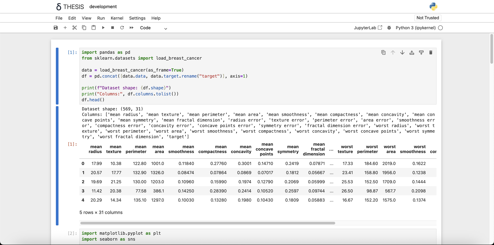

# Jupyter Notebook


[](https://jupyter-notebook.readthedocs.io/en/latest/?badge=latest)
[](https://mybinder.org/v2/gh/jupyter/notebook/main?urlpath=tree)
[](https://codecov.io/gh/jupyter/notebook)

The Jupyter notebook is a web-based notebook environment for interactive
computing.



## Maintained versions

We maintain the **two most recently released major versions of Jupyter Notebook**, Notebook v5 and Classic Notebook v6. After Notebook v7.0 is released, we will no longer maintain Notebook v5. All Notebook v5 users are strongly advised to upgrade to Classic Notebook v6 as soon as possible.

The Jupyter Notebook project is currently undertaking a transition to a more modern code base built from the ground-up using JupyterLab components and extensions.

There is new stream of work which was submitted and then accepted as a Jupyter Enhancement Proposal (JEP) as part of the next version (v7): https://jupyter.org/enhancement-proposals/79-notebook-v7/notebook-v7.html

There is also a plan to continue maintaining Notebook v6 with bug and security fixes only, to ease the transition to Notebook v7: https://github.com/jupyter/notebook-team-compass/issues/5#issuecomment-1085254000

### Notebook v7

The next major version of Notebook will be based on:

- JupyterLab components for the frontend
- Jupyter Server for the Python server

This represents a significant change to the `jupyter/notebook` code base.

To learn more about Notebook v7: https://jupyter.org/enhancement-proposals/79-notebook-v7/notebook-v7.html

### Classic Notebook v6

Maintainance and security-related issues are now being addressed in the [`6.4.x`](https://github.com/jupyter/notebook/tree/6.4.x) branch.

A `6.5.x` branch will be soon created and will depend on [`nbclassic`](https://github.com/jupyter/nbclassic) for the HTML/JavaScript/CSS assets.

New features and continuous improvement is now focused on Notebook v7 (see section above).

If you have an open pull request with a new feature or if you were planning to open one, we encourage switching over to the Jupyter Server and JupyterLab architecture, and distribute it as a server extension and / or JupyterLab prebuilt extension. That way your new feature will also be compatible with the new Notebook v7.

## Jupyter notebook, the language-agnostic evolution of IPython notebook

Jupyter notebook is a language-agnostic HTML notebook application for
Project Jupyter. In 2015, Jupyter notebook was released as a part of
The Big Split™ of the IPython codebase. IPython 3 was the last major monolithic
release containing both language-agnostic code, such as the _IPython notebook_,
and language specific code, such as the _IPython kernel for Python_. As
computing spans across many languages, Project Jupyter will continue to develop the
language-agnostic **Jupyter notebook** in this repo and with the help of the
community develop language specific kernels which are found in their own
discrete repos.

- [The Big Split™ announcement](https://blog.jupyter.org/the-big-split-9d7b88a031a7)
- [Jupyter Ascending blog post](https://blog.jupyter.org/jupyter-ascending-1bf5b362d97e)

## Installation

You can find the installation documentation for the
[Jupyter platform, on ReadTheDocs](https://jupyter.readthedocs.io/en/latest/install.html).
The documentation for advanced usage of Jupyter notebook can be found
[here](https://jupyter-notebook.readthedocs.io/en/latest/).

For a local installation, make sure you have
[pip installed](https://pip.readthedocs.io/en/stable/installing/) and run:

```bash
pip install notebook
```

## Usage - Running Jupyter notebook

### Running in a local installation

Launch with:

```bash
jupyter notebook
```

### Running in a remote installation

You need some configuration before starting Jupyter notebook remotely. See [Running a notebook server](https://jupyter-notebook.readthedocs.io/en/stable/public_server.html).

## Development Installation

See [`CONTRIBUTING.md`](CONTRIBUTING.md) for how to set up a local development installation.

## Contributing

If you are interested in contributing to the project, see [`CONTRIBUTING.md`](CONTRIBUTING.md).

## Community Guidelines and Code of Conduct

This repository is a Jupyter project and follows the Jupyter
[Community Guides and Code of Conduct](https://jupyter.readthedocs.io/en/latest/community/content-community.html).

## Resources

- [Project Jupyter website](https://jupyter.org)
- [Online Demo at jupyter.org/try](https://jupyter.org/try)
- [Documentation for Jupyter notebook](https://jupyter-notebook.readthedocs.io/en/latest/) \[[PDF](https://media.readthedocs.org/pdf/jupyter-notebook/latest/jupyter-notebook.pdf)\]
- [Korean Version of Installation](https://github.com/ChungJooHo/Jupyter_Kor_doc/)
- [Documentation for Project Jupyter](https://jupyter.readthedocs.io/en/latest/index.html) \[[PDF](https://media.readthedocs.org/pdf/jupyter/latest/jupyter.pdf)\]
- [Issues](https://github.com/jupyter/notebook/issues)
- [Technical support - Jupyter Google Group](https://discourse.jupyter.org/)
