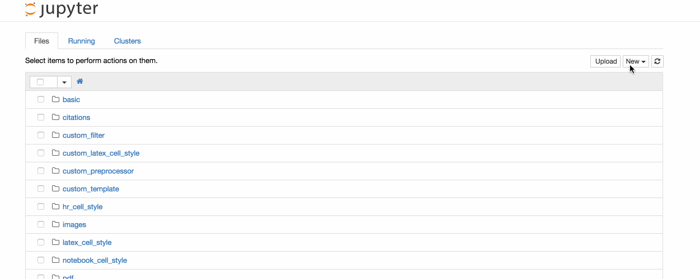
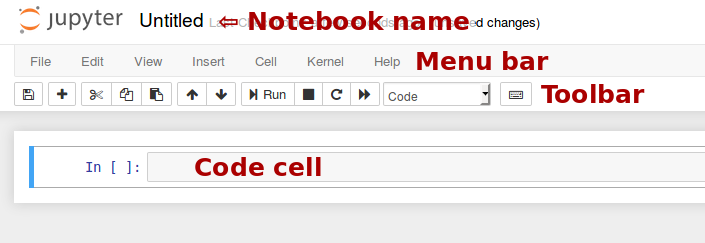

.. _htmlnotebook:

The Jupyter Notebook
====================

Introduction
------------

The notebook extends the console-based approach to interactive computing in
a qualitatively new direction, providing a web-based application suitable for
capturing the whole computation process: developing, documenting, and
executing code, as well as communicating the results.  The Jupyter notebook
combines two components:

**A web application**: a browser-based tool for interactive authoring of
documents which combine explanatory text, mathematics, computations and their
rich media output.

**Notebook documents**: a representation of all content visible in the web
application, including inputs and outputs of the computations, explanatory
text, mathematics, images, and rich media representations of objects.

.. seealso::

    See the :ref:`installation guide <jupyter:install>` on how to install the
    notebook and its dependencies.

Main features of the web application
~~~~~~~~~~~~~~~~~~~~~~~~~~~~~~~~~~~~

* In-browser editing for code, with automatic syntax highlighting,
  indentation, and tab completion/introspection.

* The ability to execute code from the browser, with the results of
  computations attached to the code which generated them.

* Displaying the result of computation using rich media representations, such
  as HTML, LaTeX, PNG, SVG, etc. For example, publication-quality figures
  rendered by the matplotlib_ library, can be included inline.

* In-browser editing for rich text using the Markdown_ markup language, which
  can provide commentary for the code, is not limited to plain text.

* The ability to easily include mathematical notation within markdown cells
  using LaTeX, and rendered natively by MathJax_.

.. _MathJax: https://www.mathjax.org/

Notebook documents
~~~~~~~~~~~~~~~~~~
Notebook documents contains the inputs and outputs of a interactive session as
well as additional text that accompanies the code but is not meant for
execution.  In this way, notebook files can serve as a complete computational
record of a session, interleaving executable code with explanatory text,
mathematics, and rich representations of resulting objects. These documents
are internally JSON_ files and are saved with the ``.ipynb`` extension. Since
JSON is a plain text format, they can be version-controlled and shared with
colleagues.

.. _JSON: https://en.wikipedia.org/wiki/JSON

Notebooks may be exported to a range of static formats, including HTML (for
example, for blog posts), reStructuredText, LaTeX, PDF, and slide shows, via
the nbconvert_ command.

Furthermore, any  ``.ipynb`` notebook document available from a public
URL can be shared via the `Jupyter Notebook Viewer <nbviewer>`_ (nbviewer_).
This service loads the notebook document from the URL and renders it as a
static web page.  The results may thus be shared with a colleague, or as a
public blog post, without other users needing to install the Jupyter notebook
themselves.  In effect, nbviewer_ is simply nbconvert_ as
a web service, so you can do your own static conversions with nbconvert,
without relying on nbviewer.

.. seealso::

    :ref:`Details on the notebook JSON file format <nbformat:notebook_file_format>`

Notebooks and privacy
~~~~~~~~~~~~~~~~~~~~~

Because you use Jupyter in a web browser, some people are understandably
concerned about using it with sensitive data.
However, if you followed the standard
`install instructions <https://jupyter.readthedocs.io/en/latest/install.html>`_,
Jupyter is actually running on your own computer.
If the URL in the address bar starts with ``http://localhost:`` or
``http://127.0.0.1:``, it's your computer acting as the server.
Jupyter doesn't send your data anywhere else—and as it's open source,
other people can check that we're being honest about this.

You can also use Jupyter remotely:
your company or university might run the server for you, for instance.
If you want to work with sensitive data in those cases,
talk to your IT or data protection staff about it.

We aim to ensure that other pages in your browser or other users on the same
computer can't access your notebook server. See :ref:`server_security` for
more about this.

Starting the notebook server
----------------------------

You can start running a notebook server from the command line using the
following command::

    jupyter notebook

This will print some information about the notebook server in your console,
and open a web browser to the URL of the web application (by default,
``http://127.0.0.1:8888``).

The landing page of the Jupyter notebook web application, the **dashboard**,
shows the notebooks currently available in the notebook directory (by default,
the directory from which the notebook server was started).

You can create new notebooks from the dashboard with the ``New Notebook``
button, or open existing ones by clicking on their name.  You can also drag
and drop ``.ipynb`` notebooks and standard ``.py`` Python source code files
into the notebook list area.

When starting a notebook server from the command line, you can also open a
particular notebook directly, bypassing the dashboard, with ``jupyter notebook
my_notebook.ipynb``. The ``.ipynb`` extension is assumed if no extension is
given.

When you are inside an open notebook, the `File | Open...` menu option will
open the dashboard in a new browser tab, to allow you to open another notebook
from the notebook directory or to create a new notebook.

.. note::

   You can start more than one notebook server at the same time, if you want
   to work on notebooks in different directories.  By default the first
   notebook server starts on port 8888, and later notebook servers search for
   ports near that one.  You can also manually specify the port with the
   ``--port`` option.

Creating a new notebook document
~~~~~~~~~~~~~~~~~~~~~~~~~~~~~~~~

A new notebook may be created at any time, either from the dashboard, or using
the :menuselection:`File --> New` menu option from within an active notebook.
The new notebook is created within the same directory and will open in a new
browser tab. It will also be reflected as a new entry in the notebook list on
the dashboard.

Opening notebooks
~~~~~~~~~~~~~~~~~
An open notebook has **exactly one** interactive session connected to a
kernel, which will execute code sent by the user
and communicate back results.  This kernel remains active if the web browser
window is closed, and reopening the same notebook from the dashboard will
reconnect the web application to the same kernel. In the dashboard, notebooks
with an active kernel have a ``Shutdown`` button next to them, whereas
notebooks without an active kernel have a ``Delete`` button in its place.

Other clients may connect to the same kernel.
When each kernel is started, the notebook server prints to the terminal a
message like this::

    [NotebookApp] Kernel started: 87f7d2c0-13e3-43df-8bb8-1bd37aaf3373

This long string is the kernel's ID which is sufficient for getting the
information necessary to connect to the kernel. If the notebook uses the IPython
kernel, you can also see this
connection data by running the ``%connect_info`` :ref:`magic
<magics_explained>`, which will print the same ID information along with other
details.

You can then, for example, manually start a Qt console connected to the *same*
kernel from the command line, by passing a portion of the ID::

    $ jupyter qtconsole --existing 87f7d2c0

Without an ID, ``--existing`` will  connect to the most recently
started kernel.

With the IPython kernel, you can also run the ``%qtconsole``
:ref:`magic <magics_explained>` in the notebook to open a Qt console connected
to the same kernel.

.. seealso::

    :ref:`ipythonzmq`

Notebook user interface
-----------------------

When you create a new notebook document, you will be presented with the
**notebook name**, a **menu bar**, a **toolbar** and an empty **code cell**.

**Notebook name**: The name displayed at the top of the page,
next to the Jupyter logo, reflects the name of the ``.ipynb`` file.
Clicking on the notebook name brings up a dialog which allows you to rename it.
Thus, renaming a notebook
from "Untitled0" to "My first notebook" in the browser, renames the
``Untitled0.ipynb`` file to ``My first notebook.ipynb``.

**Menu bar**: The menu bar presents different options that may be used to
manipulate the way the notebook functions.

**Toolbar**: The tool bar gives a quick way of performing the most-used
operations within the notebook, by clicking on an icon.

**Code cell**: the default type of cell; read on for an explanation of cells.

Structure of a notebook document
--------------------------------

The notebook consists of a sequence of cells.  A cell is a multiline text input
field, and its contents can be executed by using :kbd:`Shift-Enter`, or by
clicking either the "Play" button the toolbar, or :guilabel:`Cell`, :guilabel:`Run` in the menu bar.
The execution behavior of a cell is determined by the cell's type.  There are three
types of cells: **code cells**, **markdown cells**, and **raw cells**.  Every
cell starts off being a **code cell**, but its type can be changed by using a
drop-down on the toolbar (which will be "Code", initially), or via
:ref:`keyboard shortcuts <keyboard-shortcuts>`.

For more information on the different things you can do in a notebook,
see the `collection of examples
<https://nbviewer.jupyter.org/github/jupyter/notebook/tree/master/docs/source/examples/Notebook/>`_.

Code cells
~~~~~~~~~~
A *code cell* allows you to edit and write new code, with full syntax
highlighting and tab completion. The programming language you use depends
on the *kernel*, and the default kernel (IPython) runs Python code.

When a code cell is executed, code that it contains is sent to the kernel
associated with the notebook.  The results that are returned from this
computation  are then displayed in the notebook as the cell's *output*. The
output is not limited to text, with many other possible forms of output are
also possible, including ``matplotlib`` figures and HTML tables (as used, for
example, in the ``pandas`` data analysis package). This is known as IPython's
*rich display* capability.

.. seealso::

   `Rich Output`_  example notebook

Markdown cells
~~~~~~~~~~~~~~
You can document the computational process in a literate way, alternating
descriptive text with code, using *rich text*. In IPython this is accomplished
by marking up text with the Markdown language. The corresponding cells are
called *Markdown cells*. The Markdown language provides a simple way to
perform this text markup, that is, to specify which parts of the text should
be emphasized (italics), bold, form lists, etc.

If you want to provide structure for your document, you can use markdown
headings. Markdown headings consist of 1 to 6 hash # signs ``#`` followed by a
space and the title of your section. The markdown heading will be converted
to a clickable link for a section of the notebook. It is also used as a hint
when exporting to other document formats, like PDF.

When a Markdown cell is executed, the Markdown code is converted into
the corresponding formatted rich text. Markdown allows arbitrary HTML code for
formatting.

Within Markdown cells, you can also include *mathematics* in a straightforward
way, using standard LaTeX notation: ``$...$`` for inline mathematics and
``$$...$$`` for displayed mathematics. When the Markdown cell is executed,
the LaTeX portions are automatically rendered in the HTML output as equations
with high quality typography. This is made possible by MathJax_, which
supports a `large subset <mathjax_tex>`_ of LaTeX functionality

.. _mathjax_tex: https://docs.mathjax.org/en/latest/tex.html

Standard mathematics environments defined by LaTeX and AMS-LaTeX (the
``amsmath`` package) also work, such as
``\begin{equation}...\end{equation}``, and ``\begin{align}...\end{align}``.
New LaTeX macros may be defined using standard methods,
such as ``\newcommand``, by placing them anywhere *between math delimiters* in
a Markdown cell. These definitions are then available throughout the rest of
the IPython session.

.. seealso::

    `Working with Markdown Cells`_ example notebook

Raw cells
~~~~~~~~~

*Raw* cells provide a place in which you can write *output* directly.
Raw cells are not evaluated by the notebook.
When passed through nbconvert_, raw cells arrive in the
destination format unmodified. For example, you can type full LaTeX
into a raw cell, which will only be rendered by LaTeX after conversion by
nbconvert.

Basic workflow
--------------

The normal workflow in a notebook is, then, quite similar to a standard
IPython session, with the difference that you can edit cells in-place multiple
times until you obtain the desired results, rather than having to
rerun separate scripts with the ``%run`` magic command.

Typically, you will work on a computational problem in pieces, organizing
related ideas into cells and moving forward once previous parts work
correctly. This is much more convenient for interactive exploration than
breaking up a computation into scripts that must be executed together, as was
previously necessary, especially if parts of them take a long time to run.

To interrupt a calculation which is taking too long, use the :guilabel:`Kernel`,
:guilabel:`Interrupt` menu option, or the :kbd:`i,i` keyboard shortcut.
Similarly, to restart the whole computational process,
use the :guilabel:`Kernel`, :guilabel:`Restart` menu option or :kbd:`0,0`
shortcut.

A notebook may be downloaded as a ``.ipynb`` file or converted to a number of
other formats using the menu option :guilabel:`File`, :guilabel:`Download as`.

.. seealso::

    `Running Code in the Jupyter Notebook`_ example notebook

    `Notebook Basics`_ example notebook

.. _keyboard-shortcuts:

Keyboard shortcuts
~~~~~~~~~~~~~~~~~~
All actions in the notebook can be performed with the mouse, but keyboard
shortcuts are also available for the most common ones. The essential shortcuts
to remember are the following:

* :kbd:`Shift-Enter`:  run cell
    Execute the current cell, show any output, and jump to the next cell below.
    If :kbd:`Shift-Enter` is invoked on the last cell, it makes a new cell below.
    This is equivalent to clicking the :guilabel:`Cell`, :guilabel:`Run` menu
    item, or the Play button in the toolbar.

* :kbd:`Esc`: Command mode
    In command mode, you can navigate around the notebook using keyboard shortcuts.

* :kbd:`Enter`: Edit mode
    In edit mode, you can edit text in cells.

For the full list of available shortcuts, click :guilabel:`Help`,
:guilabel:`Keyboard Shortcuts` in the notebook menus.

Plotting
--------
One major feature of the Jupyter notebook is the ability to display plots that
are the output of running code cells. The IPython kernel is designed to work
seamlessly with the matplotlib_ plotting library to provide this functionality.
Specific plotting library integration is a feature of the kernel.

Installing kernels
------------------

For information on how to install a Python kernel, refer to the
`IPython install page <https://ipython.org/install.html>`__.

The Jupyter wiki has a long list of `Kernels for other languages
<https://github.com/jupyter/jupyter/wiki/Jupyter-kernels>`_.
They usually come with instructions on how to make the kernel available
in the notebook.

.. _signing_notebooks:

Trusting Notebooks
------------------

To prevent untrusted code from executing on users' behalf when notebooks open,
we store a signature of each trusted notebook.
The notebook server verifies this signature when a notebook is opened.
If no matching signature is found,
Javascript and HTML output will not be displayed
until they are regenerated by re-executing the cells.

Any notebook that you have fully executed yourself will be
considered trusted, and its HTML and Javascript output will be displayed on
load.

If you need to see HTML or Javascript output without re-executing,
and you are sure the notebook is not malicious, you can tell Jupyter to trust it
at the command-line with::

    $ jupyter trust mynotebook.ipynb

See :ref:`notebook_security` for more details about the trust mechanism.

Browser Compatibility
---------------------

The Jupyter Notebook aims to support the latest versions of these browsers:

* Chrome
* Safari
* Firefox

Up to date versions of Opera and Edge may also work, but if they don't, please
use one of the supported browsers.

Using Safari with HTTPS and an untrusted certificate is known to not work
(websockets will fail).

.. include:: links.txt
