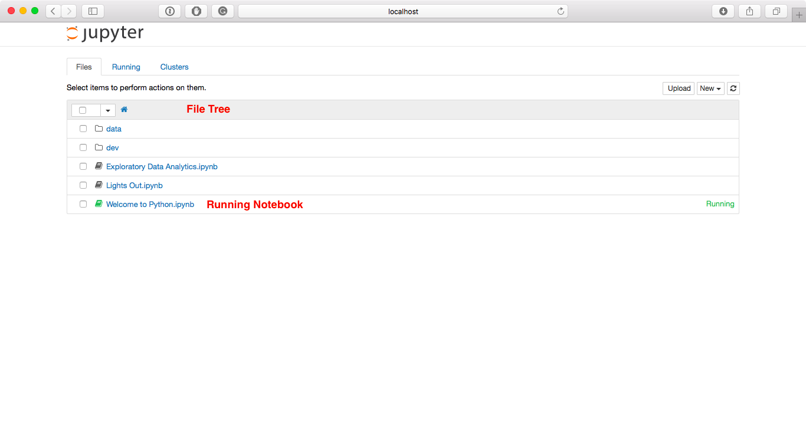
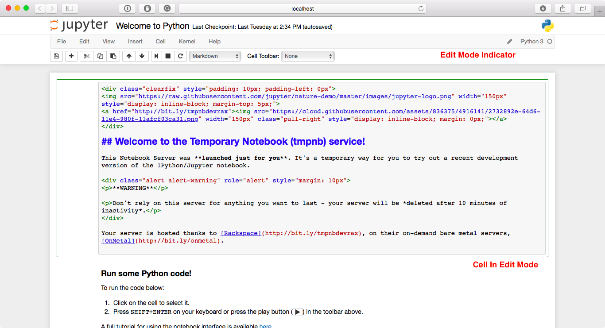
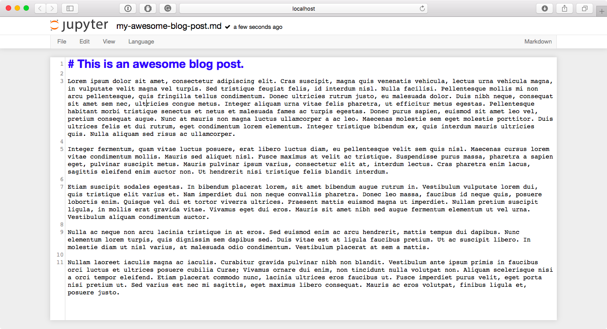

UI Components
=============
When opening bug reports or sending emails to the Jupyter mailing list, it is
useful to know the names of different UI components so that other developers
and users have an easier time helping you diagnose your problems. This section
will familiarize you with the names of UI elements within the Notebook and the
different Notebook modes.

Notebook Dashboard
-------------------

When you launch ``jupyter notebook`` the first page that you encounter is the
Notebook Dashboard.

Notebook Editor
---------------

Once you've selected a Notebook to edit, the Notebook will open in the Notebook
Editor.

.. image:: ./_static/images/jupyter-notebook-default.png

Interactive User Interface Tour of the Notebook
-----------------------------------------------

If you would like to learn more about the specific elements within the Notebook
Editor, you can go through the User Interface Tour by selecting Help in the
menubar then selecting User Interface Tour.

Edit Mode and Notebook Editor
~~~~~~~~~~~~~~~~~~~~~~~~~~~~~

When a cell is in edit mode, the Cell Mode Indicator will change to reflect
the cell's state. This state is indicated by a small pencil icon on the
top right of the interface. When the cell is in command mode, there is no
icon in that location.

File Editor
-----------

Now let's say that you've chosen to open a Markdown file instead of a Notebook
file whilst in the Notebook Dashboard. If so, the file will be opened in the
File Editor.

